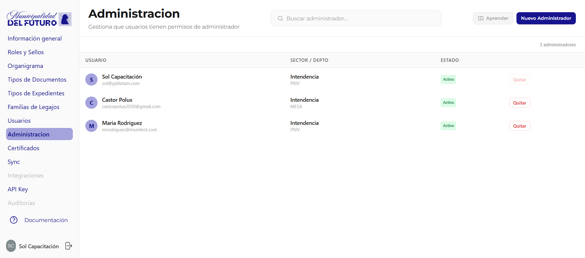

# Administracion

Gestiona que usuarios tienen permisos de administrador en el BackOffice. Los administradores pueden acceder a todas las secciones de configuracion de la organizacion.

!!! video "Video tutorial"
    **GDI BackOffice — Administradores del municipio**

    
<iframe src="https://www.youtube-nocookie.com/embed/3RR7-jH8cYE?list=PLbbUEsKhLkuc" title="GDI BackOffice — Administradores del municipio" loading="lazy" allow="accelerometer; autoplay; clipboard-write; encrypted-media; gyroscope; picture-in-picture; web-share" allowfullscreen></iframe>

    **GDI BackOffice — API Keys: integra GDI con otros sistemas**

    
<iframe src="https://www.youtube-nocookie.com/embed/DnHSfwnbDGM?list=PLbbUEsKhLkuc" title="GDI BackOffice — API Keys: integra GDI con otros sistemas" loading="lazy" allow="accelerometer; autoplay; clipboard-write; encrypted-media; gyroscope; picture-in-picture; web-share" allowfullscreen></iframe>

    **GDI BackOffice — Logs: actividad del municipio en vivo**

    
<iframe src="https://www.youtube-nocookie.com/embed/hvodkrKP1mM?list=PLbbUEsKhLkuc" title="GDI BackOffice — Logs: actividad del municipio en vivo" loading="lazy" allow="accelerometer; autoplay; clipboard-write; encrypted-media; gyroscope; picture-in-picture; web-share" allowfullscreen></iframe>

---

## Listado de Administradores

La tabla muestra todos los usuarios con rol de administrador.

| Columna | Descripcion |
|---------|-------------|
| **Usuario** | Avatar con inicial, nombre completo y email |
| **Sector / Depto** | Departamento y sector del administrador |
| **Estado** | `Activo` o `Inactivo` |

### Acciones

| Accion | Descripcion |
|--------|-------------|
| **Buscar** | Filtrar administradores por nombre o email |
| **Nuevo Administrador** | Agregar un usuario existente como administrador |
| **Quitar** | Revocar permisos de administrador a un usuario |

!!! warning "Precaucion"
    Revocar permisos de administrador es una accion inmediata. El usuario perdera acceso al BackOffice en su proxima sesion. Asegurate de que siempre haya al menos un administrador activo.
