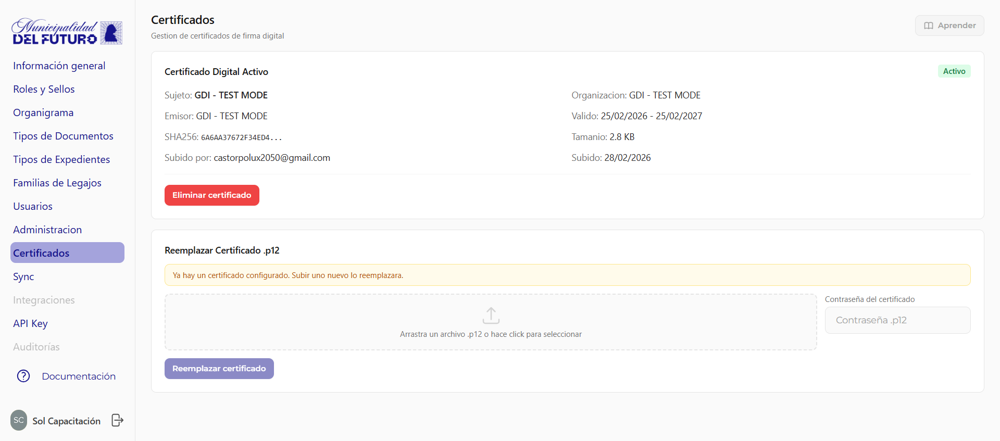

# Certificados

Gestiona los certificados digitales utilizados para la firma electronica de documentos.

---

## Descripcion General

La seccion de Certificados permite al administrador gestionar los certificados de firma digital que utiliza el sistema GDI-Notary para firmar documentos PDF.
