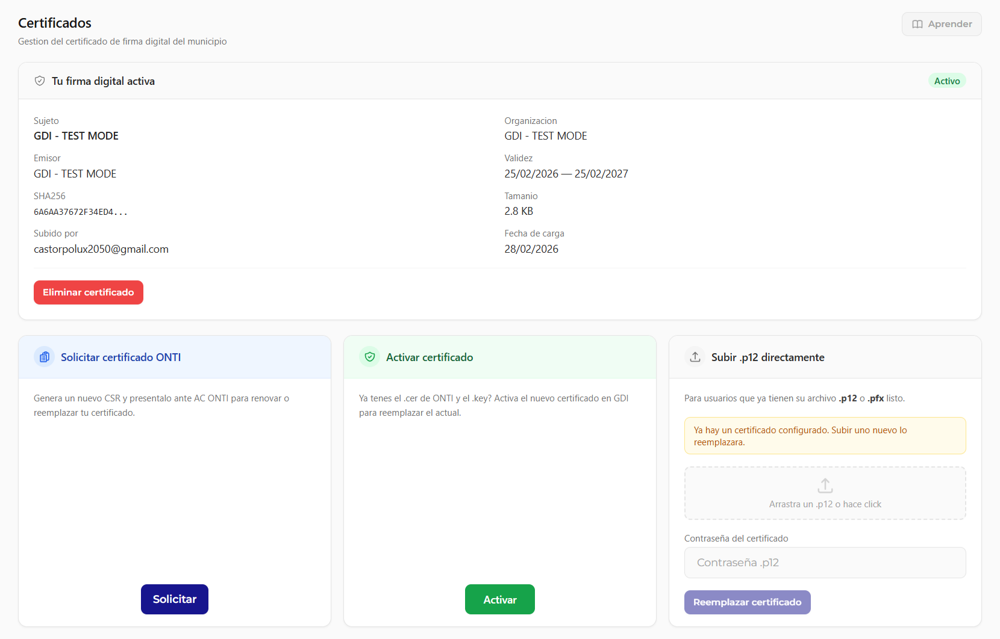
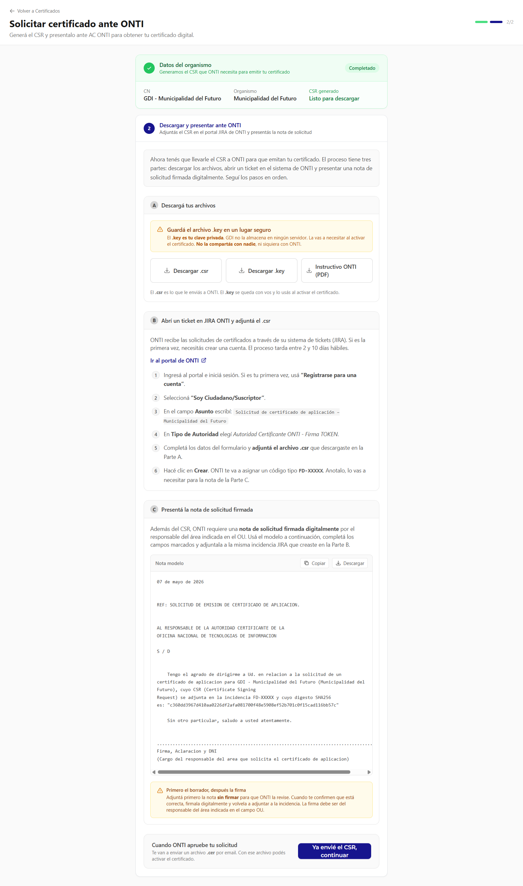
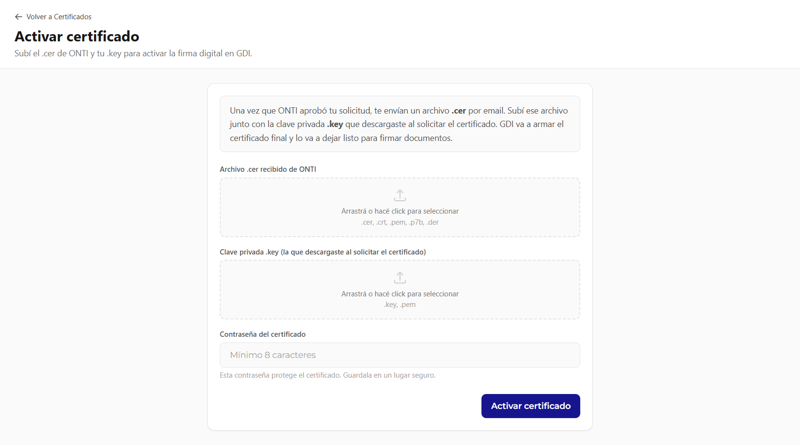

# Certificados

Gestiona los certificados digitales utilizados para la firma electronica de documentos.

!!! video "Video tutorial"
    **GDI BackOffice — Certificados de firma digital (ONTI)**

    
<iframe src="https://www.youtube-nocookie.com/embed/jS7_0tQyLBo?list=PLbbUEsKhLkuc" title="GDI BackOffice — Certificados de firma digital (ONTI)" loading="lazy" allow="accelerometer; autoplay; clipboard-write; encrypted-media; gyroscope; picture-in-picture; web-share" allowfullscreen></iframe>

---

## Descripcion General

La seccion de Certificados permite al administrador gestionar los certificados de firma digital que utiliza el sistema GDI-Notary para firmar documentos PDF. Desde aca se puede solicitar un certificado ante la ONTI, activar uno recibido, o subir un `.p12` directamente.

---

## Tu firma digital activa

Si el organismo ya tiene un certificado cargado, el panel muestra:

| Campo | Descripcion |
|-------|-------------|
| **Sujeto** | Nombre del titular del certificado |
| **Organizacion** | Nombre de la organizacion |
| **Emisor** | Autoridad certificante que lo emitio |
| **Validez** | Rango de fechas de vigencia |
| **SHA256** | Huella digital del certificado |
| **Tamanio** | Peso del archivo |
| **Subido por** | Usuario que cargo el certificado |
| **Fecha de carga** | Cuando fue subido al sistema |

El boton **Eliminar certificado** permite retirar el certificado activo. Esta accion deshabilita la firma digital hasta que se cargue uno nuevo.

---

## Opciones disponibles

El panel ofrece tres caminos segun el estado del organismo:

| Opcion | Cuando usarla |
|--------|---------------|
| **Solicitar certificado ONTI** | Primera vez o renovacion: genera el CSR y guia el tramite ante AC ONTI |
| **Activar certificado** | Ya se recibio el `.cer` de ONTI y se tiene el `.key` generado |
| **Subir .p12 directamente** | Se tiene un archivo `.p12` o `.pfx` listo para cargar |

---

## Solicitar certificado ante ONTI

Este flujo guia al administrador paso a paso para obtener un certificado de firma digital emitido por la **Autoridad Certificante de la ONTI (AC ONTI)**, que es la AC oficial para organismos del Estado argentino.

### Paso 1 — Datos del organismo

GDI genera automaticamente el CSR (Certificate Signing Request) usando los datos del organismo ya configurados en el sistema. Este paso aparece como **Completado** una vez que la informacion del organismo esta cargada en Informacion General.

Si los datos no estan completos, el sistema avisa antes de continuar.

### Paso 2 — Descargar y presentar ante ONTI

GDI genera dos archivos que hay que conservar:

- **`.csr`** — Solicitud de certificado para presentar a ONTI
- **`.key`** — Clave privada del organismo. **Guardar en lugar seguro y privado.** Si se pierde, no se puede activar el certificado.

Ademas se descarga el **Instructivo ONTI (PDF)** con los pasos oficiales del tramite.

!!! warning "La clave .key es privada"
    El archivo `.key` **nunca** debe compartirse. GDI no lo almacena. Si se pierde, hay que generar un nuevo CSR desde cero.

#### Abrir un ticket en JIRA ONTI

ONTI gestiona las solicitudes de certificacion a traves de su sistema de tickets (JIRA). Si es la primera vez, se necesita crear una cuenta. El proceso tarda entre 7 y 10 dias habiles.

Pasos en el portal de ONTI:

1. Ingresar al portal e iniciar sesion (o registrarse si es primera vez)
2. Seleccionar **"Soy Ciudadano/Suscriptor"**
3. En el campo **Asunto** escribir: `Solicitud de certificados de aplicacion - [Nombre del organismo]`
4. En **Tipo de Autoridad** elegir: `Autoridad Certificante ONTI - Firma TOKEN`
5. Completar los campos requeridos y **adjuntar el archivo `.csr`** descargado en el Paso A
6. Hacer clic en **Crear**. ONTI va a asignar un codigo tipo `PG-XXXXX`

Con ese codigo se completa la nota de solicitud que se genera en el Paso C.

### Paso 3 — Presentar la nota de solicitud firmada

GDI genera automaticamente una **nota de solicitud** pre-completada con los datos del organismo, la referencia ONTI y la fecha. El responsable del area debe:

1. Firmar la nota digitalmente (o de puno y letra si se presenta en papel)
2. Completar los campos marcados: nombre del responsable, cargo y referencia ONTI asignada
3. Adjuntar la nota firmada al ticket de JIRA ONTI

Una vez enviado todo, hacer clic en **"Ya envie el CSR, continuar"** para que GDI registre que el tramite fue iniciado.

---

## Activar certificado

Una vez que ONTI aprueba la solicitud, envia un archivo **`.cer`** por email. Con ese archivo y el **`.key`** generado en el paso anterior, se activa el certificado en GDI.

### Que subir

| Campo | Archivo |
|-------|---------|
| **Archivo .cer recibido de ONTI** | El `.cer`, `.crt`, `.pem`, `.p7b` o `.der` que envio ONTI |
| **Clave privada .key** | El `.key` o `.pem` generado al solicitar el certificado |
| **Contrasena del certificado** | Minimo 8 caracteres. Protege el certificado en el sistema. Guardarla en un lugar seguro. |

Luego de hacer clic en **Activar certificado**, GDI combina ambos archivos y deja el certificado listo para firmar documentos.

---

## Subir .p12 directamente

Para organismos que ya tienen su certificado en formato `.p12` o `.pfx` (por ejemplo, exportado desde otro sistema), pueden cargarlo directamente sin pasar por el flujo ONTI.

1. Arrastrar el archivo `.p12` o hacer click en el area de carga
2. Ingresar la **contrasena del certificado**
3. Hacer clic en **Reemplazar certificado**

!!! info "Reemplazo de certificado existente"
    Si ya hay un certificado activo, el sistema avisa que subir uno nuevo lo reemplazara. El certificado anterior queda desactivado de inmediato.
