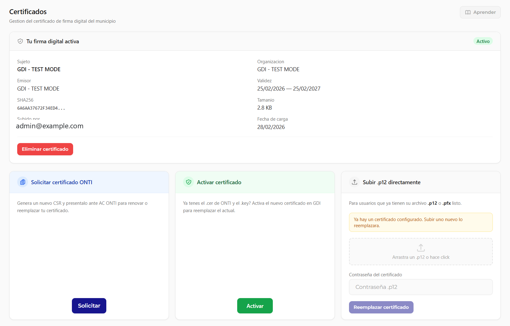
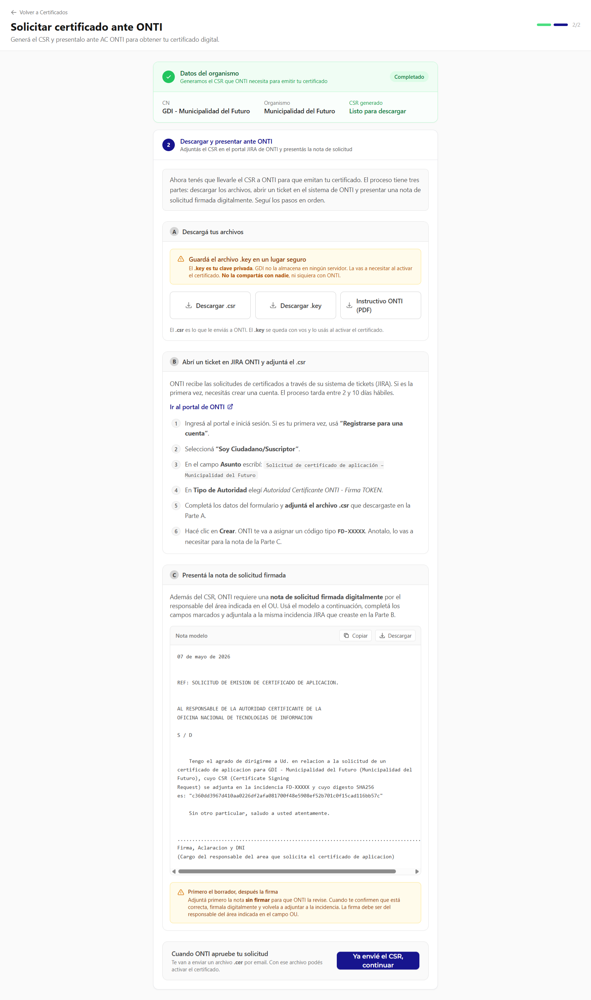
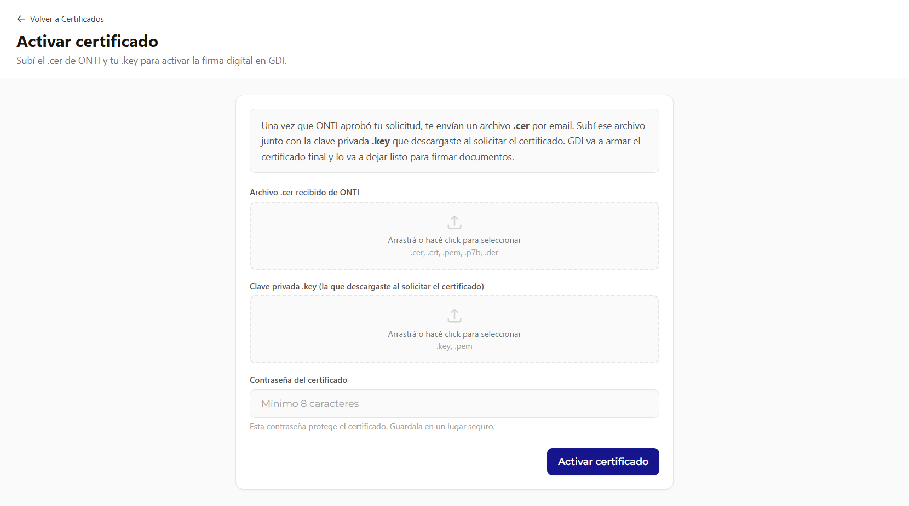

# Certificados

Gestiona los certificados digitales utilizados para la firma electronica de documentos.



!!! video "Video tutorial"
    **GDI BackOffice — Certificados de firma digital (ONTI)**

    <div class="video-embed"><iframe src="https://www.youtube-nocookie.com/embed/jS7_0tQyLBo?list=PLbbUEsKhLkuc" title="GDI BackOffice — Certificados de firma digital (ONTI)" loading="lazy" allow="accelerometer; autoplay; clipboard-write; encrypted-media; gyroscope; picture-in-picture; web-share" allowfullscreen></iframe></div>


---

## Descripcion General

La seccion de Certificados permite al administrador gestionar los certificados de firma digital que utiliza el sistema GDI-Notary para firmar documentos PDF. Desde aca se puede solicitar un certificado ante la ONTI, activar uno recibido, o subir un `.p12` directamente.

---

## Que es un archivo .p12

Un `.p12` (tambien llamado **PKCS#12**, o `.pfx` en el mundo Windows) es un **unico archivo, protegido por contrasena, que contiene la identidad digital del organismo**. Adentro guarda dos cosas que van siempre juntas:

| Contenido | Que es | Para que sirve |
|-----------|--------|----------------|
| **Certificado** | Documento firmado por una Autoridad Certificante (AC ONTI) que dice "esta clave publica pertenece a tal organismo" | Es la parte **publica**: viaja dentro de cada PDF firmado y permite que cualquiera valide la firma |
| **Clave privada** | El secreto que produce las firmas | Es la parte **privada**: es lo que efectivamente *firma*. Nunca se comparte |

Se puede pensar como el documento de identidad del organismo (el certificado) mas su sello indelegable (la clave privada), guardados en un sobre cerrado con una contrasena.

### Por que GDI lo necesita

Cuando un usuario firma digitalmente un documento, GDI aplica una **firma PAdES** sobre el PDF usando el `.p12` del organismo. Esa firma:

- queda **dentro** del PDF (se puede validar en Adobe Reader, en el validador de firma de la Nacion, o en cualquier lector compatible);
- detecta cualquier modificacion posterior del archivo;
- prueba que el documento fue emitido por ese organismo, no por un tercero.

Sin `.p12` cargado, el organismo **no puede firmar digitalmente**: solo quedan disponibles las firmas electronicas (sin criptografia de AC).

!!! info "Un certificado por organismo, no por persona"
    El `.p12` que se carga en GDI es un **certificado de aplicacion**: identifica al organismo, no a cada agente. Quien firma queda identificado en el sello visual y en la auditoria del sistema. No hay que cargar un certificado por usuario.

### De donde sale un .p12

Hay tres caminos, en orden de preferencia:

1. **Solicitarlo ante AC ONTI desde GDI** (recomendado). Es el flujo guiado que esta mas abajo: GDI genera el `.csr` y el `.key`, el organismo tramita ante ONTI, y al recibir el `.cer` GDI **arma el `.p12` automaticamente**. En este camino el administrador nunca tiene que fabricar el archivo a mano.
2. **Ya tener un `.cer` y su `.key`** de un tramite anterior. Se pueden combinar desde la opcion **Activar certificado**, o armar el `.p12` a mano (ver abajo).
3. **Ya tener un `.p12` o `.pfx`** exportado de otro sistema. Se sube directo.

### Armarlo a mano (opcional)

Si el organismo prefiere generar el archivo por su cuenta, con OpenSSL:

```bash
# Combinar certificado + clave privada en un .p12
openssl pkcs12 -export \
  -in certificado.cer \
  -inkey clave.key \
  -certfile cadena.pem \
  -out certificado.p12
```

`-certfile` es opcional y agrega la cadena de la AC (recomendado: mejora la validacion en Adobe). OpenSSL va a pedir una contrasena de exportacion: **esa es la contrasena que hay que ingresar al subir el archivo a GDI**.

Para verificar el contenido antes de subirlo:

```bash
openssl pkcs12 -info -in certificado.p12 -nokeys
```

### Requisitos que valida GDI

Al subir el archivo, el sistema lo abre y lo rechaza si no cumple:

| Requisito | Detalle |
|-----------|---------|
| Formato | PKCS#12 valido (`.p12` / `.pfx`) |
| Contenido | Debe traer **certificado y clave privada**. Un `.p12` solo con el certificado no sirve para firmar |
| Contrasena | Tiene que abrir el archivo. Minimo 8 caracteres cuando GDI lo genera |
| Vigencia | El certificado no puede estar vencido ni tener fecha de inicio futura |
| Tamano | Maximo 5 MB |

!!! warning "Certificados de token personal no sirven aca"
    Los certificados que vienen en un token fisico (eToken) son **no exportables** por diseno: no se puede obtener un `.p12` de ellos. Ese tipo de firma se usa desde el FirmadorGDI en la maquina del usuario, no se carga en el BackOffice.

!!! danger "La contrasena y el archivo son material sensible"
    Quien tenga el `.p12` y su contrasena puede firmar en nombre del organismo. Guardarlos en un gestor de contrasenas o boveda institucional, nunca por mail ni en un chat. GDI almacena el archivo cifrado y la contrasena encriptada.

---

## Tu firma digital activa

Si el organismo ya tiene un certificado cargado, el panel muestra:

| Campo | Descripcion |
|-------|-------------|
| **Sujeto** | Nombre del titular del certificado |
| **Organizacion** | Nombre de la organizacion |
| **Emisor** | Autoridad certificante que lo emitio |
| **Validez** | Rango de fechas de vigencia |
| **SHA256** | Huella digital del certificado |
| **Tamanio** | Peso del archivo |
| **Subido por** | Usuario que cargo el certificado |
| **Fecha de carga** | Cuando fue subido al sistema |

El boton **Eliminar certificado** permite retirar el certificado activo. Esta accion deshabilita la firma digital hasta que se cargue uno nuevo.

---

## Opciones disponibles

El panel ofrece tres caminos segun el estado del organismo:

| Opcion | Cuando usarla |
|--------|---------------|
| **Solicitar certificado ONTI** | Primera vez o renovacion: genera el CSR y guia el tramite ante AC ONTI |
| **Activar certificado** | Ya se recibio el `.cer` de ONTI y se tiene el `.key` generado |
| **Subir .p12 directamente** | Se tiene un archivo `.p12` o `.pfx` listo para cargar |

---

## Solicitar certificado ante ONTI

Este flujo guia al administrador paso a paso para obtener un certificado de firma digital emitido por la **Autoridad Certificante de la ONTI (AC ONTI)**, que es la AC oficial para organismos del Estado argentino.



### Paso 1 — Datos del organismo

GDI genera automaticamente el CSR (Certificate Signing Request) usando los datos del organismo ya configurados en el sistema. Este paso aparece como **Completado** una vez que la informacion del organismo esta cargada en Informacion General.

Si los datos no estan completos, el sistema avisa antes de continuar.

### Paso 2 — Descargar y presentar ante ONTI

GDI genera dos archivos que hay que conservar:

- **`.csr`** — Solicitud de certificado para presentar a ONTI
- **`.key`** — Clave privada del organismo. **Guardar en lugar seguro y privado.** Si se pierde, no se puede activar el certificado.

Ademas se descarga el **Instructivo ONTI (PDF)** con los pasos oficiales del tramite.

!!! warning "La clave .key es privada"
    El archivo `.key` **nunca** debe compartirse. GDI no lo almacena. Si se pierde, hay que generar un nuevo CSR desde cero.

#### Abrir un ticket en JIRA ONTI

ONTI gestiona las solicitudes de certificacion a traves de su sistema de tickets (JIRA). Si es la primera vez, se necesita crear una cuenta. El proceso tarda entre 7 y 10 dias habiles.

Pasos en el portal de ONTI:

1. Ingresar al portal e iniciar sesion (o registrarse si es primera vez)
2. Seleccionar **"Soy Ciudadano/Suscriptor"**
3. En el campo **Asunto** escribir: `Solicitud de certificados de aplicacion - [Nombre del organismo]`
4. En **Tipo de Autoridad** elegir: `Autoridad Certificante ONTI - Firma TOKEN`
5. Completar los campos requeridos y **adjuntar el archivo `.csr`** descargado en el Paso A
6. Hacer clic en **Crear**. ONTI va a asignar un codigo tipo `PG-XXXXX`

Con ese codigo se completa la nota de solicitud que se genera en el Paso C.

### Paso 3 — Presentar la nota de solicitud firmada

GDI genera automaticamente una **nota de solicitud** pre-completada con los datos del organismo, la referencia ONTI y la fecha. El responsable del area debe:

1. Firmar la nota digitalmente (o de puno y letra si se presenta en papel)
2. Completar los campos marcados: nombre del responsable, cargo y referencia ONTI asignada
3. Adjuntar la nota firmada al ticket de JIRA ONTI

Una vez enviado todo, hacer clic en **"Ya envie el CSR, continuar"** para que GDI registre que el tramite fue iniciado.

---

## Activar certificado

Una vez que ONTI aprueba la solicitud, envia un archivo **`.cer`** por email. Con ese archivo y el **`.key`** generado en el paso anterior, se activa el certificado en GDI.



### Que subir

| Campo | Archivo |
|-------|---------|
| **Archivo .cer recibido de ONTI** | El `.cer`, `.crt`, `.pem`, `.p7b` o `.der` que envio ONTI |
| **Clave privada .key** | El `.key` o `.pem` generado al solicitar el certificado |
| **Contrasena del certificado** | Minimo 8 caracteres. Protege el certificado en el sistema. Guardarla en un lugar seguro. |

Luego de hacer clic en **Activar certificado**, GDI combina ambos archivos y deja el certificado listo para firmar documentos.

---

## Subir .p12 directamente

Para organismos que ya tienen su certificado en formato `.p12` o `.pfx` (por ejemplo, exportado desde otro sistema), pueden cargarlo directamente sin pasar por el flujo ONTI.

1. Arrastrar el archivo `.p12` o hacer click en el area de carga
2. Ingresar la **contrasena del certificado**
3. Hacer clic en **Reemplazar certificado**

!!! info "Reemplazo de certificado existente"
    Si ya hay un certificado activo, el sistema avisa que subir uno nuevo lo reemplazara. El certificado anterior queda desactivado de inmediato.
