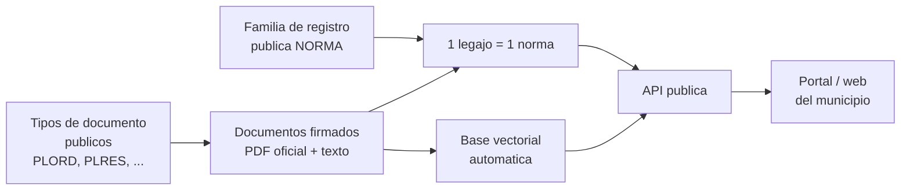

# Digesto Normativo Público

El **Digesto Normativo** es la aplicacion mas directa del modelo de [Documentos y Legajos Públicos](documentos-publicos.md): publicar en internet, **sin login**, toda la normativa del municipio (ordenanzas, resoluciones, decretos, comunicaciones) de forma ordenada, buscable y consumible por sistemas propios.

!!! abstract "La idea en una frase"
    Cada norma vive como un **documento publico firmado** (el PDF oficial) vinculado a un **legajo publico** (la ficha de la norma: numero, tipo, materia, fecha, estado de vigencia). El sistema genera automaticamente la **base vectorial** que permite busqueda inteligente, y una **API publica** de solo lectura entrega todo para el portal web del municipio.

El resultado: un digesto siempre actualizado, donde publicar una norma nueva es simplemente **firmarla y vincularla a su legajo** — sin cargas dobles ni sitios paralelos que mantener.

---

## Arquitectura del digesto

| Pieza | Rol en el digesto |
|-------|-------------------|
| **Tipos de documento publicos** | Definen que clase de normas se publican (Ordenanza, Resolucion, etc.) |
| **Documentos firmados** | El texto oficial de cada norma: PDF firmado + transcripcion |
| **Base vectorial** | Se genera sola al subir cada documento; habilita la busqueda por significado |
| **Familia de registro publica** | La ficha estructurada de cada norma (campos publicos y privados) |
| **Legajos** | Un legajo por norma: agrupa la norma, sus anexos y modificatorias |
| **API publica** | El punto de consumo para el portal de digesto del municipio |

---

## Paso 1 — Configurar los tipos de documento publico

En [Tipos de Documentos](tipos-de-documentos.md) se crean los tipos que van a contener la normativa, con **Visibilidad: Público**. La convencion recomendada para normativa del Poder Legislativo:

| Acronimo | Nombre | Contiene |
|----------|--------|----------|
| **PLORD** | Poder Legislativo - Ordenanza | Ordenanzas del HCD |
| **PLRES** | Poder Legislativo - Resolucion | Resoluciones del HCD |
| **PLCOM** | Poder Legislativo - Comunicacion | Comunicaciones del HCD |
| **PLDEC** | Poder Legislativo - Decreto | Decretos del HCD |

Se pueden agregar los que el municipio necesite (por ejemplo decretos del Ejecutivo que reglamentan ordenanzas), siempre con el mismo criterio: **un tipo por clase de norma**.

!!! danger "Público es irreversible: decidir antes de crear"
    La visibilidad de un tipo de documento se elige **una sola vez, al crearlo**, y no se puede volver atras. Todos los PDFs firmados de estos tipos quedan accesibles por cualquier persona en internet. Para un digesto esto es exactamente lo buscado — la normativa es publica por naturaleza — pero conviene verificar que por estos tipos **solo** vaya a circular normativa, nunca documentos con datos personales. Ver [Publicar un Tipo de Documento](documentos-publicos.md#publicar-un-tipo-de-documento).

!!! warning "El acronimo del municipio queda congelado"
    Las URLs publicas dependen del acronimo del municipio. Desde que existe el primer tipo publico, el acronimo **no se puede cambiar**. Elegirlo bien antes de arrancar.

---

## Paso 2 — Subir los documentos (la base vectorial se genera sola)

Con los tipos creados, se sube la normativa: las normas nuevas por el circuito normal de firma, y el acervo historico como **documentos importados** (PDF) que se firman digitalmente al ingresar.

Por cada documento firmado de un tipo publico, el sistema hace automaticamente:

1. **Publica el PDF oficial**: se copia al espacio publico y queda accesible por una URL estable (`pdf_url`).
2. **Transcribe el contenido**: extrae el texto completo del PDF (incluso escaneados, via OCR).
3. **Genera el resumen**: un resumen automatico del contenido de la norma.
4. **Construye la base vectorial**: genera los *embeddings* del texto, que alimentan la busqueda semantica.

!!! tip "No hay nada que configurar"
    La transcripcion, el resumen y la base vectorial **vienen de fabrica**: no hay que activar ni configurar nada. Subir y firmar el documento alcanza; unos minutos despues el contenido ya es buscable por significado (por ejemplo, buscar *"habilitacion de comercios gastronomicos"* encuentra normas que no usan esas palabras exactas).

!!! info "Cargas masivas del acervo historico"
    Para digitalizar anos de normativa acumulada (miles de PDFs), GDI acompana el proceso con un pipeline de carga masiva que sube, firma, transcribe y crea los legajos en tandas. Consultar al equipo de GDI antes de encarar una carga historica a mano.

---

## Paso 3 — Crear la familia de legajos publica

La ficha de cada norma vive en un **legajo** de una [Familia de Registro](familias-registro.md) dedicada a normativa (convencion: codigo **NORMA**). En la familia se definen **todos** los campos que el municipio quiere registrar — publicos y privados — y despues se marca **cuales se publican**.

Un esquema de datos tipico para normativa:

| Campo | Ejemplo | ¿Publicarlo? |
|-------|---------|--------------|
| `tipo_norma` | Ordenanza | Si |
| `numero_norma` | 5383 | Si |
| `fecha_sancion` | 12/06/2026 | Si |
| `materia` | Habilitaciones comerciales | Si |
| `expediente` | 18045/24 | Segun criterio del municipio |
| `sesion` | Ordinaria 08/2026 | Segun criterio del municipio |
| Notas internas de seguimiento | — | No |

Luego se activa la **Publicación Pública** de la familia y se configura que se expone:

- **Campos públicos**: solo los tildados salen por la API; el resto nunca se publica.
- **Estados visibles**: por ejemplo, publicar solo los legajos en estado *Vigente*. Una norma **derogada** puede mantenerse visible (con su estado a la vista) o salir del digesto automaticamente al cambiar de estado — lo decide el municipio con los estados que marca.
- **Mostrar documentos vinculados**: activarlo — es lo que conecta la ficha de la norma con su PDF y su texto.
- **Mostrar legajos relacionados**: activarlo si se quiere navegar de una norma a sus modificatorias.

La mecanica completa (dialogos, validaciones, reversibilidad) esta en [Familias de Registro públicas](documentos-publicos.md#familias-de-registro-publicas).

!!! tip "La familia publica es reversible"
    A diferencia de los tipos de documento, la publicacion de la familia se puede **prender y apagar** cuando se quiera, y la configuracion de campos y estados se ajusta en cualquier momento.

---

## Paso 4 — Vincular cada documento a su legajo

La regla de oro del digesto: **1 legajo = 1 normativa**. Por cada norma se crea un legajo de la familia NORMA, se completan sus campos y se le vinculan sus documentos:

- El documento principal (el texto de la ordenanza o resolucion).
- Sus **anexos** (planos, tablas, nomencladores), cada uno como documento propio.
- Con el tiempo, sus **modificatorias y textos ordenados**, para que el legajo cuente la historia completa de la norma.

Asi, quien consulta la Ordenanza 5383 ve **una sola ficha** con todos sus documentos, su estado de vigencia y sus normas relacionadas — en lugar de PDFs sueltos.

!!! tip "Normas extensas: separar en capitulos"
    Para normativas tipo **Codigo de Edificacion, Codigo de Ordenamiento Territorial o Fiscal/Tributaria** (cientos de paginas), se recomienda **separar el texto en capitulos**, subiendo cada capitulo como un documento propio, todos vinculados al mismo legajo. Ventajas:

    - Los motores de IA procesan **mucho mejor** documentos acotados: la transcripcion, el resumen y la busqueda semantica ganan precision cuando cada documento trata un solo tema.
    - Una modificacion puntual (por ejemplo, un articulo del capitulo de usos del suelo) se resuelve reemplazando **un capitulo**, no re-procesando el codigo entero.
    - El ciudadano llega directo al capitulo que le interesa, sin descargar un PDF gigante.

!!! info "Relaciones entre normas"
    Las relaciones entre legajos permiten modelar el tejido normativo: una ordenanza *modifica* a otra, un decreto *reglamenta* una ordenanza, un texto ordenado *reemplaza* versiones anteriores. Ver [Relaciones y Vinculos](../usuarios/legajos/relaciones.md).

---

## Paso 5 — Conectar el digesto a la web del municipio

Con todo publicado, el digesto se consume desde la **API publica** de solo lectura: el municipio arma su portal de digesto (o integra el existente) contra estos endpoints, bajo `/api/v1/public/{muni}/...`:

| Necesidad del portal | Endpoint |
|----------------------|----------|
| Buscador del digesto (texto + significado) | `GET .../search?q=...` |
| Listado de normas, paginado y filtrable | `GET .../registries/NORMA/records` |
| Ficha de una norma (campos + documentos + relacionadas) | `GET .../records/{record_number}` |
| Texto completo de la norma en HTML | `GET .../documents/{document_id}/content` |
| Descarga del PDF oficial firmado | `pdf_url` (link directo, sin API Key) |

La referencia completa — autenticacion con `X-API-Key`, parametros, ejemplos de request/respuesta, codigos de error y buenas practicas — esta en [API pública](documentos-publicos.md#api-publica).

!!! warning "La API Key vive en el servidor del municipio"
    La API se consume **server-to-server**: el backend del portal municipal llama a GDI con su API Key y arma las paginas. La clave **nunca** debe viajar al navegador. El unico recurso de acceso directo y anonimo es el `pdf_url` de cada PDF publico.

!!! info "Flujo tipico del portal de digesto"
    1. `GET /registries` → confirma la familia NORMA y sus campos publicos.
    2. `GET /registries/NORMA/records` → listado de normas para el buscador/indice.
    3. `GET /records/{record_number}` → ficha de la norma, con `pdf_url` y `document_id` de cada documento.
    4. `GET /documents/{document_id}/content` → texto HTML para mostrar la norma en la pagina (sanitizar antes de renderizar).

---

## Checklist de puesta en marcha

- [ ] Acronimo del municipio definitivo (queda congelado al publicar).
- [ ] Tipos de documento publicos creados (PLORD, PLRES y los que correspondan).
- [ ] Normativa subida y firmada (nueva por circuito normal; historica por carga masiva).
- [ ] Familia NORMA creada, con esquema de datos completo (campos publicos y privados).
- [ ] Publicación Pública de la familia activada: campos, estados y vinculados configurados.
- [ ] Un legajo por norma, con sus documentos vinculados (capitulos separados en codigos extensos).
- [ ] API Key del municipio entregada al equipo tecnico por canal seguro.
- [ ] Portal del municipio integrado contra la API publica.

!!! note "Regimen permanente"
    Una vez en marcha, el digesto se mantiene solo: sancionada una norma nueva, se firma su documento (tipo publico), se crea su legajo y se vincula. Aparece en el portal automaticamente, con su texto buscable — sin ningun paso extra de "publicacion".
