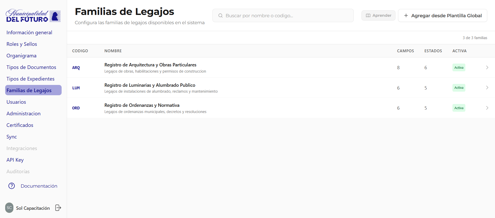
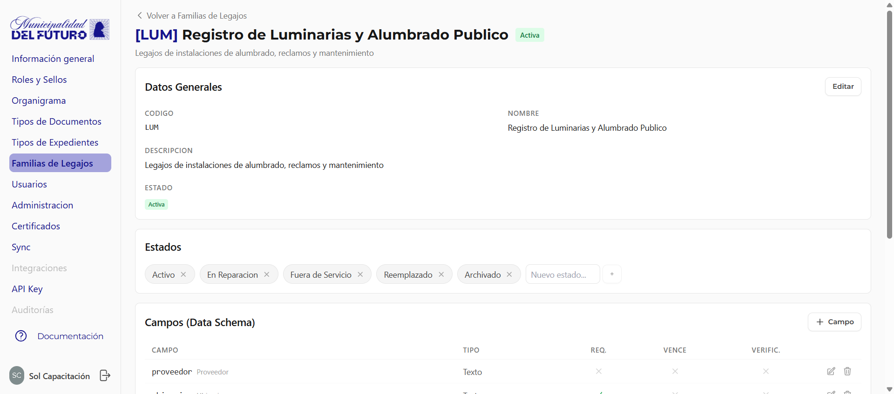

# Familias de Registro (RLM)

Gestiona las familias de registro del sistema. Las familias son plantillas que definen la estructura de los legajos: que campos tiene cada tipo de legajo, que sectores pueden operar con el, y que estados puede atravesar.

---

## Que es una Familia de Registro

Una familia de registro es una **plantilla reutilizable** que define como se estructura un tipo de legajo. Pensala como un formulario modelo: establece que datos se cargan, quien puede acceder y que ciclo de vida sigue el legajo.

!!! example "Ejemplo practico"
    La familia **ARQ** (Arquitectura) podria definir que cada legajo de obra debe tener: nombre del titular, numero de plano, fecha de presentacion, superficie en m2, y un campo de observaciones. Solo los sectores de Obras Privadas y Catastro pueden crear y ver estos legajos.

Cada familia tiene un **codigo unico** de entre 3 y 8 caracteres (ej: `ARQ`, `LUM`, `ORD`, `HABCOM`) que la identifica en todo el sistema.

---

## Familias Globales vs Personalizadas

El sistema maneja dos tipos de familias:

| Tipo | Descripcion |
|------|-------------|
| **Global** | Viene del catalogo global de GDI. Disponible para todas las organizaciones. No se puede modificar su estructura base |
| **Personalizada** | Creada por la organizacion para necesidades especificas del municipio. Totalmente configurable |

!!! info "Catalogo global"
    Las familias globales son mantenidas por GDI Latam y representan los tipos de legajo mas comunes en la gestion municipal. Tu organizacion puede habilitarlas desde el catalogo y ajustar los permisos por sector.

---

## Listado de Familias

La tabla muestra todas las familias habilitadas para la organizacion.

| Columna | Descripcion |
|---------|-------------|
| **Codigo** | Codigo unico de la familia (3-8 caracteres, ej: `ARQ`, `LUM`) |
| **Nombre** | Nombre descriptivo de la familia |
| **Campos** | Cantidad de campos configurados en el esquema de datos |
| **Sectores** | Cantidad de sectores con permisos asignados |
| **Estado** | `Activo` o `Inactivo` |

### Acciones del listado

| Accion | Descripcion |
|--------|-------------|
| **+ Nueva Familia** | Crear una familia personalizada |
| **+ Catalogo Global** | Habilitar una familia del catalogo global |

---

## Crear una Familia

Hay dos formas de crear una familia:

### Opcion A: Desde el catalogo global

1. Presiona **"+ Catalogo Global"**
2. Se muestra la lista de plantillas globales disponibles (las que ya estan habilitadas aparecen marcadas)
3. Selecciona la plantilla que queres habilitar
4. Se crea la familia con los campos y estados predefinidos de la plantilla
5. Ajusta los permisos por sector segun tu organizacion

### Opcion B: Familia personalizada

1. Presiona **"+ Nueva Familia"**
2. Completa el formulario:

| Campo | Descripcion |
|-------|-------------|
| **Codigo** | Codigo unico de 3 a 8 caracteres. Solo letras mayusculas y numeros. No se puede cambiar despues de creado |
| **Nombre** | Nombre descriptivo de la familia (ej: *Legajo de Obra Privada*) |
| **Descripcion** | Texto opcional que explica el uso de la familia |

!!! warning "El codigo es permanente"
    Una vez creada la familia, el codigo no se puede modificar. Elegi un codigo claro y representativo. Ejemplos: `ARQ` para Arquitectura, `LUM` para Luminarias, `ORD` para Ordenanzas, `HABCOM` para Habilitaciones Comerciales.

Si no defines estados al crear, el sistema asigna por defecto: *Activo* e *Inactivo*.

---

## Editar una Familia

Desde el detalle de la familia podes modificar:

| Campo | Editable | Descripcion |
|-------|:--------:|-------------|
| **Codigo** | No | El codigo es permanente, no se puede cambiar |
| **Nombre** | Si | Nombre descriptivo de la familia |
| **Descripcion** | Si | Texto que explica el uso de la familia |
| **Estado** | Si | Activar o desactivar la familia (ver [Desactivar una familia](#desactivar-una-familia)) |

---

## Configurar Campos (Data Schema)

Cada familia define un esquema de datos: los campos que va a tener cada legajo creado con esa familia.

### Agregar un campo

1. En el detalle de la familia, busca la seccion **Campos**
2. Presiona **"+ Agregar campo"**
3. Completa las propiedades del campo:

| Propiedad | Descripcion |
|-----------|-------------|
| **Clave** | Identificador interno del campo (minusculas, numeros y guion bajo). No se puede cambiar despues |
| **Nombre** | Nombre del campo tal como lo ve el usuario (ej: *Nombre del titular*, *Superficie m2*). Maximo 100 caracteres |
| **Tipo** | Tipo de dato del campo (ver tabla de tipos) |
| **Obligatorio** | Si el campo es requerido al crear o editar el legajo |
| **Vencimiento** | Si el campo tiene fecha de vencimiento asociada |
| **Verificacion** | Si el campo requiere verificacion por un usuario autorizado |

### Editar un campo

1. Hace click en el campo que queres modificar
2. Podes cambiar: nombre, obligatoriedad, vencimiento y verificacion
3. Guarda los cambios

!!! warning "El tipo no se puede cambiar"
    Una vez creado el campo, no se puede cambiar su tipo (text, number, date, etc.). Si necesitas un tipo diferente, crea un campo nuevo y elimina el anterior.

### Eliminar un campo

1. Hace click en el icono de eliminar junto al campo
2. Confirma la eliminacion

!!! warning "Campos con datos"
    No se puede eliminar un campo si hay legajos que ya tienen datos cargados en ese campo. El sistema muestra cuantos legajos estan afectados. Para eliminar el campo, primero hay que limpiar los datos de esos legajos.

### Tipos de campo disponibles

| Tipo | Descripcion | Ejemplo de uso |
|------|-------------|----------------|
| **text** | Texto corto, una linea | Nombre del titular, Numero de plano |
| **number** | Valor numerico | Superficie en m2, Cantidad de pisos |
| **date** | Fecha con selector de calendario | Fecha de presentacion, Fecha de vencimiento |
| **textarea** | Texto largo, multiples lineas | Observaciones, Descripcion de la obra |
| **select** | Lista desplegable con opciones predefinidas | Estado de la obra (En curso, Finalizada, Paralizada) |
| **boolean** | Casilla de verificacion (si/no) | Tiene plano aprobado, Requiere inspeccion |
| **file** | Archivo adjunto | Plano aprobado, Foto del frente, Certificado escaneado |

!!! tip "Campo tipo select"
    Para campos de tipo `select`, se configura la lista de opciones disponibles. Por ejemplo, para un campo "Estado de obra" las opciones podrian ser: *En curso*, *Finalizada*, *Paralizada*, *Demolicion*.

!!! tip "Campos con vencimiento"
    Cuando marcas un campo como "con vencimiento", el sistema muestra visualmente cuando la fecha cargada en ese campo esta proxima a vencer o ya vencio. Esto es util para habilitaciones, certificados o permisos temporales.

!!! info "Campos con verificacion"
    Un campo marcado como "requiere verificacion" necesita que un usuario con permiso `can_verify` lo valide adjuntando un documento oficial. Hasta que no se verifique, el campo queda marcado como pendiente.

---

## Permisos por Sector

Cada familia define que sectores pueden operar con sus legajos y con que nivel de acceso.

### Agregar un sector

1. En el detalle de la familia, busca la seccion **Permisos**
2. Presiona **"+ Agregar sector"**
3. Selecciona el sector de la lista
4. Configura los permisos que correspondan
5. Guarda

!!! warning "Un sector por vez"
    Cada sector solo puede aparecer una vez en la lista de permisos. Si el sector ya esta agregado, editalo en lugar de intentar agregarlo de nuevo.

### Permisos disponibles

Cada sector recibe una combinacion de los siguientes permisos:

| Permiso | Descripcion | Por defecto |
|---------|-------------|:-----------:|
| **can_view** | Puede ver y consultar los legajos | Si |
| **can_create** | Puede crear nuevos legajos de esta familia | No |
| **can_edit** | Puede editar los datos de legajos existentes | No |
| **can_verify** | Puede verificar campos que requieren verificacion | No |

### Editar permisos de un sector

1. Busca el sector en la tabla de permisos
2. Modifica los checkboxes de permisos
3. Guarda los cambios

Los cambios de permisos aplican inmediatamente para todos los usuarios de ese sector.

### Quitar un sector

1. Busca el sector en la tabla de permisos
2. Presiona el boton de eliminar
3. Confirma la eliminacion

!!! warning "Quitar permisos"
    Al quitar un sector, todos los usuarios de ese sector pierden acceso a los legajos de esta familia inmediatamente. Los legajos no se eliminan, solo dejan de ser visibles para esos usuarios.

!!! example "Ejemplo de configuracion de permisos"
    Para la familia **ARQ** (Arquitectura):

    | Sector | can_create | can_edit | can_view | can_verify |
    |--------|:----------:|:--------:|:--------:|:----------:|
    | Obras Privadas | Si | Si | Si | Si |
    | Catastro | No | No | Si | Si |
    | Mesa de Entradas | Si | No | Si | No |
    | Intendencia | No | No | Si | No |

    En este ejemplo, Obras Privadas tiene control total. Mesa de Entradas puede crear legajos nuevos y verlos, pero no editarlos ni verificar campos. Catastro puede ver y verificar. Intendencia solo puede consultar.

!!! tip "Permisos del usuario"
    Si un usuario pertenece a multiples sectores (sector principal + sectores adicionales), el sistema evalua los permisos de **todos** sus sectores. Si cualquiera de sus sectores tiene el permiso, se le autoriza la accion.

---

## Estados Configurables

Cada familia puede definir sus propios **estados** que representan el ciclo de vida de un legajo.

### Configurar estados

Los estados se configuran al **editar la familia**:

1. Abri el detalle de la familia
2. Edita el campo **Estados**
3. Agrega, quita o reordena los estados de la lista
4. Guarda los cambios

!!! example "Ejemplo de estados"
    La familia **HABCOM** (Habilitaciones Comerciales) podria tener los siguientes estados:

    - Ingresado
    - En revision
    - Observado
    - Aprobado
    - Rechazado
    - Vencido

!!! info "Sin restricciones de transicion"
    Los usuarios con permiso de edicion pueden cambiar el estado de un legajo a cualquier otro estado de la lista. No hay restricciones de transicion (ej: no se fuerza un orden). Cada cambio de estado queda registrado en el historial del legajo.

!!! tip "Estados por defecto"
    Si no defines estados al crear una familia, el sistema asigna por defecto: *Activo* e *Inactivo*. Podes cambiarlos en cualquier momento.

Los estados permiten hacer seguimiento del progreso de cada legajo y filtrar legajos por su situacion actual.

---

## Desactivar una familia

Si una familia ya no se usa, podes desactivarla:

1. Abri el detalle de la familia
2. Presiona **Desactivar**
3. Confirma la accion

!!! warning "Solo si no hay legajos activos"
    No se puede desactivar una familia si tiene legajos creados. El sistema muestra cuantos legajos estan asociados. Para desactivar, primero hay que archivar o eliminar los legajos de esa familia.

La desactivacion es un **soft delete**: la familia no se elimina, solo se marca como inactiva. Los legajos existentes siguen siendo consultables pero no se pueden crear nuevos.

---

## Resumen de configuracion

Para dejar una familia lista para usar, segui estos pasos:

1. **Crear la familia** con codigo, nombre y descripcion (o habilitarla desde el catalogo global)
2. **Definir los campos** del esquema de datos (clave, tipo, obligatoriedad, vencimiento, verificacion)
3. **Agregar sectores** con sus permisos especificos (can_view, can_create, can_edit, can_verify)
4. **Configurar los estados** del ciclo de vida del legajo

!!! tip "Orden recomendado"
    Es mas facil configurar primero los campos y estados, y luego asignar los permisos por sector. Asi cuando pruebes con un usuario, ya va a ver la estructura completa del legajo.
