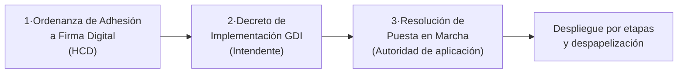

# Hoja de Ruta Normativa

Qué normas dictar, en qué orden y quién firma cada una. El paquete son **tres documentos**: la secuencia está pensada para que ninguna etapa del despliegue de GDI quede sin respaldo jurídico, sin frenar el arranque operativo del sistema.

---

## Secuencia

| Paso | Norma | Quién la dicta | Cuándo | Modelo |
|------|-------|----------------|--------|--------|
| 1 | Ordenanza de Adhesión a Firma Digital | HCD | Antes o durante la configuración inicial | [Modelo 1](modelos/ordenanza-adhesion-firma-digital.md) |
| 2 | Decreto de Implementación GDI | Intendente | Tras la promulgación de la ordenanza | [Modelo 2](modelos/decreto-reglamentario.md) |
| 3 | Resolución de Puesta en Marcha (y una por cada etapa siguiente) | Autoridad de aplicación | Al iniciar la operación | [Modelo 3](modelos/resolucion-etapas.md) |

El reparto de roles es deliberado: el **HCD** da el marco jurídico (adhesión a firma digital, sin atarse a ningún sistema), el **Intendente** decide la herramienta y el carácter progresivo, integral y continuo de la implementación, y la **autoridad de aplicación** opera el despliegue con actos administrativos simples que no requieren volver al Concejo.

!!! tip "¿Y si no se puede esperar al HCD?"
    GDI puede arrancar en paralelo al trámite legislativo: la configuración, la capacitación y los primeros circuitos internos (notas, memos) no requieren la ordenanza sancionada. Lo que **sí** conviene que espere a la norma marco es la obligatoriedad general y el reemplazo del papel como original en trámites con efectos frente a terceros.

## Checklist normativo de implementación

- [ ] Identificada la ley provincial de adhesión a la Ley 25.506, si existe (en PBA: Ley 13.666, modificada por la Ley 14.828) — se completa en los corchetes de los tres modelos.
- [ ] Verificado si existe ordenanza previa de adhesión a firma digital (caso Salta: ya existía — se preserva, se cita en el Visto del decreto y el Modelo 1 no hace falta).
- [ ] Proyecto de ordenanza adaptado al municipio y girado a Legal y Técnica, con mensaje de elevación del Intendente.
- [ ] Ordenanza sancionada y promulgada.
- [ ] Decreto de implementación dictado: GDI aprobado, validez del expediente electrónico, autoridad de aplicación designada.
- [ ] Resolución de puesta en marcha dictada: módulos de Documentos y Expedientes habilitados.
- [ ] Resoluciones de etapas siguientes según el avance del despliegue (áreas, tipos documentales, fechas de obligatoriedad).
- [ ] (Si se digitaliza papel con valor de original) Protocolo de digitalización aprobado — [material adicional](modelos/protocolo-digitalizacion.md).
- [ ] (Si se abren trámites a distancia para vecinos) Términos y condiciones aprobados — [complementarios](modelos/complementarios.md).
- [ ] (Opcional) Acuerdo con el HCD para extender GDI al Concejo Deliberante.

## Casos según el punto de partida

| Situación del municipio | Camino sugerido |
|-------------------------|-----------------|
| Sin ninguna norma previa de firma digital | Paquete completo: Modelos 1 → 2 → 3 |
| Ya adherido a Ley 25.506 por ordenanza vieja | El Modelo 1 no hace falta: la ordenanza previa se cita en el Visto del decreto (Modelo 2), que puede dictarse directamente |
| Migración desde GDE/GDEBA u otro sistema | La norma que aprobó aquel sistema suele servir de base; el decreto (Modelo 2) designa a GDI como plataforma y regula la migración. En la resolución (Modelo 3) la equivalencia es GEDO → Documentos, EE → Expedientes |
| HCD quiere usar GDI también | El Modelo 1 ya autoriza la firma digital en todo el ámbito municipal (incluido el HCD); la incorporación operativa se hace por resolución de presidencia del HCD |
| El municipio quiere marco estratégico amplio | Sumar la [Ordenanza Plan de Evolución Tecnológica](modelos/plan-evolucion-tecnologica.md) junto al Modelo 1 |
| Varios municipios avanzan juntos | Convenio marco de cooperación intermunicipal + actas de adhesión ([complementarios](modelos/complementarios.md)) |
