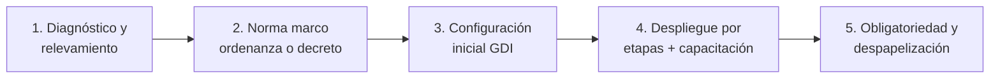

---
hide:
  - toc
---

# Implementación GDI

**Guía de implementación** del Sistema de Gestión Documental Inteligente en un municipio: marco normativo, hoja de ruta y modelos de normas listos para adaptar.

Implementar GDI no es solo un proyecto tecnológico: para que el expediente electrónico y la firma digital tengan plena validez jurídica, el municipio necesita un **respaldo normativo** (ordenanza, decreto reglamentario y actos administrativos de despliegue). Esta sección documenta ese camino completo.

---

-   :material-scale-balance:{ .lg .middle } **Marco Normativo**

    ---

    El encuadre legal de la gestión documental electrónica en Argentina: leyes nacionales, adhesiones provinciales y antecedentes municipales reales.

    [:octicons-arrow-right-24: Ver sección](marco-normativo.md)

-   :material-map-marker-path:{ .lg .middle } **Hoja de Ruta Normativa**

    ---

    Qué normas dictar, en qué orden y quién las firma: del proyecto de ordenanza a la resolución de cada etapa de despliegue.

    [:octicons-arrow-right-24: Ver sección](hoja-de-ruta.md)

-   :material-file-document-edit:{ .lg .middle } **Modelos de Normas**

    ---

    El paquete de tres documentos: ordenanza de adhesión a firma digital, decreto de implementación GDI y resolución de puesta en marcha. Más material adicional para escenarios específicos.

    [:octicons-arrow-right-24: Ver modelos](modelos/index.md)

---

## Las dos dimensiones de la implementación

| Dimensión | Qué incluye | Quién la lleva |
|-----------|-------------|----------------|
| **Normativa** | Ordenanza, decreto reglamentario, resoluciones de despliegue, protocolo de digitalización | Intendencia, Secretaría de Gobierno / Legal y Técnica, HCD |
| **Operativa** | Organigrama, roles y sellos, tipos de documento y expediente, usuarios, capacitación | Autoridad de aplicación + equipo GDI |

La dimensión operativa está documentada en el resto de la sección [Administradores](../index.md). Esta sección cubre la dimensión normativa y la secuencia general del proyecto.

## Etapas típicas de un proyecto GDI

1. **Diagnóstico**: relevamiento de circuitos, tipos de documento y expediente, estructura del organigrama y estado de la firma digital en el municipio.
2. **Norma marco**: sanción de la ordenanza (o decreto, según el esquema institucional) que da validez al documento y expediente electrónico. Ver [Hoja de Ruta](hoja-de-ruta.md).
3. **Configuración inicial**: carga del organigrama, roles y sellos, tipos de documento y usuarios en el [BackOffice](../index.md).
4. **Despliegue por etapas**: incorporación progresiva de secretarías y trámites, con capacitación por área y resoluciones de obligatoriedad. 
5. **Despapelización**: el documento electrónico pasa a ser el original; el papel queda como excepción regulada por el [Protocolo de Digitalización](modelos/protocolo-digitalizacion.md).

!!! tip "Modelos editables"
    Todos los modelos de esta sección están disponibles también en formato Word (.docx) para entregar al área de Legal y Técnica del municipio. Solicitalos a tu contacto de implementación GDI.
