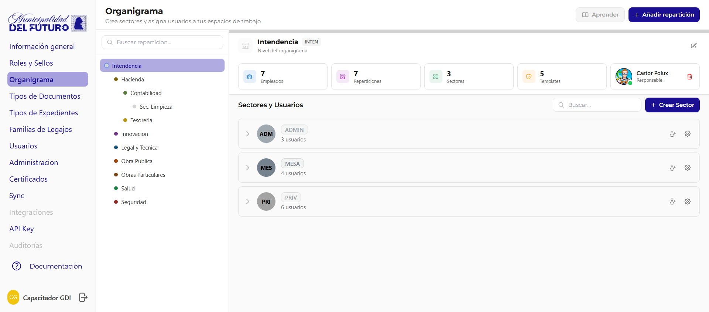
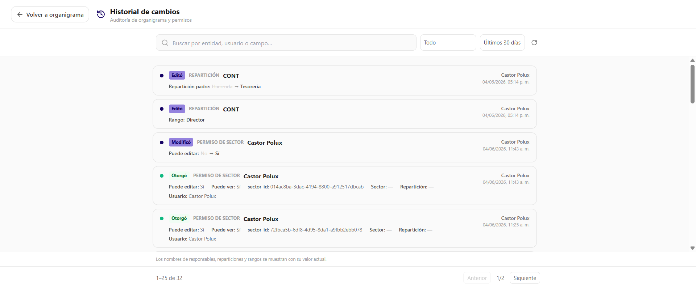

# Organigrama

Crea nuevos sectores y asigna usuarios a tus espacios de trabajo. El organigrama define la estructura organizativa de la organizacion: reparticiones (departamentos) y sectores.

!!! video "Video tutorial"
    **GDI BackOffice — Organigrama: reparticiones y sectores**

    
<iframe src="https://www.youtube-nocookie.com/embed/hclnkyEnSDs?list=PLbbUEsKhLkuc" title="GDI BackOffice — Organigrama: reparticiones y sectores" loading="lazy" allow="accelerometer; autoplay; clipboard-write; encrypted-media; gyroscope; picture-in-picture; web-share" allowfullscreen></iframe>

---

## Diseño general

La pantalla tiene tres zonas principales:

| Zona | Descripcion |
|------|-------------|
| **Panel izquierdo** | Arbol **ESTRUCTURA** con todas las reparticiones (colapsable y redimensionable). Muestra la cantidad total de reparticiones y la jerarquia (reparticion padre -> sub-reparticiones) |
| **Panel derecho** | Detalle de la reparticion seleccionada: nombre, rango, acronimos, tarjeta de responsable, stats, sectores y sub-reparticiones |
| **Modales centrados** | Crear reparticion, crear sector, detalle de sector y detalle de reparticion se abren como dialogos modales |

Arriba a la derecha de la pagina hay tres botones:

| Boton | Que hace |
|-------|----------|
| **Exportar** | Exporta la estructura del organigrama |
| **Audit** | Abre la auditoria legible de organigrama y permisos (ver [Auditoria de organigrama](#auditoria-de-organigrama-audit)) |
| **Nueva reparticion** | Crea una nueva reparticion |

El panel izquierdo se puede colapsar con el boton lateral y redimensionar arrastrando el borde.

---

## Arbol de Reparticiones (ESTRUCTURA)

El panel izquierdo muestra todas las reparticiones de la organizacion en formato jerarquico, con la cantidad total de reparticiones en el encabezado. Cada reparticion tiene un **color** identificatorio y puede contener sub-reparticiones anidadas (reparticion padre -> sub-reparticiones).

Al seleccionar una reparticion, el panel derecho se actualiza con su detalle.

---

## Detalle de Reparticion

Al seleccionar una reparticion, el panel derecho muestra:

- **Nombre** de la reparticion
- **Rango** jerarquico asociado
- **Acronimos**: lista de siglas de los sectores de la reparticion (por ejemplo `INTEN2#ADMIN`, `INTEN2#PRIV`, etc.)
- Tarjeta **RESPONSABLE** con la persona asignada y un boton para cambiar responsable
- Boton **Editar Reparticion** para abrir el modal de detalle/edicion
- Contadores **N Empleados** | **N Tipos de exp.**

### Responsable

Cada reparticion puede tener un responsable (titular del departamento). El boton de la tarjeta **RESPONSABLE** permite:

| Accion | Descripcion |
|--------|-------------|
| **Asignar responsable** | Buscar y seleccionar un usuario activo. Al asignarlo, se lo mueve automaticamente al sector PRIV del departamento y se le asigna el sello del rango del departamento |
| **Cambiar responsable** | Si ya hay un responsable asignado, se puede reemplazar. El sistema pide confirmacion antes de hacer el cambio |
| **Quitar responsable** | Quita al responsable actual. El departamento queda sin titular asignado |

---

## Estadisticas de la Reparticion

El detalle de la reparticion muestra contadores con los totales de la reparticion seleccionada:

| Estadistica | Descripcion |
|-------------|-------------|
| **Empleados** | Cantidad total de usuarios asignados |
| **Tipos de exp.** | Cantidad de tipos de expediente habilitados para la reparticion |

---

## Sectores y Sub-Reparticiones

Debajo del detalle hay dos pestañas:

| Pestaña | Contenido |
|---------|-----------|
| **Sectores (N)** | Lista de sectores de la reparticion, con un boton **Nuevo Sector** |
| **Sub-Reparticiones (N)** | Sub-reparticiones como tarjetas clicables (color, acronimo, nombre y cantidad de empleados). Hacer clic en una sub-reparticion la selecciona en el arbol |

### Vista "Por sector" / "Por usuario"

Dentro de la pestaña **Sectores** hay un toggle de vista que cambia como se listan los datos:

| Vista | Que muestra |
|-------|-------------|
| **Por sector** | Agrupa por sector. Cada sector lista los usuarios que tiene asignados. Es la vista para administrar los integrantes y permisos de cada sector |
| **Por usuario** | Agrupa por usuario. Permite ver de un vistazo en que sectores esta cada persona |

### Detalle de Sector

Al hacer clic en **Configurar sector** se abre un modal con:

| Dato | Descripcion |
|------|-------------|
| **Acronimo** | Sigla del sector. Editable (excepto en el sector PRIV, que es de sistema) |
| **Color del sector** | Selector de color con paleta predefinida |
| **Usuarios asignados** | Cantidad de usuarios en el sector |

!!! info "Sector PRIV (privado)"
    El sector **PRIV** es el sector de sistema (privado) que se crea automaticamente al crear una reparticion. Solo se puede cambiar su color; el acronimo esta fijo. Ademas, el responsable de la reparticion **no se puede quitar** del sector Privado.

---

## Multi-admin: varios usuarios por sector

Un mismo sector puede tener **varios usuarios** asignados. En la vista **Por sector**, cada sector lista sus integrantes con su permiso:

| Marca | Significado |
|-------|-------------|
| **Principal** | Es el responsable del sector. Cada sector tiene un unico usuario con el badge **Principal** |
| **Ver + Editar** | Resto de usuarios del sector. Tienen permiso de ver y editar, controlado por el toggle **EDITAR** de cada usuario |

### Acciones sobre los usuarios del sector

| Accion | Descripcion |
|--------|-------------|
| **Asignar usuario** | Suma un usuario nuevo al sector |
| **EDITAR** (toggle) | Activa o desactiva el permiso de edicion del usuario en el sector |
| **Configurar sector** | Abre el detalle del sector (acronimo, color) |
| **Quitar del sector** | Quita al usuario del sector |

!!! warning "Quitar al usuario Principal"
    No se puede quitar directamente al usuario **Principal** de un sector. Primero hay que reasignar el principal: el propio boton lo indica con el texto **"Quitar del sector (requiere reasignar el sector principal)"**. En el sector PRIV (privado), el responsable de la reparticion no se puede quitar.

---

## Crear Reparticion

El boton **Nueva reparticion** (en el header de la pagina) o **+ Agregar sub-reparticion** (dentro de Sub-Reparticiones) abre un modal:

| Campo | Obligatorio | Descripcion |
|-------|:-----------:|-------------|
| **Reparticion padre** | Si | Reparticion a la que pertenece |
| **Rango** | No | Rango jerarquico del responsable |
| **Nombre** | Si | Nombre completo (2-100 caracteres) |
| **Acronimo** | Si | Solo letras y numeros, max 20 caracteres, unico |

Al crear la reparticion, el sistema genera automaticamente un sector **PRIV** para ella.

!!! info "El acronimo es solo una etiqueta; la numeracion va por reparticion"
    El acronimo de una reparticion se puede cambiar, pero **cambiarlo no reinicia el contador de los numeros especiales**. Los documentos de [numeracion especial](tipos-de-documentos.md) (contador propio, ej: Decretos, Resoluciones, Disposiciones) llevan un contador atado a la **reparticion**, no a su acronimo: al renombrar el acronimo el contador **sigue la misma secuencia** (…7, 8, 9). Los documentos ya emitidos conservan en su numero el acronimo con el que se emitieron (registro historico), y los nuevos salen con el acronimo nuevo, continuando la misma serie.

    **Si necesitas una numeracion que arranque desde 1, tenes que crear una reparticion nueva** (no alcanza con cambiar el acronimo de una existente).

---

## Crear Sector

El boton **Nuevo Sector** abre un modal:

| Campo | Obligatorio | Descripcion |
|-------|:-----------:|-------------|
| **Reparticion** | Si | Reparticion a la que pertenece (pre-seleccionada si se usa el boton de la reparticion activa) |
| **Acronimo** | Si | Solo letras y numeros, max 10 caracteres, unico dentro de la reparticion |
| **Color** | No | Color identificatorio con paleta predefinida |

---

## Auditoria de organigrama (Audit)

El boton **Audit** en el header de la pagina abre la vista **"Historial de cambios — Auditoria de organigrama y permisos"**. Es una bitacora legible de todas las operaciones registradas automaticamente sobre reparticiones, sectores y permisos de usuario.

### Buscador y filtros

| Control | Descripcion |
|---------|-------------|
| **Buscar** | Caja "Buscar por entidad, usuario o campo" |
| **Filtro por entidad** | `Todo`, `Reparticiones`, `Sectores` o `Permisos de usuario` |
| **Filtro por fecha** | `Ultimos 30 dias`, `Ultimos 7 dias` o `Todo` |
| **Recargar** | Vuelve a cargar el historial |

### Entradas del historial

Cada entrada del historial muestra:

| Dato | Descripcion |
|------|-------------|
| **Accion** | Verbo de la operacion: `Edito`, `Modifico`, `Otorgo`, `Quito` o `Creo` |
| **Entidad** | Objeto afectado: `REPARTICION`, `SECTOR` o `PERMISO DE SECTOR` |
| **Campo y valores** | Campo cambiado con valor anterior -> nuevo. Por ejemplo `Puede editar: No -> Si`, `Responsable: X -> Y`, `Color: ... -> ...` |
| **Quien** | Nombre del usuario que hizo el cambio |
| **Cuando** | Fecha y hora del cambio |

El historial esta **paginado**.

!!! info "Auditoria legible"
    Los nombres de responsables, reparticiones y rangos se muestran con su **valor actual**, para que el historial sea facil de leer aunque la entidad haya cambiado de nombre despues.

---

## Color de Departamento

Al editar el detalle de una reparticion se puede modificar su **color primario**. El color se aplica a la barra superior del header y al avatar de la reparticion. Tambien se puede ajustar el color individual de cada sector hijo desde el mismo panel.

---

## Preguntas frecuentes

??? question "¿Cuantos usuarios puede tener un sector?"
    Varios. Un sector tiene un unico usuario **Principal** (responsable del sector) y puede tener otros usuarios con permiso **Ver + Editar**. Se suman con **Asignar usuario**.

??? question "¿Que es el badge Principal?"
    Marca al responsable del sector. Es unico por sector. Para quitarlo del sector primero hay que reasignar el principal a otro usuario.

??? question "¿Para que sirve la vista Por sector / Por usuario?"
    Son dos formas de leer lo mismo. **Por sector** agrupa los usuarios dentro de cada sector (ideal para administrar permisos). **Por usuario** agrupa por persona para ver en que sectores esta cada una.

??? question "¿Por que no puedo quitar a un usuario del sector PRIV?"
    PRIV es el sector privado de sistema y el responsable de la reparticion no se puede quitar de el. Si es el Principal de otro sector, primero hay que reasignar ese principal.

??? question "¿Que registra la Auditoria (Audit)?"
    Cambios en reparticiones, sectores y permisos de sector: quien los hizo, cuando, y el campo modificado con su valor anterior y nuevo. Se puede filtrar por entidad y por fecha, y buscar por texto.

??? question "Si cambio el acronimo de una reparticion, ¿se reinicia la numeracion?"
    No. En los tipos con [numeracion especial](tipos-de-documentos.md) (contador propio, como Decretos, Resoluciones o Disposiciones) el contador esta atado a la **reparticion**, no a su acronimo. Al cambiar el acronimo la secuencia **continua** donde estaba: los documentos ya emitidos mantienen el acronimo viejo en su numero (registro historico) y los nuevos salen con el acronimo nuevo, dentro de la misma serie. **Para tener una numeracion que empiece desde 1 hay que crear una reparticion nueva.**
