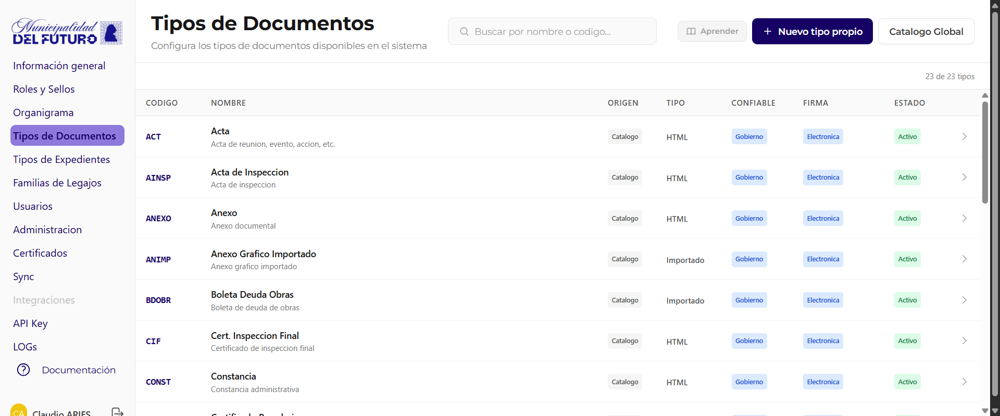
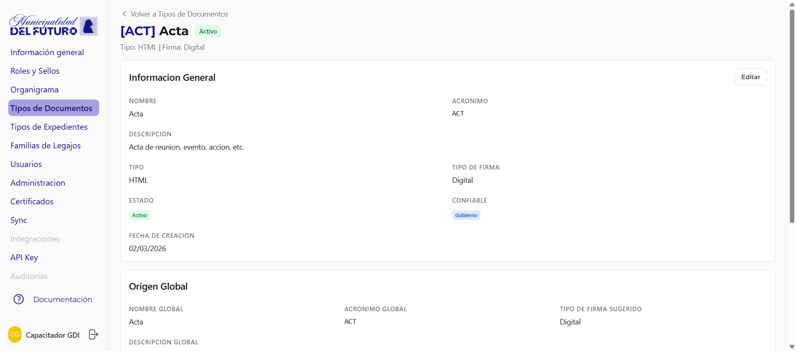
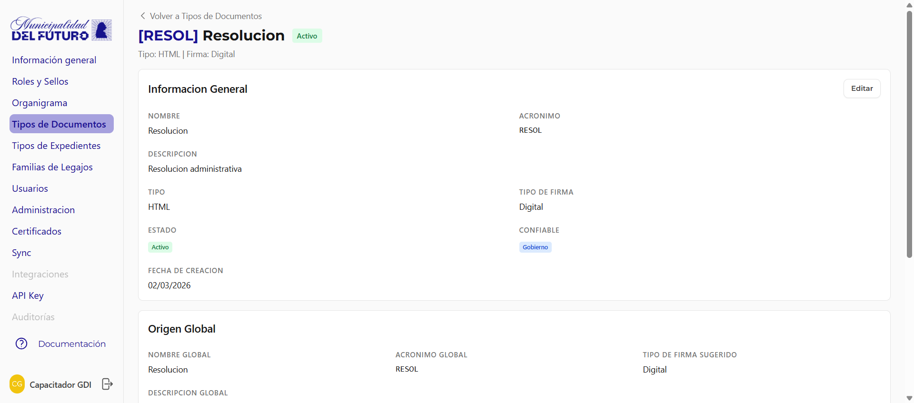
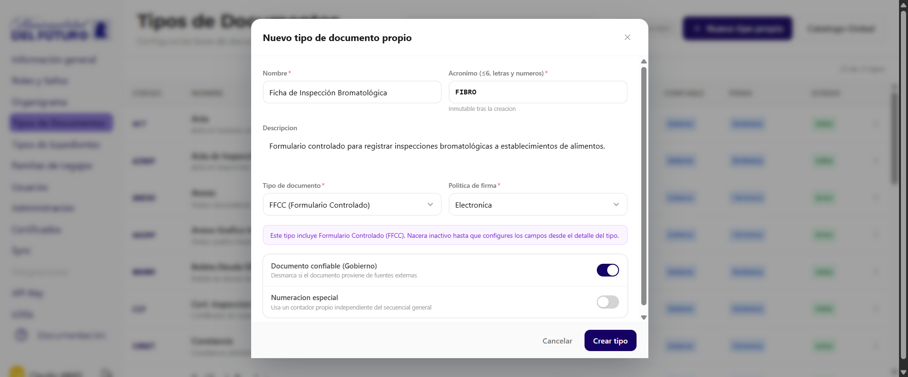
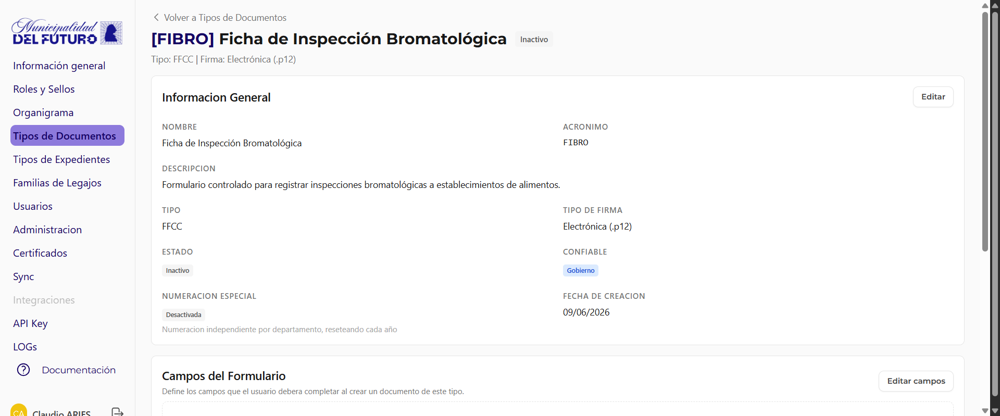
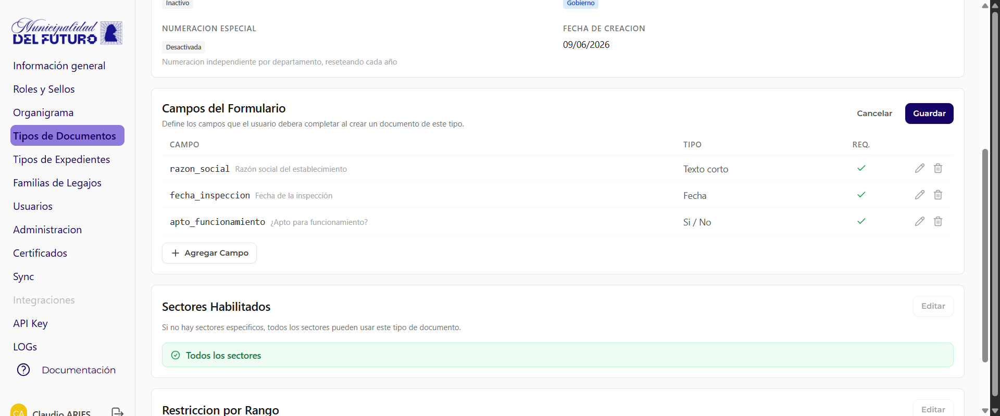
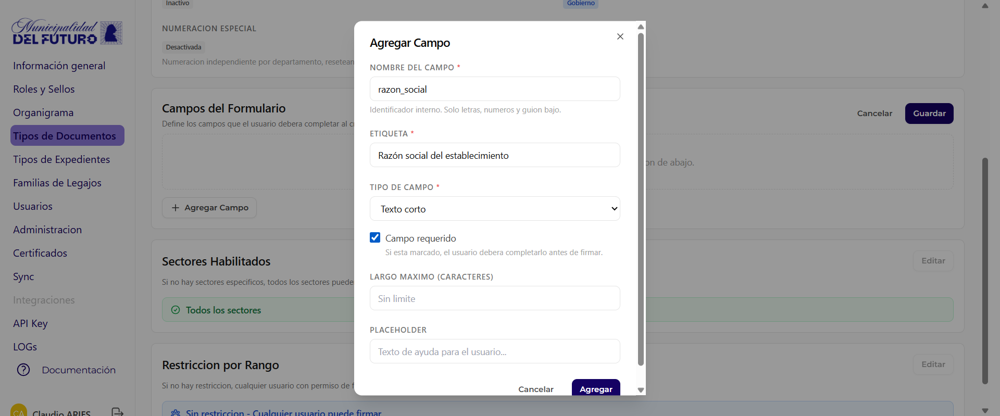
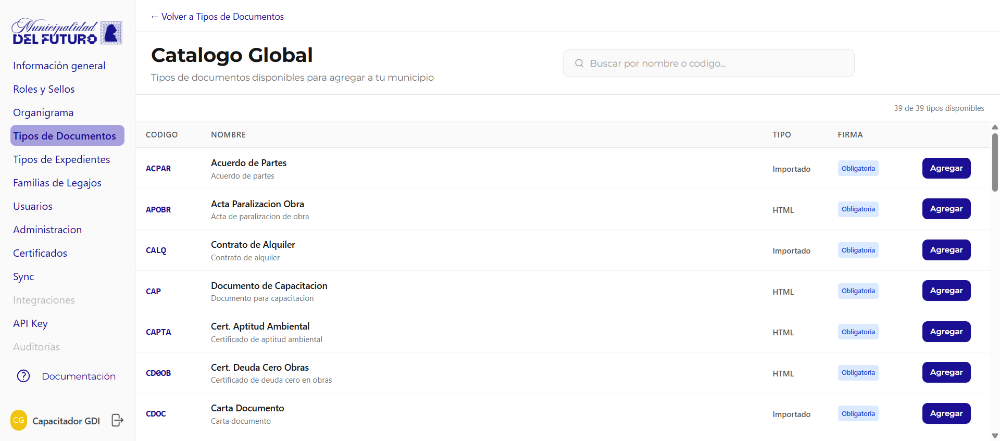

# Tipos de Documentos

Configura los tipos de documentos disponibles en el sistema. Cada organizacion puede **adoptar** tipos del catalogo global o **crear tipos propios** del municipio, y personalizar sus restricciones.

Arriba del listado hay dos botones:

- **Nuevo tipo propio**: crea un tipo de documento exclusivo de tu organizacion.
- **Catalogo Global**: adopta un tipo del catalogo global compartido.

---

## Listado de Tipos

La tabla muestra todos los tipos de documento habilitados para la organizacion.

| Columna | Descripcion |
|---------|-------------|
| **Codigo** | Acronimo unico del tipo (ej: *ACT*, *AINSP*, *ANEXO*) |
| **Nombre** | Nombre completo del tipo y descripcion |
| **Origen** | `Catalogo` (adoptado del catalogo global) o `Propio` (creado por la organizacion) |
| **Tipo** | `HTML` (redactado en editor), `Importado` (PDF cargado), `NOTA`, `MEMO` o `FFCC` (Formulario Controlado) |
| **Confiable** | Nivel de confiabilidad: `Gobierno` (documento oficial) |
| **Firma** | `Electronica`, `Digital (num.)` (solo numeradores) o `Digital (todos)` |
| **Estado** | `Activo` o `Inactivo` |

---

## Detalle de un Tipo de Documento

Al hacer clic en un tipo se muestra su ficha completa:

### Informacion General

| Campo | Descripcion |
|-------|-------------|
| **Nombre** | Nombre del tipo |
| **Acronimo** | Codigo unico |
| **Descripcion** | Descripcion del proposito del tipo |
| **Tipo** | HTML, Importado, NOTA, MEMO o FFCC |
| **Tipo de Firma** | Electronica o Digital |
| **Estado** | Activo / Inactivo |
| **Confiable** | Gobierno |
| **Fecha de Creacion** | Fecha en que se agrego a la organizacion |

### Origen Global

Solo para tipos adoptados del catalogo. Muestra los datos del tipo en el catalogo global (nombre, acronimo, descripcion y tipo de firma sugerido).

### Sectores Habilitados

Define que sectores pueden crear documentos de este tipo.

- **Todos los sectores**: Cualquier sector puede usar este tipo
- **Sectores especificos**: Solo los sectores listados pueden usarlo

### Restriccion por Rango

Define que rango minimo necesita un funcionario para **numerar** (firmar como numerador) documentos de este tipo.

- **Sin restriccion**: Cualquier usuario con permiso de firma puede firmar
- **Nivel N - Rango**: Solo funcionarios con ese rango o superior (ej: *Nivel 2 - Secretario*)

---

## Crear un tipo propio (Nuevo tipo propio)

Ademas de adoptar tipos del catalogo global, podes crear tipos de documento **propios** de tu municipio. El boton **Nuevo tipo propio** abre el modal *Nuevo tipo de documento propio*.

| Campo | Obligatorio | Descripcion |
|-------|-------------|-------------|
| **Nombre** | Si | Nombre completo del tipo |
| **Acronimo** | Si | Hasta 6 caracteres, letras y numeros. **Inmutable** tras la creacion. No puede coincidir con un acronimo del catalogo global |
| **Descripcion** | No | Detalle del proposito del tipo |
| **Tipo de documento** | Si | `HTML`, `NOTA`, `NOTA FFCC`, `MEMO`, `MEMO FFCC`, `FFCC (Formulario Controlado)` o `Importado` |
| **Politica de firma** | Si | `Electronica`, `Digital (todos)` o `Digital (numerados)` |
| **Documento confiable (Gobierno)** | No | Switch que marca el tipo como documento oficial de gobierno |
| **Numeracion especial** | No | Switch: *Usa un contador propio independiente del secuencial general* |

Al completar los datos, el boton **Crear tipo** da de alta el tipo en tu organizacion.

!!! warning "El acronimo es inmutable"
    Elegi el acronimo con cuidado: una vez creado el tipo **no se puede cambiar**. Ademas, no puede coincidir con el acronimo de ningun tipo del catalogo global.

!!! info "Tipos FFCC nacen inactivos"
    Cuando elegis un tipo FFCC (FFCC, NOTA FFCC o MEMO FFCC) aparece la nota: *"Este tipo incluye Formulario Controlado (FFCC). Nacera inactivo hasta que configures los campos desde el detalle del tipo."* El tipo recien se puede activar cuando tiene sus campos configurados.

---

## Formularios Controlados (FFCC)

Un tipo **FFCC** (Formulario Controlado) presenta al usuario un **formulario de campos controlados** (campo:valor) en lugar de un editor de texto libre. Sirve para capturar datos estructurados: fichas, formularios de inspeccion, planillas, etc.

Hay tres variantes:

- **FFCC**: documento que es puramente un formulario controlado.
- **NOTA FFCC**: una NOTA con campos controlados.
- **MEMO FFCC**: un MEMO con campos controlados.

!!! note "Ciclo de vida de un tipo FFCC"
    Un tipo FFCC **nace inactivo**. Recien se puede **activar** cuando configuraste al menos sus campos del formulario desde el detalle del tipo.

### Campos del Formulario

En el detalle de un tipo FFCC, ademas de *Informacion General*, *Sectores Habilitados* y *Restriccion por Rango*, aparece la seccion **Campos del Formulario**: *"Define los campos que el usuario debera completar al crear un documento de este tipo."*

Con los botones **Editar campos** y **Agregar Campo** administras la lista. Los campos se muestran en una tabla:

| Columna | Descripcion |
|---------|-------------|
| **Campo** | Nombre interno del campo y su etiqueta |
| **Tipo** | Tipo de dato del campo |
| **Req.** | Indica si el campo es requerido |

### Agregar Campo

El dialogo **Agregar Campo** define cada campo del formulario.

| Campo | Obligatorio | Descripcion |
|-------|-------------|-------------|
| **Nombre del campo** | Si | Identificador interno. Solo letras, numeros y guion bajo (ej: *razon_social*) |
| **Etiqueta** | Si | Texto visible para el usuario al completar el documento |
| **Tipo de campo** | Si | `Texto corto`, `Texto largo`, `Email`, `Numero`, `Fecha`, `Seleccion (lista)`, `Si / No` o `Documento adjunto` |
| **Campo requerido** | No | Checkbox: obliga a completar el campo |
| **Largo maximo (caracteres)** | No | Limite de caracteres del campo |
| **Placeholder** | No | Texto de ayuda que se muestra dentro del campo |

??? question "Como creo un tipo FFCC de punta a punta?"
    1. Click en **Nuevo tipo propio**.
    2. Carga *Nombre*, *Acronimo* (≤6, inmutable) y *Descripcion*.
    3. En *Tipo de documento* elegi una variante FFCC (FFCC, NOTA FFCC o MEMO FFCC). El tipo nacera **inactivo**.
    4. Click en **Crear tipo**.
    5. Abri el detalle del tipo y, en **Campos del Formulario**, agrega los campos con **Agregar Campo**.
    6. Cuando los campos esten listos, **activa** el tipo para que quede disponible para los usuarios.

??? question "Ejemplo: Ficha de Inspeccion Bromatologica"
    Un tipo propio *Ficha de Inspeccion Bromatologica* (acronimo **FIBRO**), de tipo FFCC, puede tener campos como *razon_social* (texto corto), *fecha_inspeccion* (fecha) y *apto_funcionamiento* (Si / No). Al crear un documento de este tipo, el usuario completa el formulario en vez de redactar texto libre.

---

## Catalogo Global

Boton **Catalogo Global** muestra todos los tipos disponibles para adoptar en la organizacion.

| Columna | Descripcion |
|---------|-------------|
| **Codigo** | Acronimo del tipo en el catalogo global |
| **Nombre** | Nombre y descripcion |
| **Tipo** | HTML o Importado |
| **Firma** | Obligatoria u Opcional |
| **Agregar** | Boton para habilitar el tipo en la organizacion |
