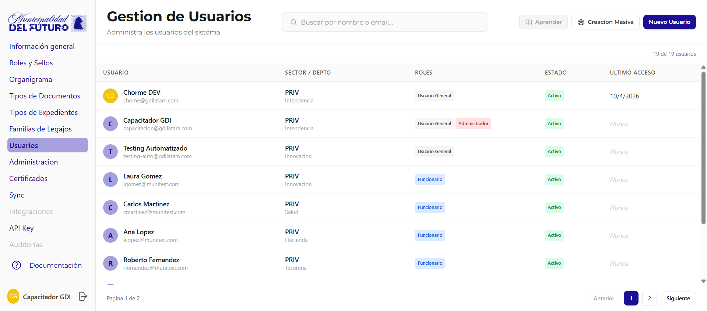
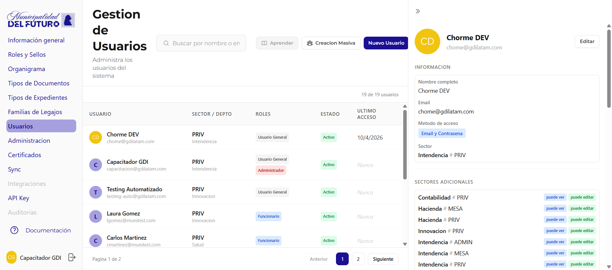

# Gestion de Usuarios

Administra los usuarios del sistema: crear, editar, asignar sectores, roles, sellos y permisos.



---

## Listado de Usuarios

La tabla muestra todos los usuarios de la organizacion.

| Columna | Descripcion |
|---------|-------------|
| **Usuario** | Avatar con inicial (o foto de perfil), nombre completo y email. Si el usuario es titular de una reparticion, se muestra la etiqueta **Titular** |
| **Reparticion / Sector** | Reparticion y acronimo del sector principal al que pertenece |
| **Rol** | Rol principal asignado (ej: `Funcionario`, `Administrador`) |
| **Estado** | `Activo`, `Pendiente` (cuenta creada pero no activada) o `Inactivo` |
| **Ultimo acceso** | Fecha del ultimo login (*nunca* si no ha ingresado) |

### Filtros y acciones del listado

| Accion | Descripcion |
|--------|-------------|
| **Buscar** | Filtrar por nombre o email |
| **Filtro por reparticion** | Mostrar solo usuarios de una reparticion especifica |
| **Filtro por estado** | Mostrar solo Activos, Inactivos o Pendientes |
| **Creacion masiva** | Crear multiples usuarios a la vez (icono de lista) |
| **Nuevo usuario** | Crear un usuario individual (boton primario) |

### Detalle del usuario (drawer)

Al hacer clic en cualquier fila de la tabla se abre un **drawer lateral** (panel deslizable sobre la derecha del contenedor) con el detalle completo del usuario. El drawer no empuja el contenido: se superpone sobre la tabla.

---

## Crear Usuario

Al presionar **Nuevo usuario** se abre un **modal** con el formulario de creacion.

### Campos del formulario

| Campo | Descripcion |
|-------|-------------|
| **Email** | Correo electronico del usuario (ej: `usuario@municipio.gob.ar`) |
| **Nombre completo** | Nombre y apellido |
| **Sello** | Sello de firma a asignar (obligatorio) |
| **Metodo de acceso** | Como va a iniciar sesion el usuario (ver abajo) |
| **Sector** | Sector principal al que se asigna |

### Metodo de acceso

Al crear un usuario se elige como va a iniciar sesion:

| Metodo | Descripcion |
|--------|-------------|
| **Login Social (Google / Microsoft)** | El usuario ingresa con su cuenta de Google o Microsoft. Ideal para emails institucionales con Google Workspace o Microsoft 365. Es la opcion por defecto |
| **Email y Contrasena** | El usuario recibe un email con un link de activacion para crear su contrasena. El link vence en 5 dias. Usar para emails que no son Google ni Microsoft |

!!! tip "Cuando usar cada metodo"
    - **Login Social**: Para la mayoria de los casos. Si el email es de Google (`@gmail.com`, dominios con Google Workspace) o Microsoft (`@outlook.com`, dominios con Microsoft 365), elegir esta opcion.
    - **Email y Contrasena**: Para dominios que no usan Google ni Microsoft como proveedor de email (ej: servidores de correo propios del municipio).

### Flujo segun metodo de acceso

Dependiendo del metodo elegido, el sistema dispara un flujo diferente:

**Login Social (Google / Microsoft)**

1. El admin crea el usuario y selecciona **Login Social**
2. El usuario recibe un **email de bienvenida** con un link directo a la aplicacion
3. El usuario hace clic en el link e inicia sesion con su cuenta de Google o Microsoft
4. El sistema lo reconoce automaticamente y le da acceso

**Email y Contrasena**

1. El admin crea el usuario y selecciona **Email y Contrasena**
2. El usuario recibe un **email de activacion** con un link para crear su contrasena
3. El usuario hace clic en el link, establece su contrasena y queda activado
4. A partir de ahi, inicia sesion con su email y la contrasena que creo

!!! warning "El link de activacion vence en 5 dias"
    Si el usuario no completa la activacion dentro de los 5 dias, el link expira. En ese caso, el admin puede reenviar la invitacion desde el detalle del usuario (ver seccion [Activacion pendiente y reinvitacion](#activacion-pendiente-y-reinvitacion)).

---

## Creacion Masiva (CSV)

Al presionar el boton de **Creacion masiva** se abre un **modal** que permite crear multiples usuarios a la vez importando un archivo CSV.

### Formato del CSV

El archivo CSV debe contener las siguientes columnas:

| Columna | Obligatoria | Descripcion |
|---------|:-----------:|-------------|
| **email** | Si | Correo electronico del usuario |
| **nombre** | Si | Nombre completo |
| **sello** | Si | Nombre del sello de firma a asignar |
| **sector** | Si | Codigo o nombre del sector a asignar (formato: `Nombre # CODIGO`) |
| **busqueda_docs** | No | Busqueda global de documentos: `1` para habilitar, `0` o vacio para no |
| **busqueda_exps** | No | Busqueda global de expedientes: `1` para habilitar, `0` o vacio para no |
| **sectores_adicionales** | No | Sectores adicionales separados por punto y coma |
| **auth_method** | No | Metodo de acceso: `social` o `database`. Si no se especifica, se usa `social` por defecto |

!!! example "Ejemplo de CSV"
    ```csv
    email,nombre,sello,sector,busqueda_docs,busqueda_exps,,auth_method
    jperez@municipio.gob.ar,Juan Perez,Director,Mesa de Entradas # MEN,0,0,,social
    mgarcia@municipio.gob.ar,Maria Garcia,Secretario,Tesoreria # TES,1,0,,social
    alopez@correo-propio.gob.ar,Ana Lopez,Director,Obras Privadas # OPR,0,0,,database
    ```

### Comportamiento segun auth_method

| Valor | Que pasa al importar |
|-------|---------------------|
| `social` (o vacio) | El usuario recibe un email de bienvenida con link a la app. Inicia sesion con Google o Microsoft |
| `database` | El usuario recibe un email de activacion con link para crear su contrasena. El link vence en 5 dias |

!!! tip "Mezclar metodos en un mismo CSV"
    Podes combinar usuarios con `social` y `database` en el mismo archivo. El sistema envia el email correspondiente a cada uno segun su metodo.

---

## Detalle de Usuario

Al hacer clic en un usuario se muestra su ficha completa:



### Informacion

| Campo | Descripcion |
|-------|-------------|
| **Nombre completo** | Nombre y apellido del usuario |
| **Email** | Correo electronico institucional |
| **Metodo de acceso** | Como inicia sesion: `Email y Contrasena`, `Google`, `Microsoft` o `Pendiente activacion` si todavia no activo su cuenta |
| **Sector** | Sector principal asignado (ej: *Tesoreria # PRIV*) |
| **Numero de Identificacion Nacional (ID)** | Documento de identidad del usuario (si fue cargado) |

### Responsable de Departamento

Si el usuario es titular de un departamento, se muestra aqui.

| Campo | Descripcion |
|-------|-------------|
| **Titular** | Indica que el usuario es responsable del departamento |
| **Departamento** | Nombre del departamento (ej: *Tesoreria*) |

### Sectores Adicionales

Lista de sectores adicionales a los que el usuario tiene acceso, ademas de su sector principal.

### Firma / Sello

| Campo | Descripcion |
|-------|-------------|
| **Sello actual** | Nombre y descripcion del sello de firma asignado (ej: *Director - Sello de Director*) |

### Permisos de Busqueda

| Permiso | Descripcion |
|---------|-------------|
| **Busqueda Global por Numero Documento** | Puede buscar documentos oficiales de cualquier sector |
| **Busqueda Global por Numero Expediente** | Puede buscar expedientes de cualquier sector |

### Roles

Roles asignados al usuario: `Funcionario`, `Administrador`.

### Estado

Estado actual del usuario: `Activo` o `Inactivo`.

### Activacion pendiente y reinvitacion

Si el usuario todavia no activo su cuenta o necesita recibir nuevamente el email de acceso, se muestra esta seccion con la opcion de reenviar la invitacion.

- **Email y Contrasena**: Genera un nuevo link de activacion y envia email para crear contrasena. El link anterior queda invalidado.
- **Login Social**: Reenvia el email de bienvenida con el link directo a la aplicacion.

| Accion | Descripcion |
|--------|-------------|
| **Reenviar invitacion** | Genera un nuevo link de activacion y envia un email al usuario para que cree su contrasena. El link anterior queda invalidado |

!!! info "Cuando usar reinvitar"
    Usa esta opcion cuando:

    - El link de activacion original ya vencio (pasaron mas de 5 dias)
    - El usuario perdio o no encontro el email original
    - Necesitas reenviar la invitacion por cualquier motivo

    El nuevo link tambien tiene una validez de **5 dias**. Podes reenviar la invitacion todas las veces que sea necesario.

### Zona de Peligro

| Accion | Descripcion |
|--------|-------------|
| **Desactivar usuario** | Desactiva el acceso del usuario al sistema. El usuario no podra iniciar sesion |

### Actividad

| Campo | Descripcion |
|-------|-------------|
| **Ultimo acceso** | Fecha y hora del ultimo login |
| **Fecha de creacion** | Fecha en que se creo el usuario en el sistema |
