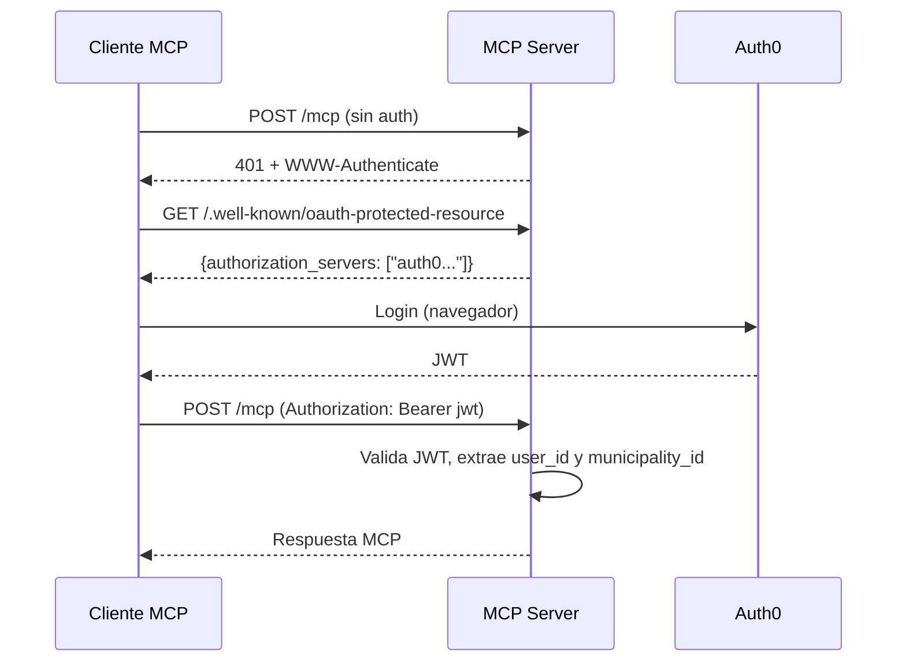

# Comunicacion entre Servicios

## Protocolos

El ecosistema GDI utiliza tres protocolos de comunicacion:

| Protocolo | Uso | Formato |
|-----------|-----|---------|
| **REST (HTTP/JSON)** | Comunicacion general entre todos los servicios | JSON sobre HTTP |
| **MCP (Model Context Protocol)** | Integracion con clientes IA (Claude, ChatGPT, Gemini) | JSON-RPC sobre HTTP |
| **S3 API** | Almacenamiento de PDFs en Cloudflare R2 | AWS S3 compatible |

## Tabla de Comunicaciones

| Origen | Destino | Protocolo | Autenticacion | Puerto destino (Fly.io) | URL tipo |
|--------|---------|-----------|---------------|------------------------|----------|
| GDI-FRONTEND | GDI-Backend | REST | Auth0 JWT (Bearer) | 8080 | Publica (Fly.io URL) |
| GDI-BackOffice-Front | GDI-BackOffice-Back | REST | Auth0 JWT (Bearer) | 8080 | Publica (Fly.io URL) |
| GDI-Backend | GDI-PDFComposer | REST | API Key (`X-API-Key`) + `X-PDF-SHA256` | 8080 | Fly.io *.internal (privada) |
| GDI-Backend | GDI-Notary | REST | API Key (`X-API-Key`) | 8080 | Fly.io *.internal (privada) |
| GDI-Backend | Cloudflare R2 | S3 API | Access Key + Secret Key | 443 | Externa (HTTPS) |
| GDI-AgenteLANG | GDI-Backend | REST | `X-API-Key` (INTERNAL_API_KEY) | 8080 | Fly.io *.internal (privada) |
| GDI-AgenteLANG | OpenRouter | REST | API Key (Bearer) | 443 | Externa (HTTPS) |
| GDI-AgenteLANG | PostgreSQL | TCP | Connection string | 5432 | Fly.io *.internal (privada) |
| Cliente MCP | GDI-MCP Server | MCP (JSON-RPC) | OAuth 2.0 (Auth0 JWT) | 8080 | Publica (Fly.io URL) |
| GDI-BackOffice-Back | PostgreSQL | TCP | Connection string | 5432 | Fly.io *.internal (privada) |

!!! note "INTERNAL_API_KEY"
    La variable `INTERNAL_API_KEY` es compartida entre el Backend y AgenteLANG de cada ambiente. Hay una key distinta por ambiente (dev, arg, demo, aries). Se usa en el header `X-API-Key` para llamadas de AgenteLANG al Backend.

!!! note "X-PDF-SHA256"
    El Backend envia el header `X-PDF-SHA256` junto con el PDF al PDFComposer para verificacion de integridad del contenido.

## Autenticacion Inter-Servicio

### Auth0 JWT (Frontend a Backend)

Los frontends autentican usuarios mediante Auth0. El JWT se envia en el header `Authorization: Bearer <token>`. Los backends validan el token contra Auth0 JWKS.

```
Frontend → Auth0 (login) → JWT
Frontend → Backend (Authorization: Bearer <jwt>)
Backend → Auth0 JWKS (validacion)
```

### API Key (Backend a Microservicios)

La comunicacion entre el Backend y los microservicios (PDFComposer, Notary) usa API Keys simples en el header `X-API-Key`.

```python
# Ejemplo: Backend llamando a PDFComposer
headers = {"X-API-Key": PDFCOMPOSER_API_KEY}
response = await client.post(f"{PDFCOMPOSER_URL}/generate-pdf", headers=headers, ...)
```

### OAuth 2.0 (MCP Server)

Los clientes MCP externos (Claude Code, ChatGPT, Gemini) se autentican via OAuth 2.0 con Auth0:



### REST API Publica (API Key + User ID)

La REST API del MCP Server tambien soporta autenticacion por API Key para integraciones programaticas:

```bash
curl -H "X-API-Key: sk-gdi-xxx" \
     -H "X-User-ID: uuid-del-usuario" \
     https://mcp.tu-dominio.com/api/v1/cases/search
```

## Comunicacion Interna (Fly.io Private Networking)

### URLs Internas en PRD (servicio a servicio)

En produccion (Fly.io), los servicios se comunican via red privada usando hostnames `*.internal` con puerto `8080`. Estas no pasan por internet, lo que reduce latencia y aumenta seguridad. PDFComposer y Notary en PRD **no tienen IP publica** — solo son accesibles via estas URLs internas.

```
http://<app-name>.internal:8080
```

**Ejemplos en PRD:**

```bash
# Backend → PDFComposer (compartido entre todos los clientes)
PDFCOMPOSER_URL=http://<your-pdfcomposer-prd-app>.internal:8080

# Backend → Notary (compartido entre todos los clientes)
NOTARY_URL=http://<your-notary-app>.internal:8080

# Backend → AgenteLANG (dedicado por cliente)
AGENT_URL=http://<your-app>-agentelang-prd.internal:8080

# AgenteLANG → Backend (por cliente)
GDI_BACKEND_URL=http://<your-backend-app>.internal:8080
```

**En desarrollo local:**

```bash
# Puerto local de cada servicio
PDFCOMPOSER_URL=http://localhost:8002
NOTARY_URL=http://localhost:8001
GDI_BACKEND_URL=http://localhost:8000
```

!!! tip "Ventajas de Fly.io Private Networking"
    - Sin exposicion a internet (microservicios sin IP publica en PRD)
    - Menor latencia (misma region gru)
    - Sin costos de bandwidth externo
    - Nombres DNS estables (`<app-name>.internal`)

### URLs Publicas (usuario a servicio)

Los frontends y clientes externos acceden via URLs publicas de Fly.io o dominios custom de Vercel:

```bash
# Frontends en Vercel (PRD) - un subdominio por cliente/ambiente
https://cliente.your-domain.com        # GDI-FRONTEND
https://cliente-admin.your-domain.com  # Panel de administracion

# APIs publicas en Fly.io (PRD)
https://<your-backend-app>.fly.dev/api/   # Backend
https://<your-gateway-app>.fly.dev/mcp    # MCP Server
```

### Comunicacion Externa

Algunos servicios se comunican con APIs externas que siempre usan HTTPS publico:

```bash
# Cloudflare R2 (storage)
CF_R2_ENDPOINT=https://{account}.r2.cloudflarestorage.com

# Auth0 (autenticacion)
AUTH0_DOMAIN=tu-tenant.us.auth0.com

# OpenRouter (modelos IA)
OPENROUTER_API_KEY=sk-or-...

# Resend (emails)
# Integrado en BackOffice-Back via Resend API
```

## Patrones de Comunicacion

### Request-Response sincrono

Todas las comunicaciones entre servicios son sincronas. El servicio que inicia la llamada espera la respuesta antes de continuar.

```python
# Backend: genera PDF y luego lo firma
pdf_bytes = await call_pdfcomposer_generate_pdf(html_content)
signed_pdf = await call_notary_sign_pdf(pdf_bytes, signer_data)
await upload_to_r2(signed_pdf, filename)
```

### Polling asincrono (AIWorker)

El unico patron asincrono es el AIWorker de GDI-AgenteLANG, que hace polling cada 60 segundos sobre las tablas de documentos para generar resumenes y embeddings.

```
AIWorker (cada 60s) → PostgreSQL
  1. document_draft WHERE status='sent_to_sign' AND resume IS NULL
  2. official_documents WHERE resume IS NULL
  3. official_documents sin chunks en document_chunks
  4. official_documents tipo 'Importado' con content IS NULL
```

### Retry con fallback (Notary FULLPAGE)

Cuando Notary detecta que la ultima pagina no tiene espacio para la firma, responde con error `FULLPAGE`. El Backend agrega automaticamente una pagina en blanco y reintenta:

```
Backend → Notary: /sign-pdf (PDF original)
Notary → Backend: 400 FULLPAGE
Backend: agrega pagina en blanco
Backend → Notary: /sign-pdf (PDF aumentado)
Notary → Backend: 200 (PDF firmado)
```

## Timeouts

| Comunicacion | Timeout | Motivo |
|--------------|---------|--------|
| Frontend a Backend | 30s | Request HTTP estandar |
| Backend a PDFComposer | 60s | Generacion PDF puede ser lenta |
| Backend a Notary | 30s | Firma es rapida |
| Backend a R2 | 30s | Upload/download de archivos |
| AgenteLANG a OpenRouter | 60s | Respuesta de LLM |
