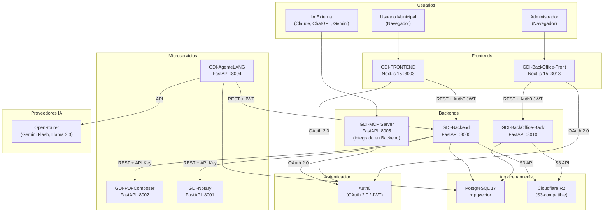
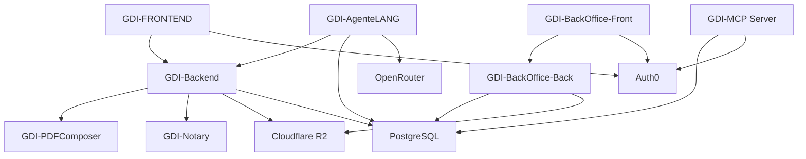

# Diagrama de Servicios

## Arquitectura Completa

## Diagrama por Capas

```mermaid
graph LR
    subgraph Presentacion["Capa de Presentacion"]
        F1["GDI-FRONTEND :3003"]
        F2["GDI-BackOffice-Front :3013"]
    end

    subgraph Aplicacion["Capa de Aplicacion"]
        B1["GDI-Backend :8000"]
        B2["GDI-BackOffice-Back :8010"]
        B3["GDI-MCP Server :8005"]
    end

    subgraph Servicios["Capa de Microservicios"]
        S1["GDI-PDFComposer :8002"]
        S2["GDI-Notary :8001"]
        S4["GDI-AgenteLANG :8004"]
    end

    subgraph Datos["Capa de Datos"]
        D1["PostgreSQL + pgvector"]
        D2["Cloudflare R2"]
    end

    Presentacion --> Aplicacion
    Aplicacion --> Servicios
    Aplicacion --> Datos
    Servicios --> Datos
```

## Puertos y Tecnologias

| Servicio | Puerto | Tecnologia | Workers | Protocolo |
|----------|--------|------------|---------|-----------|
| GDI-FRONTEND | 3003 | Next.js 15 (Pages Router) | Node.js | HTTP |
| GDI-BackOffice-Front | 3013 | Next.js 15 (Pages Router) | Node.js | HTTP |
| GDI-Backend | 8000 | FastAPI + Gunicorn | 8 Uvicorn workers | HTTP |
| GDI-BackOffice-Back | 8010 | FastAPI + Uvicorn | 1 worker | HTTP |
| GDI-MCP Server | 8005 | FastAPI (integrado en Backend) | Compartido | MCP + HTTP |
| GDI-AgenteLANG | 8004 | FastAPI + Uvicorn | 1 + AIWorker background | HTTP |
| GDI-PDFComposer | 8002 | FastAPI + Gunicorn | 4 Uvicorn workers | HTTP |
| GDI-Notary | 8001 | FastAPI + Gunicorn | 3 Uvicorn workers | HTTP |
| PostgreSQL | 5432 | PostgreSQL 17 + pgvector | Docker managed | TCP |

## Dependencias entre Servicios

!!! note "MCP Server integrado"
    El MCP Server (puerto 8005) esta integrado dentro del repositorio GDI-Backend en la carpeta `api_gateway/`. No es un servicio separado, sino un modulo del Backend que escucha en un puerto adicional.

---

## Security Hardening

Medidas de seguridad implementadas transversalmente en los servicios.

### XSS Prevention

| Capa | Libreria | Uso |
|------|----------|-----|
| Backend (Python) | **nh3** | Sanitizacion de HTML en `save_document` y contenido generado por usuarios |
| Frontend (JS) | **DOMPurify** | Sanitizacion de HTML antes de renderizar en el navegador |

El backend sanitiza todo contenido HTML antes de persistirlo en la base de datos, eliminando tags y atributos peligrosos (scripts, event handlers, iframes, etc.). El frontend aplica una segunda capa de sanitizacion al renderizar contenido que proviene de la API.

### Rate Limiting

El Gateway implementa rate limiting dual:

| Mecanismo | Tipo | Limite | Ventana |
|-----------|------|--------|---------|
| **In-memory** | Sliding window por IP | 60 requests | 1 minuto |
| **Redis** | Distribuido (Upstash) | Configurable | Configurable |

Implementado en `api_gateway/rate_limiter.py`. Usa `InMemoryRateLimiter` con sliding window. La IP del cliente se extrae considerando proxies de Fly.io (`fly-client-ip`, `x-forwarded-for`).

Cuando se excede el limite, el servidor responde con `429 Too Many Requests` e incluye el header `Retry-After` con los segundos de espera.

### Permission Enforcement en MCP Tools

Las tools MCP verifican permisos del usuario autenticado antes de ejecutar cualquier operacion. El `MCPContext` incluye `user_id` y `schema_name`, que se propagan a los servicios de negocio para validar acceso a nivel de sector.

### Sanitizacion de Datos Sensibles

| Funcion | Ubicacion | Proposito |
|---------|-----------|-----------|
| `strip_storage_urls` | `api_gateway/tools/_sanitize.py` | Remueve URLs de storage (R2) de las respuestas MCP |
| `search_users` | Tools MCP | Reduce datos privados en resultados de busqueda de usuarios |

Las respuestas del Gateway nunca exponen URLs directas de Cloudflare R2 (`pdf_url`, `signed_pdf_url`). Estos campos se eliminan recursivamente antes de devolver datos al cliente MCP.
