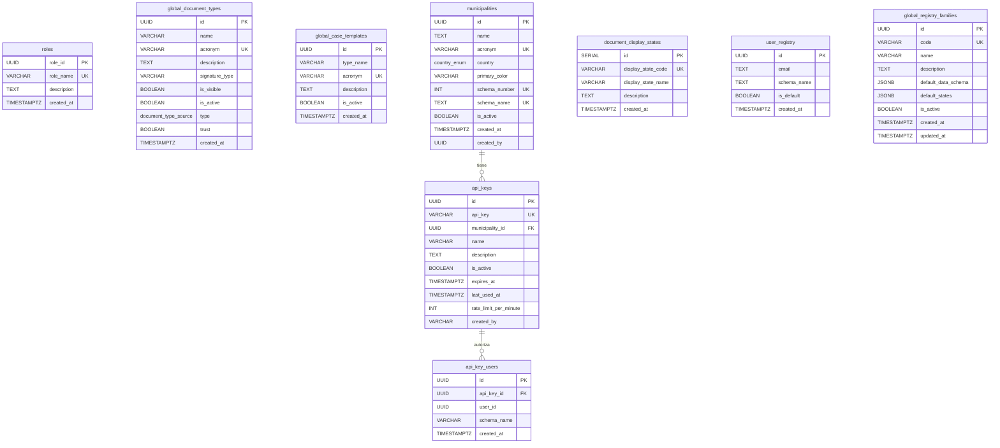

# Schema Public

El schema `public` contiene **9 tablas globales** compartidas por todas las organizaciones, mas dos tablas de auditoria/workflow (`firma_audit_log`, `catalog_proposals`) y tablas automaticas creadas por GDI-AgenteLANG.

## Diagrama ER



---

## TABLA 1: roles

Roles globales del sistema. Compartidos por todas las organizaciones.

| Columna | Tipo | Nullable | Default | Descripcion |
|---------|------|----------|---------|-------------|
| `role_id` | UUID | NO | `gen_random_uuid()` | Identificador unico |
| `role_name` | VARCHAR(50) | NO | - | Nombre del rol (unique) |
| `description` | TEXT | SI | - | Descripcion del rol |
| `created_at` | TIMESTAMPTZ | NO | `NOW()` | Fecha de creacion |

**Constraints:** PK `role_id`, UNIQUE `role_name`

**Datos seed (3 roles):**

| role_name | Descripcion |
|-----------|-------------|
| Usuario General | Usuario basico del sistema |
| Funcionario | Funcionario con permisos operativos |
| Administrador | Administrador con todos los permisos |

---

## TABLA 2: global_document_types

Catalogo maestro de tipos de documento. Cada organizacion copia los que necesita a su tabla local `document_types`.

| Columna | Tipo | Nullable | Default | Descripcion |
|---------|------|----------|---------|-------------|
| `id` | UUID | NO | `gen_random_uuid()` | Identificador unico |
| `name` | VARCHAR(100) | NO | - | Nombre completo |
| `acronym` | VARCHAR(6) | NO | - | Acronimo (max 6 chars, unique) |
| `description` | TEXT | SI | - | Descripcion del tipo |
| `signature_type` | VARCHAR(50) | SI | `'required'` | Tipo de firma requerida |
| `is_visible` | BOOLEAN | NO | `true` | `false` para tipos internos (PV, CAEX) |
| `is_active` | BOOLEAN | NO | `true` | Si esta activo para uso |
| `type` | `document_type_source` | NO | `'HTML'` | Fuente: HTML, Importado, NOTA |
| `trust` | BOOLEAN | NO | `true` | `true` = documento gobierno, `false` = externo |
| `created_at` | TIMESTAMPTZ | NO | `NOW()` | Fecha de creacion |

**Constraints:** PK `id`, UNIQUE `acronym`, CHECK `char_length(acronym) <= 6`

**Datos seed:** 61 tipos (58 publicos + PV + CAEX internos). Ejemplos:

| Acronimo | Nombre | Tipo | Trust | Visible |
|----------|--------|------|-------|---------|
| IF | Informe | HTML | true | true |
| NOTA | Nota | NOTA | true | true |
| PROV | Providencia | HTML | true | true |
| IFGRA | Informe Grafico Importado | Importado | true | true |
| OFJUD | Oficio Judicial | Importado | false | true |
| PV | Pase | HTML | true | **false** |
| CAEX | Caratula | HTML | true | **false** |

!!! info "Tipos internos"
    PV (Pase) y CAEX (Caratula) tienen `is_visible = false` y `is_active = false`. Son de uso exclusivo del modulo de Expedientes Electronicos y se generan automaticamente.

---

## TABLA 3: global_case_templates

Catalogo maestro de plantillas de expediente. Cada organizacion copia las que necesita.

| Columna | Tipo | Nullable | Default | Descripcion |
|---------|------|----------|---------|-------------|
| `id` | UUID | NO | `gen_random_uuid()` | Identificador unico |
| `type_name` | VARCHAR(100) | NO | - | Nombre de la plantilla |
| `acronym` | VARCHAR(6) | NO | - | Acronimo (unique) |
| `description` | TEXT | SI | - | Descripcion detallada |
| `is_active` | BOOLEAN | NO | `true` | Si esta activa |
| `created_at` | TIMESTAMPTZ | NO | `NOW()` | Fecha de creacion |

**Constraints:** PK `id`, UNIQUE `acronym`

**Datos seed:** 30 plantillas. Ejemplos:

| Acronimo | Nombre |
|----------|--------|
| EEVAR | Varios |
| LICPUB | Licitacion Publica |
| HABI | Habilitacion Comercial |
| COMP | Compras y Contrataciones |
| DEM | Demanda Judicial |
| RRHH | Recursos Humanos |
| OBPUB | Obra Publica |
| MAMBI | Medio Ambiente |

---

## TABLA 4: municipalities

Registro de organizaciones activas. Cada fila representa un tenant con su propio schema.

| Columna | Tipo | Nullable | Default | Descripcion |
|---------|------|----------|---------|-------------|
| `id` | UUID | NO | `gen_random_uuid()` | Identificador unico |
| `name` | TEXT | NO | - | Nombre completo de la organizacion |
| `acronym` | VARCHAR(4) | NO | - | Acronimo auto-generado (WXYZ) |
| `country` | `country_enum` | NO | - | Codigo de pais (AR, BR, UY...) |
| `primary_color` | VARCHAR(6) | NO | `'16158C'` | Color hex sin # |
| `schema_number` | INT | NO | - | Numero auto-incremental (100, 101...) |
| `schema_name` | TEXT | NO | - | Nombre del schema (ej: `200_muni`) |
| `is_active` | BOOLEAN | NO | `true` | Si esta activo |
| `created_at` | TIMESTAMPTZ | NO | `NOW()` | Fecha de creacion |
| `created_by` | UUID | SI | - | Usuario que creo el registro |

**Constraints:** PK `id`, UNIQUE `acronym`, UNIQUE `schema_number`, UNIQUE `schema_name`

!!! note "Convencion de nombres"
    El `schema_name` sigue el formato `{schema_number}_{acronym_lower}`, por ejemplo: `200_muni`, `201_otra`. El acronimo se genera automaticamente con WXYZ y puede cambiar cuando la organizacion formaliza el contrato.

---

## TABLA 5: document_display_states

Estados de visualizacion para el frontend. Mapeo de estados internos a nombres amigables.

| Columna | Tipo | Nullable | Default | Descripcion |
|---------|------|----------|---------|-------------|
| `id` | SERIAL | NO | auto | Identificador secuencial |
| `display_state_code` | VARCHAR(50) | NO | - | Codigo (unique) |
| `display_state_name` | VARCHAR(100) | NO | - | Nombre para mostrar |
| `description` | TEXT | SI | - | Descripcion |
| `created_at` | TIMESTAMPTZ | NO | `NOW()` | Fecha de creacion |

**Constraints:** PK `id`, UNIQUE `display_state_code`

**Datos seed (6 estados):**

| ID | Codigo | Nombre |
|----|--------|--------|
| 1 | DRAFT | Borrador |
| 2 | PENDING_SIGN | Pendiente de Firma |
| 3 | SIGNED | Firmado |
| 4 | REJECTED | Rechazado |
| 5 | CANCELLED | Cancelado |
| 6 | NUMBERED | Numerado |

---

## TABLA 6: user_registry

Mapeo multi-tenant: asocia un email a los schemas donde tiene acceso. Un usuario puede pertenecer a multiples organizaciones.

| Columna | Tipo | Nullable | Default | Descripcion |
|---------|------|----------|---------|-------------|
| `id` | UUID | NO | `gen_random_uuid()` | Identificador unico |
| `email` | TEXT | NO | - | Email del usuario |
| `schema_name` | TEXT | NO | - | Schema de la organizacion |
| `is_default` | BOOLEAN | NO | `false` | Organizacion por defecto |
| `created_at` | TIMESTAMPTZ | NO | `NOW()` | Fecha de creacion |

**Constraints:** PK `id`, UNIQUE (`email`, `schema_name`)

**Indices:** `idx_user_registry_email` en `email`

!!! info "Sincronizacion automatica"
    Esta tabla se mantiene sincronizada automaticamente via trigger `fn_sync_user_registry` en cada schema de organizacion. Cuando se crea, actualiza o elimina un usuario en `{schema}.users`, el trigger refleja el cambio en `public.user_registry`.

---

## TABLA 7: api_keys

API Keys para acceso REST a GDI-MCP Server. Cada organizacion puede tener multiples API Keys.

| Columna | Tipo | Nullable | Default | Descripcion |
|---------|------|----------|---------|-------------|
| `id` | UUID | NO | `gen_random_uuid()` | Identificador unico |
| `api_key` | VARCHAR(64) | NO | - | Key unica (formato: `sk_live_xxx` o `sk_test_xxx`) |
| `municipality_id` | UUID | NO | - | FK a `municipalities` |
| `name` | VARCHAR(100) | NO | - | Nombre descriptivo del cliente |
| `description` | TEXT | SI | - | Descripcion de la integracion |
| `is_active` | BOOLEAN | NO | `true` | Si esta activa |
| `created_at` | TIMESTAMPTZ | NO | `NOW()` | Fecha de creacion |
| `expires_at` | TIMESTAMPTZ | SI | - | NULL = no expira |
| `last_used_at` | TIMESTAMPTZ | SI | - | Ultimo uso (se actualiza en cada request) |
| `rate_limit_per_minute` | INT | SI | `60` | Limite de requests/minuto |
| `created_by` | VARCHAR(100) | SI | - | Quien creo la key |

**Constraints:** PK `id`, UNIQUE `api_key`, FK `municipality_id` -> `municipalities(id)`

**Indices:**

- `idx_api_keys_key`: parcial en `api_key` WHERE `is_active = true`
- `idx_api_keys_municipality`: en `municipality_id`

---

## TABLA 8: api_key_users

Asocia usuarios a API Keys para trazabilidad. El cliente REST debe enviar `X-User-ID` en cada request.

| Columna | Tipo | Nullable | Default | Descripcion |
|---------|------|----------|---------|-------------|
| `id` | UUID | NO | `gen_random_uuid()` | Identificador unico |
| `api_key_id` | UUID | NO | - | FK a `api_keys` (CASCADE on delete) |
| `user_id` | UUID | NO | - | UUID del usuario en el schema del tenant |
| `schema_name` | VARCHAR(100) | NO | - | Schema donde existe el usuario |
| `created_at` | TIMESTAMPTZ | NO | `NOW()` | Fecha de creacion |

**Constraints:** PK `id`, UNIQUE (`api_key_id`, `user_id`, `schema_name`), FK `api_key_id` -> `api_keys(id)` ON DELETE CASCADE

**Indices:**

- `idx_api_key_users_key`: en `api_key_id`
- `idx_api_key_users_user`: en (`user_id`, `schema_name`)

---

## TABLA 9: global_registry_families

Familias de registros globales con esquema de datos y estados por defecto. Cada organizacion puede copiar y personalizar estas familias.

| Columna | Tipo | Nullable | Default | Descripcion |
|---------|------|----------|---------|-------------|
| `id` | UUID | NO | `gen_random_uuid()` | Identificador unico |
| `code` | VARCHAR(10) | NO | - | Codigo unico (ej: ARQ, LUM, ORD) |
| `name` | VARCHAR(200) | NO | - | Nombre de la familia |
| `description` | TEXT | SI | - | Descripcion |
| `default_data_schema` | JSONB | SI | `'{}'` | Schema JSONB que define los campos del registro |
| `default_states` | JSONB | SI | `'["Activo","Inactivo","Suspendido","Archivado"]'` | Estados posibles |
| `is_active` | BOOLEAN | NO | `true` | Si esta activa |
| `created_at` | TIMESTAMPTZ | NO | `NOW()` | Fecha de creacion |
| `updated_at` | TIMESTAMPTZ | NO | `NOW()` | Ultima modificacion |

**Constraints:** PK `id`, UNIQUE `code`

**Datos seed (3 familias):**

| Codigo | Nombre | Estados |
|--------|--------|---------|
| ARQ | Registro de Arquitectura y Obras Particulares | Activo, En Inspeccion, Aprobado, Rechazado, Suspendido, Archivado |
| LUM | Registro de Luminarias y Alumbrado Publico | Activo, En Reparacion, Fuera de Servicio, Reemplazado, Archivado |
| ORD | Registro de Ordenanzas y Normativa | Vigente, Derogada, Modificada, En Revision, Archivada |

---

## TABLA: firma_audit_log

Tabla de auditoria de firma digital conforme a la **Ley 25.506** (Ley de Firma Digital Argentina). INSERT-only; no se permiten UPDATE ni DELETE.

**Schema:** `public` (global, no por tenant). El tenant se identifica por la columna `schema_name`.

**Migracion:** 045 (`045_create_firma_audit_log.sql`). Parche 052: columna `session_id` cambiada de `uuid` a `varchar(50)` para soportar el formato de session_id de FirmadorGDI (`"SES" + token_hex(6)`, ej: `SESCE461141ADC1`).

**Retencion:** 10 anos.

| Columna | Tipo | Nullable | Descripcion |
|---------|------|----------|-------------|
| `id` | UUID | NO | PK, gen_random_uuid() |
| `created_at` | TIMESTAMPTZ | NO | Timestamp de insercion |
| `schema_name` | TEXT | NO | Tenant (schema de la municipalidad) |
| `session_id` | VARCHAR(50) | SI | ID de sesion de firma digital (NULL para firma electronica) |
| `signature_method` | TEXT | NO | `electronic`, `digital_token` o `digital_cloud` |
| `user_id` | UUID | NO | Usuario firmante |
| `user_cuit` | TEXT | SI | CUIT del firmante (extraido del certificado) |
| `document_id` | UUID | NO | Documento firmado |
| `official_number` | TEXT | SI | Numero oficial del documento (ej: `IF-2026-00001234`) |
| `document_hash_pre` | BYTEA | SI | Hash SHA del PDF antes de firmar |
| `document_hash_post` | BYTEA | SI | Hash SHA del PDF firmado |
| `cert_serial` | TEXT | SI | Numero de serie del certificado |
| `cert_issuer_dn` | TEXT | SI | DN del emisor del certificado |
| `cert_subject_dn` | TEXT | SI | DN del sujeto del certificado |
| `cert_subject_cuit` | TEXT | SI | CUIT del sujeto del certificado |
| `cert_not_after` | TIMESTAMPTZ | SI | Fecha de vencimiento del certificado |
| `cert_policy_oids` | TEXT[] | SI | OIDs de politica del certificado |
| `signature_algorithm` | TEXT | SI | Algoritmo de firma (ej: `SHA256withRSA`) |
| `signature_level` | TEXT | SI | Nivel AdES: `B-B`, `B-T`, `B-LT`, `B-LTA` |
| `tsa_url` | TEXT | SI | URL del servidor de sello de tiempo (TSA) |
| `tsa_serial` | TEXT | SI | Serial del sello de tiempo |
| `tsa_time` | TIMESTAMPTZ | SI | Tiempo del sello TSA |
| `server_time` | TIMESTAMPTZ | NO | Hora del servidor al registrar (DEFAULT NOW()) |
| `time_skew_seconds` | INT | SI | Diferencia entre hora cliente y servidor |
| `ip_address` | INET | SI | IP del cliente firmante |
| `user_agent` | TEXT | SI | User-Agent del cliente (FirmadorGDI version) |
| `revocation_method` | TEXT | SI | Metodo de verificacion de revocacion (OCSP, CRL) |
| `revocation_status` | TEXT | SI | `good`, `revoked` o `unknown` |
| `revocation_check_time` | TIMESTAMPTZ | SI | Cuando se verifico la revocacion |
| `result` | TEXT | NO | Resultado de la firma: `success`, `failure`, etc. |
| `failure_reason` | TEXT | SI | Detalle del error si `result != success` |
| `r2_object_key` | TEXT | SI | Key del objeto en R2 donde quedo el PDF firmado |

**Constraints:**

- CHECK `signature_method IN ('electronic', 'digital_token', 'digital_cloud')`
- CHECK `signature_level IS NULL OR signature_level IN ('B-B', 'B-T', 'B-LT', 'B-LTA')`
- CHECK `revocation_status IS NULL OR revocation_status IN ('good', 'revoked', 'unknown')`

**Indices:**

| Indice | Columnas | Proposito |
|--------|----------|-----------|
| `idx_firma_audit_log_created_schema` | `(created_at, schema_name)` | Consultas por tenant y periodo |
| `idx_firma_audit_log_session` | `session_id` | Buscar por sesion de firma digital |
| `idx_firma_audit_log_user` | `user_id` | Historial por usuario |
| `idx_firma_audit_log_document` | `document_id` | Historial por documento |
| `idx_firma_audit_log_result` | `result` | Filtrar por exito/fallo |

**Anti-tampering (permisos SQL):**

```sql
REVOKE UPDATE, DELETE, TRUNCATE ON public.firma_audit_log FROM PUBLIC;
GRANT INSERT, SELECT ON public.firma_audit_log TO authenticated;
```

El rol `authenticated` (usado por GDI-Backend) solo puede INSERT y SELECT. Ningun UPDATE ni DELETE es posible desde la aplicacion.

!!! info "INSERT-only"
    Esta tabla nunca se modifica. Cada evento de firma genera una nueva fila. Los sistemas de auditoria deben consultar por `document_id` o `session_id` para reconstruir el historial.

---

## TABLA: catalog_proposals

Tabla global para el sistema de propuestas al catalogo. Permite que admins de municipios sugieran nuevos tipos de documento, plantillas de expediente o familias de registro para que sean incorporados al catalogo global.

**Schema:** `public` (global).

**Migracion:** 056 (`056_create_global_catalog_proposals.sql`).

**Tablas destino soportadas:** `global_document_types`, `global_case_templates`, `global_registry_families`.

**Flujo:** Admin de municipio propone un item → GDI-AgenteLANG lo analiza con LLM (`POST /api/v1/ai/analyze-catalog-proposal` en GDI-AgenteLANG, auth: `X-API-Key` interna) → la IA decide `auto_approve` o `review` con justificacion → si es `review`, queda en cola para revisor humano (BackOffice) → al aprobar, se crea el item en la tabla global destino y se llena `global_item_id`.

| Columna | Tipo | Nullable | Descripcion |
|---------|------|----------|-------------|
| `id` | UUID | NO | PK, gen_random_uuid() |
| `catalog_table` | TEXT | NO | Tabla destino: `global_document_types`, `global_case_templates` o `global_registry_families` |
| `proposed_data` | JSONB | NO | Datos propuestos (estructura libre segun tabla destino) |
| `proposed_by_user_id` | TEXT | NO | ID del admin que propone |
| `proposed_by_schema` | TEXT | NO | Schema del tenant que origina la propuesta |
| `ai_decision` | TEXT | NO | Decision IA: `auto_approve` o `review` |
| `ai_reason` | TEXT | SI | Justificacion textual de la decision IA |
| `status` | TEXT | NO | Estado del workflow: `pending`, `approved`, `rejected`, `auto_approved` (default `pending`) |
| `global_item_id` | UUID | SI | UUID del item creado en la tabla global (se llena al aprobar) |
| `review_notes` | TEXT | SI | Notas del revisor humano |
| `created_at` | TIMESTAMPTZ | NO | Fecha de creacion |
| `reviewed_at` | TIMESTAMPTZ | SI | Fecha de revision humana |
| `reviewed_by` | TEXT | SI | ID del revisor humano |

**Constraints:** CHECK `catalog_table IN (...)`, CHECK `ai_decision IN (...)`, CHECK `status IN (...)`

**Indices:**

| Indice | Columnas | Proposito |
|--------|----------|-----------|
| `idx_catalog_proposals_status_created` | `(status, created_at DESC)` | Cola de revision ordenada por fecha |
| `idx_catalog_proposals_proposed_by` | `(proposed_by_user_id, created_at DESC)` | Historial por admin |
| `idx_catalog_proposals_table` | `catalog_table` | Filtrar por tabla destino |

**Endpoint de analisis IA (GDI-AgenteLANG):**

```
POST /api/v1/ai/analyze-catalog-proposal
Auth: X-API-Key (interna, no expuesta al publico)
```

Request:
```json
{
  "catalog_table": "global_document_types",
  "proposed_data": {"name": "Informe Ambiental", "acronym": "IAMB"},
  "existing_items": [{"name": "Informe", "acronym": "IF"}, ...]
}
```

Response:
```json
{
  "decision": "auto_approve",
  "reason": "Acronimo unico y categoricamente distinto a los existentes."
}
```

!!! note "Feature en consolidacion"
    La tabla `catalog_proposals` y el endpoint de analisis IA existen en codigo y BD (migracion 056 aplicada). La interfaz de gestion en BackOffice para que los admins propongan y revisen items esta en desarrollo. La tabla no es visible desde el Frontend principal.

---

## Tablas Automaticas (LangGraph)

Las siguientes tablas son creadas automaticamente por **GDI-AgenteLANG** durante el startup. No deben crearse manualmente.

| Tabla | Proposito |
|-------|-----------|
| `checkpoints` | Estado del grafo LangGraph por thread_id |
| `checkpoint_blobs` | Datos binarios grandes (mensajes, estado) |
| `checkpoint_writes` | Escrituras pendientes (concurrencia) |
| `checkpoint_migrations` | Control de version del schema de checkpoints |
| `chat_messages` | Historial de chat relacional y consultable |

!!! warning "No crear manualmente"
    Estas tablas las administra LangGraph. El `thread_id` tiene formato `{municipality_id}:{conversation_id}` para aislamiento multi-tenant.
