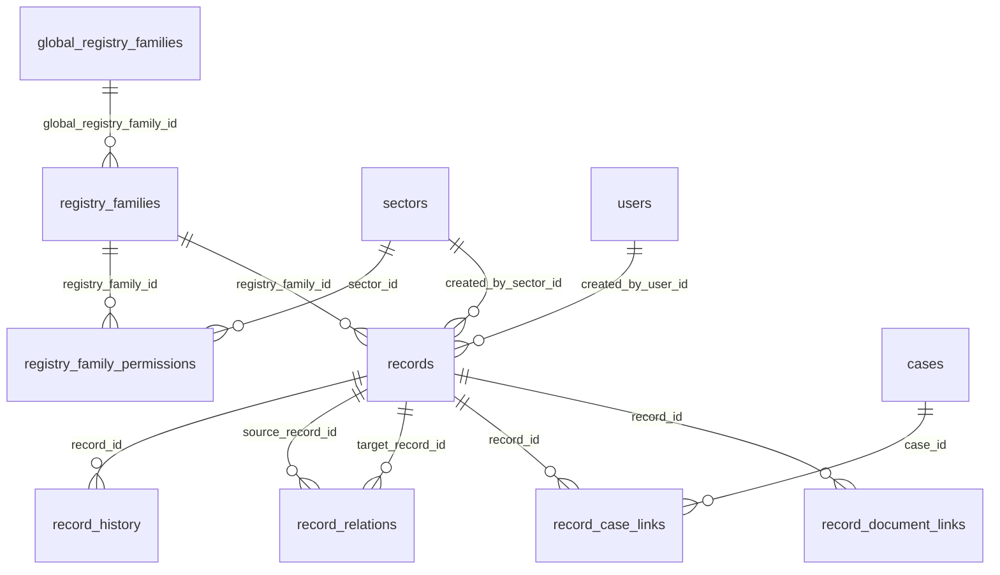

# Schema RLM (Registros)

El modulo RLM (Registro Legajo Multiproposito) usa **8 tablas** distribuidas entre el schema `public` (1 tabla global) y el schema del municipio (7 tablas per-tenant). Grupo I del schema municipio.

## Resumen de Tablas

| # | Tabla | Schema | Descripcion |
|---|-------|--------|-------------|
| 1 | `global_registry_families` | `public` | Familias de registros globales (template) |
| 2 | `registry_families` | municipio | Familias de registros del municipio |
| 3 | `registry_family_permissions` | municipio | Permisos por sector sobre familias |
| 4 | `records` | municipio | Legajos individuales |
| 5 | `record_history` | municipio | Historial de cambios |
| 6 | `record_relations` | municipio | Relaciones entre legajos |
| 7 | `record_case_links` | municipio | Vinculos legajo-expediente |
| 8 | `record_document_links` | municipio | Vinculos legajo-documento |

## Diagrama ER



---

## TABLA 1: global_registry_families (public)

Familias de registros globales con esquema de datos y estados por defecto. Cada municipio puede copiar y personalizar estas familias en su schema local.

**Schema:** `public`

| Columna | Tipo | Nullable | Default | Descripcion |
|---------|------|----------|---------|-------------|
| `id` | UUID | NO | `gen_random_uuid()` | PK |
| `code` | VARCHAR(10) | NO | - | Codigo unico (ARQ, LUM, ORD) |
| `name` | VARCHAR(200) | NO | - | Nombre de la familia |
| `description` | TEXT | SI | - | Descripcion |
| `default_data_schema` | JSONB | SI | `'{}'` | Schema de campos por defecto |
| `default_states` | JSONB | SI | `'["Activo","Inactivo","Suspendido","Archivado"]'` | Estados por defecto |
| `is_active` | BOOLEAN | NO | `true` | Si esta activa |
| `created_at` | TIMESTAMPTZ | NO | `NOW()` | Fecha de creacion |
| `updated_at` | TIMESTAMPTZ | NO | `NOW()` | Fecha de actualizacion |

**Constraints:**

- PK: `global_registry_families_pkey` (`id`)
- UNIQUE: `global_registry_families_code_unique` (`code`)

**Trigger:** `trg_global_registry_families_updated_at` -- auto-update `updated_at`

---

## TABLA 2: registry_families (municipio)

Familias de registros del municipio. Copiadas y personalizadas desde `global_registry_families`.

**Schema:** `{SCHEMA_NAME}`

| Columna | Tipo | Nullable | Default | Descripcion |
|---------|------|----------|---------|-------------|
| `id` | UUID | NO | `gen_random_uuid()` | PK |
| `global_registry_family_id` | UUID | SI | - | FK a `public.global_registry_families` |
| `code` | VARCHAR(10) | NO | - | Codigo unico en el municipio |
| `name` | VARCHAR(200) | NO | - | Nombre |
| `description` | TEXT | SI | - | Descripcion |
| `data_schema` | JSONB | SI | `'{}'` | Schema de campos del registro |
| `states` | JSONB | SI | `'["Activo","Inactivo","Suspendido","Archivado"]'` | Estados posibles |
| `is_active` | BOOLEAN | NO | `true` | Si esta activa |
| `created_at` | TIMESTAMPTZ | NO | `NOW()` | Fecha de creacion |
| `updated_at` | TIMESTAMPTZ | NO | `NOW()` | Fecha de actualizacion |

**Constraints:**

- PK: `registry_families_pkey` (`id`)
- UNIQUE: `registry_families_code_unique` (`code`)
- FK: `registry_families_global_fkey` (`global_registry_family_id`) -> `public.global_registry_families(id)`

### Estructura del data_schema (JSONB)

El campo `data_schema` define los campos enriquecidos de los legajos. Cada key es el nombre del campo:

```json
{
    "nombre_titular": {
        "label": "Nombre del titular",
        "type": "text",
        "required": true
    },
    "habilitacion": {
        "label": "Habilitacion comercial",
        "type": "file",
        "required": false,
        "has_expiration": true,
        "has_verification": true,
        "has_document": true
    },
    "categoria": {
        "label": "Categoria",
        "type": "select",
        "options": ["A", "B", "C"],
        "required": true
    }
}
```

**Propiedades de cada campo:**

| Propiedad | Tipo | Descripcion |
|-----------|------|-------------|
| `label` | string | Etiqueta para mostrar en UI |
| `type` | string | Tipo: `text`, `number`, `date`, `select`, `boolean`, `file`, `textarea` |
| `required` | bool | Si el campo es requerido |
| `has_expiration` | bool | Si el campo tiene fecha de vencimiento |
| `has_verification` | bool | Si el campo puede ser verificado |
| `has_document` | bool | Si el campo tiene un documento vinculado |
| `options` | array | Opciones para campos `select` |

### Estructura del states (JSONB)

Array JSON con los estados posibles de un legajo de esta familia:

```json
["Activo", "Inactivo", "Suspendido", "Archivado"]
```

El primer elemento es el estado por defecto al crear un legajo.

---

## TABLA 3: registry_family_permissions (municipio)

Permisos de sectores sobre familias de registros. Cada fila define que puede hacer un sector sobre una familia.

**Schema:** `{SCHEMA_NAME}`

| Columna | Tipo | Nullable | Default | Descripcion |
|---------|------|----------|---------|-------------|
| `id` | UUID | NO | `gen_random_uuid()` | PK |
| `registry_family_id` | UUID | NO | - | FK a `registry_families` |
| `sector_id` | UUID | NO | - | FK a `sectors` |
| `can_create` | BOOLEAN | NO | `false` | Puede crear legajos |
| `can_edit` | BOOLEAN | NO | `false` | Puede editar legajos y campos |
| `can_view` | BOOLEAN | NO | `true` | Puede ver legajos |
| `can_verify` | BOOLEAN | NO | `false` | Puede verificar campos |
| `created_at` | TIMESTAMPTZ | NO | `NOW()` | Fecha de creacion |
| `updated_at` | TIMESTAMPTZ | NO | `NOW()` | Fecha de actualizacion |

**Constraints:**

- PK: `registry_family_permissions_pkey` (`id`)
- FK: `rfp_family_fkey` (`registry_family_id`) -> `registry_families(id)`
- FK: `rfp_sector_fkey` (`sector_id`) -> `sectors(id)`
- UNIQUE: `rfp_unique` (`registry_family_id`, `sector_id`)

!!! note "Logica OR multi-sector"
    Un usuario puede pertenecer a multiples sectores (principal + adicionales via `user_sector_permissions`). Los permisos se resuelven con logica OR: si CUALQUIER sector del usuario tiene el permiso, el usuario lo tiene.

---

## TABLA 4: records (municipio)

Legajos individuales con datos JSONB segun el schema de la familia.

**Schema:** `{SCHEMA_NAME}`

| Columna | Tipo | Nullable | Default | Descripcion |
|---------|------|----------|---------|-------------|
| `id` | UUID | NO | `gen_random_uuid()` | PK |
| `record_number` | VARCHAR(50) | NO | - | Numero unico (RLM-2026-00000001-SMG-ARQ) |
| `display_name` | VARCHAR(200) | NO | - | Nombre identificador del legajo |
| `registry_family_id` | UUID | NO | - | FK a `registry_families` |
| `data` | JSONB | SI | `'{}'` | Campos enriquecidos del legajo |
| `state` | VARCHAR(50) | SI | `'Activo'` | Estado actual |
| `next_expiration` | DATE | SI | - | Proxima fecha de vencimiento |
| `created_by_user_id` | UUID | NO | - | FK a `users` (creador) |
| `created_by_sector_id` | UUID | NO | - | FK a `sectors` (sector del creador) |
| `created_at` | TIMESTAMPTZ | NO | `NOW()` | Fecha de creacion |
| `resume` | TEXT | SI | - | Resumen generado por IA |
| `updated_at` | TIMESTAMPTZ | NO | `NOW()` | Fecha de actualizacion |

**Constraints:**

- PK: `records_pkey` (`id`)
- UNIQUE: `records_number_unique` (`record_number`)
- FK: `records_family_fkey` (`registry_family_id`) -> `registry_families(id)`
- FK: `records_user_fkey` (`created_by_user_id`) -> `users(id)`
- FK: `records_sector_fkey` (`created_by_sector_id`) -> `sectors(id)`

### Formato de record_number

```
RLM-{ANIO}-{SECUENCIA:08d}-{MUNICIPIO}-{CODIGO_FAMILIA}
```

Ejemplo: `RLM-2026-00000001-SMG-ARQ`

La generacion usa `pg_advisory_xact_lock(777777)` para evitar race conditions.

### Estructura del data (JSONB)

Los campos enriquecidos se almacenan como objetos con metadatos:

```json
{
    "nombre_titular": {
        "value": "Juan Perez"
    },
    "habilitacion": {
        "value": "Habilitacion comercial vigente",
        "expiration_date": "2026-12-31",
        "document_id": "uuid-documento",
        "document_reference": "IF-2026-0001234-SMG",
        "document_resume": "Informe de habilitacion",
        "verified": true,
        "verified_at": "2026-03-15T10:00:00",
        "verified_by": "uuid-verificador",
        "verified_by_name": "Maria Garcia",
        "verified_document_id": "uuid-doc-verificacion",
        "verified_document_number": "IF-2026-0001234-SMG",
        "verified_document_resume": "Informe de verificacion",
        "verification_notes": "Verificado contra documento oficial"
    }
}
```

### Campo next_expiration

Calculado automaticamente recorriendo todos los campos con `has_expiration` en el `data_schema`. Almacena la fecha de vencimiento mas proxima. Se recalcula en cada operacion de `update_field()` y `verify_field()`.

**Indices:**

| Indice | Columna(s) | Tipo |
|--------|-----------|------|
| `idx_{SCHEMA}_records_family` | `registry_family_id` | B-tree |
| `idx_{SCHEMA}_records_state` | `state` | B-tree |
| `idx_{SCHEMA}_records_created_by` | `created_by_user_id` | B-tree |
| `idx_{SCHEMA}_records_data` | `data` | GIN |
| `idx_{SCHEMA}_records_expiration` | `next_expiration` | B-tree parcial (`WHERE next_expiration IS NOT NULL`) |

!!! info "Indice GIN en data"
    El indice GIN sobre `data` permite busquedas eficientes dentro del JSONB. Se usa en combinacion con `data::text ILIKE %patron%` en la busqueda general de legajos.

---

## TABLA 5: record_history (municipio)

Historial de cambios en legajos. Almacena valores antes/despues como JSONB.

**Schema:** `{SCHEMA_NAME}`

| Columna | Tipo | Nullable | Default | Descripcion |
|---------|------|----------|---------|-------------|
| `id` | UUID | NO | `gen_random_uuid()` | PK |
| `record_id` | UUID | NO | - | FK a `records` |
| `action` | VARCHAR(50) | NO | - | Tipo de accion |
| `field_name` | VARCHAR(100) | SI | - | Campo afectado (para field_updated, field_verified) |
| `before_value` | JSONB | SI | - | Valor anterior |
| `after_value` | JSONB | SI | - | Valor posterior |
| `user_id` | UUID | NO | - | FK a `users` (quien hizo el cambio) |
| `sector_id` | UUID | NO | - | FK a `sectors` (sector del usuario) |
| `created_at` | TIMESTAMPTZ | NO | `NOW()` | Fecha del cambio |
| `updated_at` | TIMESTAMPTZ | NO | `NOW()` | Fecha de actualizacion |

**Constraints:**

- PK: `record_history_pkey` (`id`)
- FK: `record_history_record_fkey` (`record_id`) -> `records(id)`
- FK: `record_history_user_fkey` (`user_id`) -> `users(id)`
- FK: `record_history_sector_fkey` (`sector_id`) -> `sectors(id)`

### Tipos de accion

| Action | field_name | before_value | after_value |
|--------|-----------|--------------|-------------|
| `created` | null | null | `{"state": "Activo", "data": {...}}` |
| `state_changed` | null | `{"state": "Activo"}` | `{"state": "Suspendido", "reason": "..."}` |
| `display_name_changed` | null | `{"display_name": "..."}` | `{"display_name": "..."}` |
| `record_updated` | null | `{"state": "...", "display_name": "..."}` | `{"state": "...", "display_name": "..."}` |
| `field_updated` | nombre_campo | `{"value": "anterior"}` | `{"value": "nuevo", ...}` |
| `field_verified` | nombre_campo | `{"value": "..."}` | `{"value": "...", "verified": true, ...}` |
| `relation_created` | null | null | `{"target_record_id": "uuid", "relation_type": "related"}` |
| `relation_deleted` | null | null | `{"relation_id": "uuid"}` |
| `document_linked` | null | null | `{"document_id": "uuid", "official_number": "...", ...}` |
| `document_unlinked` | null | null | `{"link_id": "uuid"}` |
| `case_linked` | null | null | `{"case_id": "uuid", "case_number": "...", ...}` |
| `case_unlinked` | null | null | `{"link_id": "uuid"}` |
| `ifrlm_generated` | null | null | `{"document_id": "uuid", "official_number": "...", ...}` |

**Indice:**

| Indice | Columna(s) | Tipo |
|--------|-----------|------|
| `idx_{SCHEMA}_record_history_record` | `record_id` | B-tree |

---

## TABLA 6: record_relations (municipio)

Relaciones entre legajos. Las relaciones son direccionales (source -> target) pero las consultas son bidireccionales.

**Schema:** `{SCHEMA_NAME}`

| Columna | Tipo | Nullable | Default | Descripcion |
|---------|------|----------|---------|-------------|
| `id` | UUID | NO | `gen_random_uuid()` | PK |
| `source_record_id` | UUID | NO | - | FK a `records` (legajo origen) |
| `target_record_id` | UUID | NO | - | FK a `records` (legajo destino) |
| `relation_type` | `public.relation_type` | NO | `'related'` | Tipo de relacion (enum) |
| `notes` | TEXT | SI | - | Notas sobre la relacion |
| `created_by_user_id` | UUID | NO | - | FK a `users` |
| `created_at` | TIMESTAMPTZ | NO | `NOW()` | Fecha de creacion |
| `updated_at` | TIMESTAMPTZ | NO | `NOW()` | Fecha de actualizacion |

**Constraints:**

- PK: `record_relations_pkey` (`id`)
- FK: `record_relations_source_fkey` (`source_record_id`) -> `records(id)`
- FK: `record_relations_target_fkey` (`target_record_id`) -> `records(id)`
- FK: `record_relations_user_fkey` (`created_by_user_id`) -> `users(id)`
- UNIQUE: `record_relations_unique` (`source_record_id`, `target_record_id`)

### Enum relation_type (public)

```sql
CREATE TYPE "public"."relation_type" AS ENUM (
    'parent',
    'child',
    'related',
    'replaces',
    'sibling',
    'cousin'
);
```

| Valor | Descripcion |
|-------|-------------|
| `parent` | Legajo origen es padre del destino |
| `child` | Legajo origen es hijo del destino |
| `related` | Relacion generica |
| `replaces` | Legajo origen reemplaza al destino |
| `sibling` | Legajos hermanos |
| `cousin` | Legajos primos |

**Indices:**

| Indice | Columna(s) | Tipo |
|--------|-----------|------|
| `idx_{SCHEMA}_record_relations_source` | `source_record_id` | B-tree |
| `idx_{SCHEMA}_record_relations_target` | `target_record_id` | B-tree |

---

## TABLA 7: record_case_links (municipio)

Vinculos entre legajos y expedientes. Permite asociar un legajo con uno o mas expedientes.

**Schema:** `{SCHEMA_NAME}`

| Columna | Tipo | Nullable | Default | Descripcion |
|---------|------|----------|---------|-------------|
| `id` | UUID | NO | `gen_random_uuid()` | PK |
| `record_id` | UUID | NO | - | FK a `records` |
| `case_id` | UUID | NO | - | FK a `cases` |
| `notes` | TEXT | SI | - | Notas sobre la vinculacion |
| `linked_by_user_id` | UUID | NO | - | FK a `users` (quien creo el vinculo) |
| `linked_at` | TIMESTAMPTZ | NO | `NOW()` | Fecha de vinculacion |
| `updated_at` | TIMESTAMPTZ | NO | `NOW()` | Fecha de actualizacion |

**Constraints:**

- PK: `record_case_links_pkey` (`id`)
- FK: `record_case_links_record_fkey` (`record_id`) -> `records(id)`
- FK: `record_case_links_case_fkey` (`case_id`) -> `cases(id)`
- FK: `record_case_links_user_fkey` (`linked_by_user_id`) -> `users(id)`
- UNIQUE: `record_case_links_unique` (`record_id`, `case_id`)

**Indice:**

| Indice | Columna(s) | Tipo |
|--------|-----------|------|
| `idx_{SCHEMA}_record_case_links_record` | `record_id` | B-tree |

---

## TABLA 8: record_document_links (municipio)

Vinculos entre legajos y documentos. Permite asociar un legajo con documentos oficiales, opcionalmente vinculados a un campo especifico del legajo.

**Schema:** `{SCHEMA_NAME}`

| Columna | Tipo | Nullable | Default | Descripcion |
|---------|------|----------|---------|-------------|
| `id` | UUID | NO | `gen_random_uuid()` | PK |
| `record_id` | UUID | NO | - | FK a `records` |
| `document_id` | UUID | NO | - | ID del documento (draft u oficial) |
| `field_name` | VARCHAR(100) | SI | - | Campo del legajo al que se asocia |
| `notes` | TEXT | SI | - | Notas sobre la vinculacion |
| `linked_by_user_id` | UUID | NO | - | FK a `users` (quien creo el vinculo) |
| `linked_at` | TIMESTAMPTZ | NO | `NOW()` | Fecha de vinculacion |
| `updated_at` | TIMESTAMPTZ | NO | `NOW()` | Fecha de actualizacion |

**Constraints:**

- PK: `record_document_links_pkey` (`id`)
- FK: `record_document_links_record_fkey` (`record_id`) -> `records(id)`
- FK: `record_document_links_user_fkey` (`linked_by_user_id`) -> `users(id)`
- UNIQUE: `record_document_links_unique` (`record_id`, `document_id`)

!!! note "Sin FK a documentos"
    La columna `document_id` no tiene FK declarada a `document_draft` ni `official_documents`. Esto es intencional porque un documento puede ser draft u oficial, y la validacion se hace a nivel de servicio (via `check_document_exists()`).

**Indice:**

| Indice | Columna(s) | Tipo |
|--------|-----------|------|
| `idx_{SCHEMA}_record_doc_links_record` | `record_id` | B-tree |

---

## Advisory Lock

El modulo RLM usa un advisory lock para la generacion atomica de numeros de legajo:

| Lock ID | Modulo | Uso |
|---------|--------|-----|
| `777777` | RLM | Numeracion de legajos (`record_number`) |
| `888888` | Documentos | Numeracion de documentos oficiales |

```sql
SELECT pg_advisory_xact_lock(777777);
-- ... generar numero y hacer INSERT en la misma transaccion ...
-- Lock se libera automaticamente al COMMIT/ROLLBACK
```

Se usa `pg_advisory_xact_lock` (no `pg_advisory_lock`) para que el lock se libere automaticamente con la transaccion. Esto garantiza que no queden locks huerfanos si la transaccion falla.

---

## Resumen de Indices

| Tabla | Indice | Columna(s) | Tipo | Notas |
|-------|--------|-----------|------|-------|
| records | `idx_records_family` | registry_family_id | B-tree | |
| records | `idx_records_state` | state | B-tree | |
| records | `idx_records_created_by` | created_by_user_id | B-tree | |
| records | `idx_records_data` | data | GIN | Busqueda en JSONB |
| records | `idx_records_expiration` | next_expiration | B-tree | Parcial: `WHERE NOT NULL` |
| record_history | `idx_record_history_record` | record_id | B-tree | |
| record_relations | `idx_record_relations_source` | source_record_id | B-tree | |
| record_relations | `idx_record_relations_target` | target_record_id | B-tree | |
| record_case_links | `idx_record_case_links_record` | record_id | B-tree | |
| record_document_links | `idx_record_doc_links_record` | record_id | B-tree | |

---

## SQL de Creacion

Archivo fuente: `GDI-BD/sql/03-create-municipio.sql` (tablas 27-33, indices Grupo I)

Tabla global: `GDI-BD/sql/01-install.sql` (tabla 9: global_registry_families)
