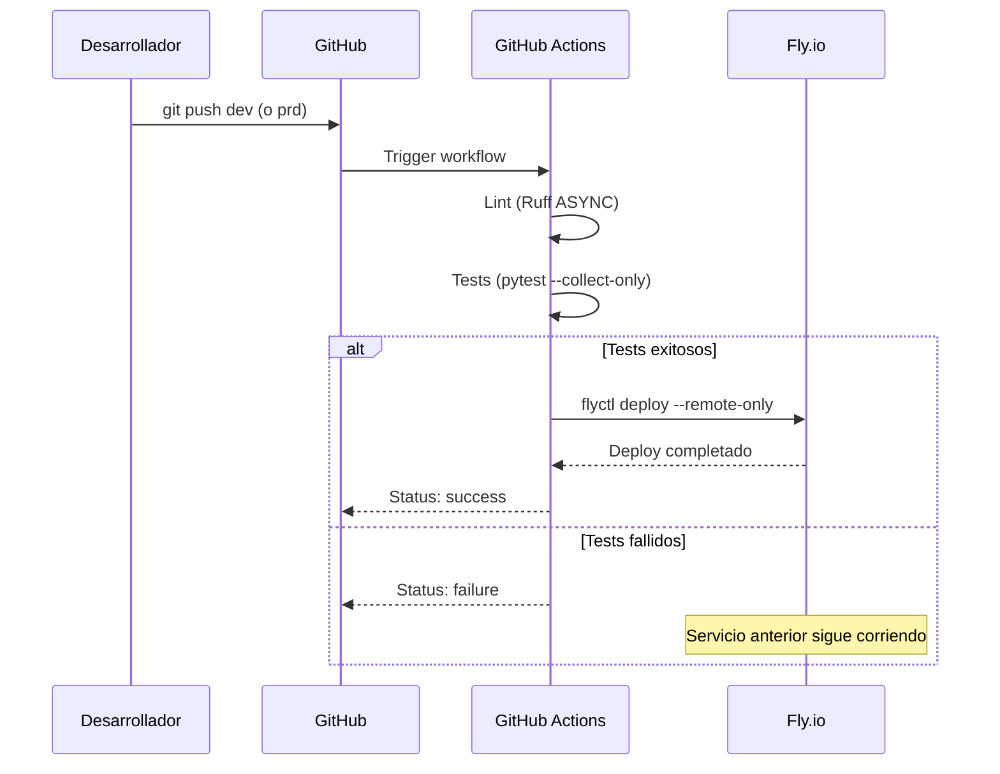
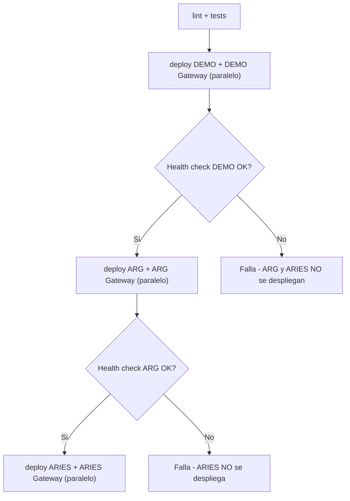
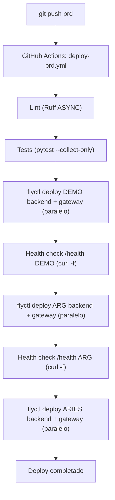

# GitHub Actions

## Vision General

GDI Latam usa GitHub Actions para CI/CD. Cada push a las ramas `dev` o `prd` dispara el workflow correspondiente, que corre lint/tests y luego hace deploy directamente a Fly.io usando `flyctl`.

Los frontends (GDI-FRONTEND, GDI-BackOffice-Front) se despliegan automaticamente via Vercel al hacer push (sin workflow manual).

---

## Repositorios

Cada servicio es un repositorio independiente en la organizacion GitHub (your-org):

| Repositorio | Servicio | Stack | Deploy |
|-------------|----------|-------|--------|
| GDI-FRONTEND | GDI-FRONTEND | Next.js 15 | Vercel (auto) |
| GDI-Backend | GDI-Backend + MCP Gateway | FastAPI | Fly.io via Actions |
| GDI-BackOffice-Front | GDI-BackOffice-Front | Next.js 15 | Vercel (auto) |
| GDI-BackOffice-Back | GDI-BackOffice-Back | FastAPI | Fly.io via Actions |
| GDI-PDFComposer | GDI-PDFComposer | FastAPI | Fly.io via Actions |
| GDI-Notary | GDI-Notary | FastAPI + pyHanko | Fly.io via Actions |
| GDI-AgenteLANG | GDI-AgenteLANG | FastAPI + LangGraph | Fly.io via Actions |
| GDI-BD | -- | Scripts SQL, migraciones | Manual |

---

## Ramas y Ambientes

| Rama | Deploy | Ambiente |
|------|--------|----------|
| `dev` | GitHub Actions → Fly.io DEV | `gdi-*-dev` (org: gdi-dev) |
| `prd` | GitHub Actions → Fly.io PRD | `{cliente}-*-prd` (org: gdilatam) |
| `feat/*`, `fix/*`, etc. | Sin deploy automatico | Solo CI (lint) |

!!! warning "Nunca hacer deploy manual"
    Excepto para PostgreSQL, el deploy siempre es via `git push`. Nunca ejecutar `flyctl deploy` manualmente en apps de backend/microservicios.

---

## Workflow de CI/CD

### Como Funciona

1. Desarrollador hace `git push` a `dev` o `prd`
2. GitHub Actions ejecuta el workflow correspondiente
3. Se corre lint (Ruff ASYNC) y tests (`pytest --collect-only`)
4. Se hace deploy a Fly.io con `flyctl deploy --config fly.{env}.toml --remote-only`



---

## Workflow DEV (rama: dev)

El workflow DEV es simple: lint → deploy en paralelo para backend y gateway.

```yaml
name: Deploy DEV

on:
  push:
    branches: [dev]

concurrency:
  group: deploy-dev
  cancel-in-progress: true  # Si llega otro push, cancela el anterior

jobs:
  lint:
    steps:
      - uses: actions/checkout@v5
      - run: ruff check --select ASYNC --exclude tests/ .

  deploy-backend:
    needs: lint
    steps:
      - uses: actions/checkout@v5
      - uses: superfly/flyctl-actions/setup-flyctl@v1
      - run: flyctl deploy --config fly.toml --remote-only
        env:
          FLY_API_TOKEN: ${{ secrets.FLY_API_TOKEN }}

  deploy-gateway:
    needs: lint
    steps:
      - run: flyctl deploy --config fly.gateway.toml --remote-only
        env:
          FLY_API_TOKEN: ${{ secrets.FLY_API_TOKEN }}
```

---

## Workflow PRD (rama: prd)

El workflow PRD usa un patron de deploy en cascada: **DEMO primero** (con health check), luego **ARG** (con health check), luego **ARIES**. Esto permite detectar problemas en DEMO antes de afectar los clientes productivos.



Cada cliente tiene su propio `fly.{cliente}.toml` y `fly.{cliente}.gateway.toml` en el repo:

| Config | App destino |
|--------|------------|
| `fly.demo.toml` | `<your-backend-app>` |
| `fly.demo.gateway.toml` | `<your-gateway-app>` |
| `fly.arg.toml` | `<your-backend-app>` |
| `fly.arg.gateway.toml` | `<your-gateway-app>` |
| `fly.aries.toml` | `<your-backend-app>` |
| `fly.aries.gateway.toml` | `<your-gateway-app>` |

!!! info "Health checks entre clientes"
    El workflow espera que DEMO este healthy antes de deployar ARG, y que ARG este healthy antes de deployar ARIES. Si un health check falla, los clientes siguientes no reciben el deploy.

---

## Servicios con Dockerfile

Todos los servicios backend tienen su propio `Dockerfile`. Fly.io lo usa en el `[build]` del toml:

| Servicio | Base Image | Notas |
|----------|-----------|-------|
| GDI-Backend | `python:3.12-slim` | Gunicorn + Uvicorn, multi-worker |
| GDI-BackOffice-Back | `python:3.12-slim` | psycopg2 |
| GDI-PDFComposer | `python:3.13-slim` | Usuario non-root, gunicorn config |
| GDI-Notary | `python:3.11-slim` | Dependencias sistema (wget, fontconfig), fuentes, certificados |
| GDI-AgenteLANG | `python:3.12-slim` | Dependencias sistema (gcc, libpq-dev) |

### Frontends (Vercel)

Los frontends (GDI-FRONTEND, GDI-BackOffice-Front) se despliegan automaticamente a Vercel cuando se hace push a la rama conectada. No requieren Dockerfile ni workflow de Actions.

---

## GitHub Secrets

Los siguientes secrets se configuran en cada repositorio o a nivel de organizacion:

| Secret | Descripcion | Donde obtener |
|--------|-------------|---------------|
| `FLY_API_TOKEN` | Token Fly.io para DEV (org: gdi-dev) | `flyctl tokens create deploy -o gdi-dev` |
| `FLY_API_TOKEN_PRD` | Token Fly.io para PRD (org: gdilatam) | `flyctl tokens create deploy -o gdilatam` |

### Configurar Secrets

**A nivel de repositorio:**

1. Ir al repositorio en GitHub
2. **Settings** > **Secrets and variables** > **Actions**
3. Click **New repository secret**

**A nivel de organizacion (recomendado):**

1. Ir a la organizacion your-org en GitHub
2. **Settings** > **Secrets and variables** > **Actions**
3. Agregar secrets compartidos y seleccionar repositorios que pueden acceder

---

## Flujo Completo de un Deployment PRD



---

## Buenas Practicas

### Branching

```bash
# Crear rama de feature
git checkout -b feat/nueva-funcionalidad

# Desarrollar y commitear
git add .
git commit -m "feat(backend): add new endpoint for X"

# Push a feature branch (NO despliega)
git push origin feat/nueva-funcionalidad

# Crear Pull Request en GitHub
# Review + merge a dev = Deploy DEV automatico

# Cuando DEV esta verificado, merge dev → prd = Deploy PRD
```

!!! tip "Proteccion de rama prd"
    Configura proteccion de rama en `prd` para requerir Pull Request con review antes de merge. Esto evita deployments accidentales a produccion.

### Commits

Seguir el formato convencional por repositorio:

```bash
# Formato
<tipo>(<scope>): <descripcion>

# Ejemplos
feat(backend): add document import endpoint
fix(frontend): resolve PDF viewer hydration error
refactor(notary): extract certificate loading logic
docs(deploy): update Fly.io configuration guide
```

### Pre-deploy Checklist

- [ ] Tests pasando localmente
- [ ] Secrets actualizados en Fly.io si hay variables nuevas (`flyctl secrets set`)
- [ ] Health check del servicio funciona en DEV
- [ ] Sin credenciales hardcodeadas en codigo ni en fly.*.toml
- [ ] PR revisado y aprobado
- [ ] Migraciones de BD ejecutadas si hay cambios de schema

### Post-deploy Checklist

- [ ] Logs sin errores criticos (`flyctl logs -a <app>`)
- [ ] Health check respondiendo 200
- [ ] Funcionalidad principal testeada en DEV antes de promover a prd
- [ ] Servicios dependientes funcionando
