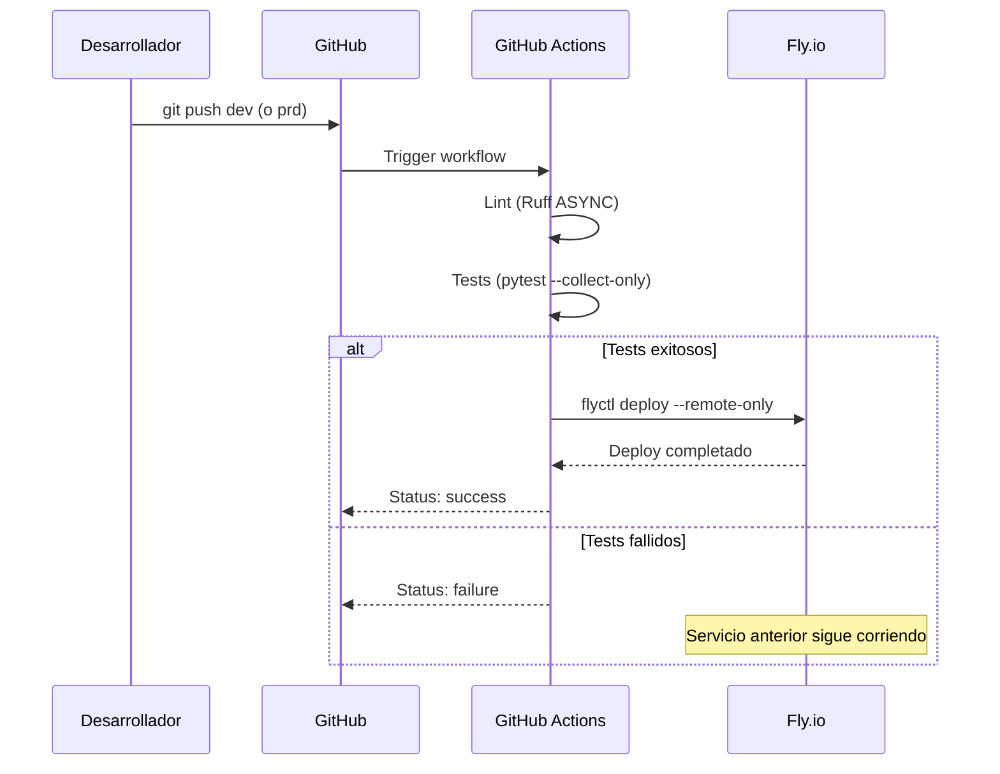
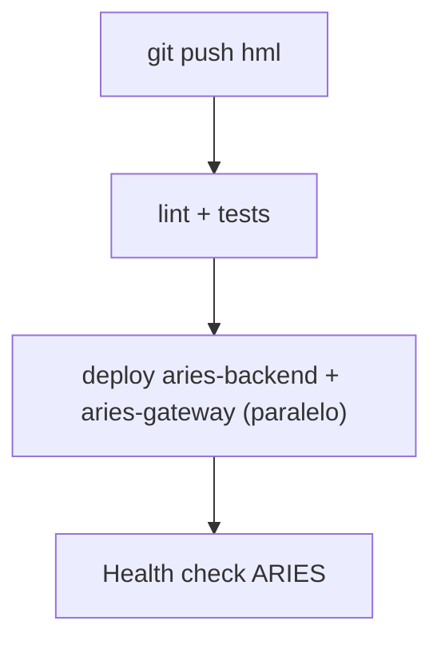
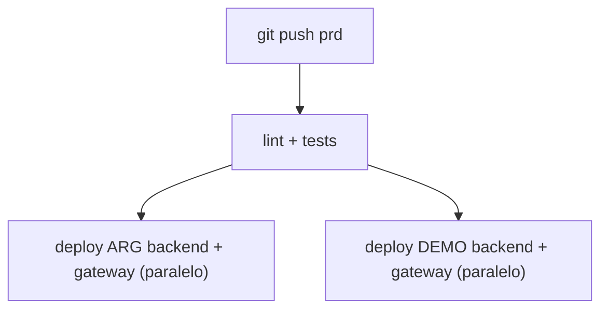
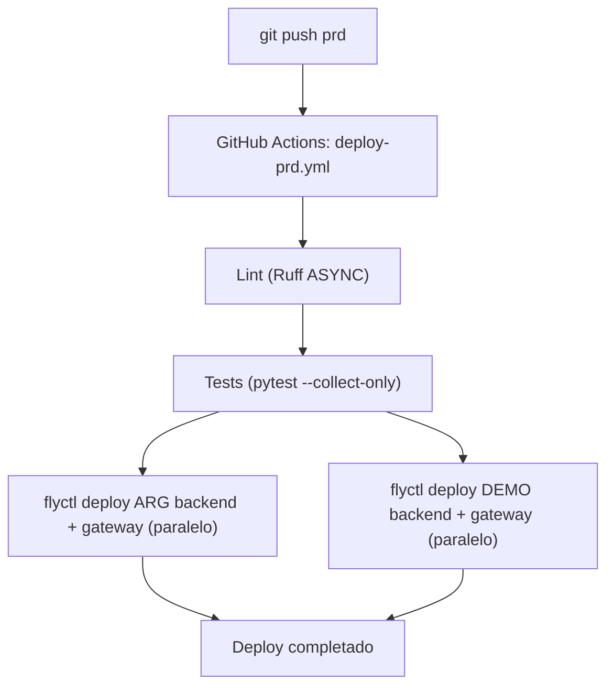

# GitHub Actions

## Vision General

GDI Latam usa GitHub Actions para CI/CD. Cada push a las ramas `dev`, `hml` o `prd` dispara el workflow correspondiente, que corre lint/tests y luego hace deploy directamente a Fly.io usando `flyctl`.

El flujo es escalonado de 3 niveles: **`dev` (DEV) → `hml` (HML = ARIES) → `prd` (PRD = ARG + DEMO)**. ARIES es ambiente de homologacion/sandbox (sin clientes reales) y se deploya desde `hml`; ARG es produccion real y DEMO son trials de prospectos, ambos desde `prd`.

Los frontends (GDI-FRONTEND, GDI-BackOffice-Front) se despliegan automaticamente via Vercel al hacer push a su Production Branch: `aries-frontend` y `aries-backoffice-front` apuntan a `hml`; los `arg-*`/`demo-*` apuntan a `prd`.

---

## Repositorios

Cada servicio es un repositorio independiente en la organizacion GitHub (your-org):

| Repositorio | Servicio | Stack | Deploy |
|-------------|----------|-------|--------|
| GDI-FRONTEND | GDI-FRONTEND | Next.js 15 | Vercel (auto) |
| GDI-Backend | GDI-Backend + MCP Gateway | FastAPI | Fly.io via Actions |
| GDI-BackOffice-Front | GDI-BackOffice-Front | Next.js 15 | Vercel (auto) |
| GDI-BackOffice-Back | GDI-BackOffice-Back | FastAPI | Fly.io via Actions |
| GDI-PDFComposer | GDI-PDFComposer | FastAPI | Fly.io via Actions |
| GDI-Notary | GDI-Notary | FastAPI + pyHanko | Fly.io via Actions |
| GDI-AgenteLANG | GDI-AgenteLANG | FastAPI + LangGraph | Fly.io via Actions |
| GDI-BD | -- | Scripts SQL, migraciones | Manual |

---

## Ramas y Ambientes

| Rama | Workflow | Deploy | Ambiente |
|------|----------|--------|----------|
| `dev` | `deploy-dev.yml` | GitHub Actions → Fly.io DEV | `gdi-*-dev` (org: gdi-dev) |
| `hml` | `deploy-hml.yml` | GitHub Actions → Fly.io HML | `aries-*-prd` (org: gdilatam) |
| `prd` | `deploy-prd.yml` | GitHub Actions → Fly.io PRD | `arg-*-prd` + `demo-*-prd` (org: gdilatam) |
| `feat/*`, `fix/*`, etc. | - | Sin deploy automatico | Solo CI (lint) |

> **`deploy-hml.yml` existe en GDI-Backend, GDI-AgenteLANG y GDI-BackOffice-Back** (los repos con apps `aries-*`). Dispara en push a `hml` y deploya SOLO las apps `aries-*` (en Backend: `aries-backend` + `aries-gateway`). ARIES salio de `deploy-prd.yml`, asi que `prd` ahora deploya solo `arg-*` + `demo-*`.

!!! warning "Nunca hacer deploy manual"
    Excepto para PostgreSQL, el deploy siempre es via `git push`. Nunca ejecutar `flyctl deploy` manualmente en apps de backend/microservicios.

---

## Workflow de CI/CD

### Como Funciona

1. Desarrollador hace `git push` a `dev` o `prd`
2. GitHub Actions ejecuta el workflow correspondiente
3. Se corre lint (Ruff ASYNC) y tests (`pytest --collect-only`)
4. Se hace deploy a Fly.io con `flyctl deploy --config fly.{env}.toml --remote-only`



---

## Workflow DEV (rama: dev)

El workflow DEV es simple: lint → deploy en paralelo para backend y gateway.

```yaml
name: Deploy DEV

on:
  push:
    branches: [dev]

concurrency:
  group: deploy-dev
  cancel-in-progress: true  # Si llega otro push, cancela el anterior

jobs:
  lint:
    steps:
      - uses: actions/checkout@v5
      - run: ruff check --select ASYNC --exclude tests/ .

  deploy-backend:
    needs: lint
    steps:
      - uses: actions/checkout@v5
      - uses: superfly/flyctl-actions/setup-flyctl@v1
      - run: flyctl deploy --config fly.toml --remote-only
        env:
          FLY_API_TOKEN: ${{ secrets.FLY_API_TOKEN }}

  deploy-gateway:
    needs: lint
    steps:
      - run: flyctl deploy --config fly.gateway.toml --remote-only
        env:
          FLY_API_TOKEN: ${{ secrets.FLY_API_TOKEN }}
```

---

## Workflow HML (rama: hml) — ARIES

`deploy-hml.yml` dispara en push a `hml` y deploya **solo el ambiente ARIES** (homologacion/sandbox, sin clientes reales). Existe en los repos con apps `aries-*`: GDI-Backend (`aries-backend` + `aries-gateway`), GDI-AgenteLANG (`aries-agentelang`) y GDI-BackOffice-Back (`aries-backoffice-back`).



Usa `fly.aries.toml` / `fly.aries.gateway.toml` y el token `FLY_API_TOKEN_PRD` (ARIES vive en la org Fly `gdilatam`). Los fronts ARIES (`aries-frontend`, `aries-backoffice-front`) se deployan via Vercel con Production Branch = `hml`.

---

## Workflow PRD (rama: prd) — ARG + DEMO

`deploy-prd.yml` deploya **ARG (produccion real) y DEMO (trials) en jobs paralelos**, despues de lint+tests. Ya NO incluye ARIES (salio a `hml`) y ya NO usa cascada con health-checks encadenados entre clientes: ARG y DEMO se deployan en paralelo, cada uno con su propio `fly.{cliente}.toml`.



Cada cliente tiene su propio `fly.{cliente}.toml` y `fly.{cliente}.gateway.toml` en el repo:

| Config | Rama | Ambiente |
|--------|------|----------|
| `fly.arg.toml` / `fly.arg.gateway.toml` | `prd` | ARG (produccion real) |
| `fly.demo.toml` / `fly.demo.gateway.toml` | `prd` | DEMO (trials) |
| `fly.aries.toml` / `fly.aries.gateway.toml` | `hml` | ARIES (homologacion) |

---

## Servicios con Dockerfile

Todos los servicios backend tienen su propio `Dockerfile`. Fly.io lo usa en el `[build]` del toml:

| Servicio | Base Image | Notas |
|----------|-----------|-------|
| GDI-Backend | `python:3.12-slim` | Gunicorn + Uvicorn, multi-worker |
| GDI-BackOffice-Back | `python:3.12-slim` | psycopg2 |
| GDI-PDFComposer | `python:3.13-slim` | Usuario non-root, gunicorn config |
| GDI-Notary | `python:3.11-slim` | Dependencias sistema (wget, fontconfig), fuentes, certificados |
| GDI-AgenteLANG | `python:3.12-slim` | Dependencias sistema (gcc, libpq-dev) |

### Frontends (Vercel)

Los frontends (GDI-FRONTEND, GDI-BackOffice-Front) se despliegan automaticamente a Vercel cuando se hace push a la rama conectada. No requieren Dockerfile ni workflow de Actions.

---

## GitHub Secrets

Los siguientes secrets se configuran en cada repositorio o a nivel de organizacion:

| Secret | Descripcion | Donde obtener |
|--------|-------------|---------------|
| `FLY_API_TOKEN` | Token Fly.io para DEV (org: gdi-dev) | `flyctl tokens create deploy -o gdi-dev` |
| `FLY_API_TOKEN_PRD` | Token Fly.io para PRD (org: gdilatam) | `flyctl tokens create deploy -o gdilatam` |

### Configurar Secrets

**A nivel de repositorio:**

1. Ir al repositorio en GitHub
2. **Settings** > **Secrets and variables** > **Actions**
3. Click **New repository secret**

**A nivel de organizacion (recomendado):**

1. Ir a la organizacion your-org en GitHub
2. **Settings** > **Secrets and variables** > **Actions**
3. Agregar secrets compartidos y seleccionar repositorios que pueden acceder

---

## Flujo Completo de un Deployment PRD



ARIES no aparece aca: se deploya por separado desde `hml` (`deploy-hml.yml`).

---

## Buenas Practicas

### Branching

```bash
# Crear rama de feature
git checkout -b feat/nueva-funcionalidad

# Desarrollar y commitear
git add .
git commit -m "feat(backend): add new endpoint for X"

# Push a feature branch (NO despliega)
git push origin feat/nueva-funcionalidad

# Crear Pull Request en GitHub
# Review + merge a dev = Deploy DEV automatico

# Cuando DEV esta verificado, merge dev → hml = Deploy HML (ARIES, homologacion)
# Cuando ARIES esta homologado, merge hml → prd = Deploy PRD (ARG + DEMO)
```

!!! tip "Proteccion de rama prd"
    Configura proteccion de rama en `prd` para requerir Pull Request con review antes de merge. Esto evita deployments accidentales a produccion.

### Commits

Seguir el formato convencional por repositorio:

```bash
# Formato
<tipo>(<scope>): <descripcion>

# Ejemplos
feat(backend): add document import endpoint
fix(frontend): resolve PDF viewer hydration error
refactor(notary): extract certificate loading logic
docs(deploy): update Fly.io configuration guide
```

### Pre-deploy Checklist

- [ ] Tests pasando localmente
- [ ] Secrets actualizados en Fly.io si hay variables nuevas (`flyctl secrets set`)
- [ ] Health check del servicio funciona en DEV
- [ ] Sin credenciales hardcodeadas en codigo ni en fly.*.toml
- [ ] PR revisado y aprobado
- [ ] Migraciones de BD ejecutadas si hay cambios de schema

### Post-deploy Checklist

- [ ] Logs sin errores criticos (`flyctl logs -a <app>`)
- [ ] Health check respondiendo 200
- [ ] Funcionalidad testeada en DEV, luego homologada en HML (ARIES) antes de promover a prd
- [ ] Servicios dependientes funcionando
