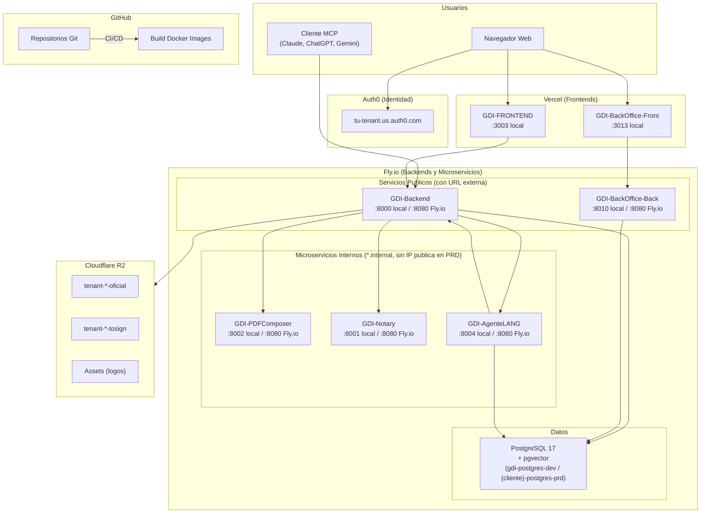

# Infraestructura

## Vision General

GDI Latam opera sobre una arquitectura cloud distribuida en cuatro plataformas principales:

| Plataforma | Rol | Servicios |
|------------|-----|-----------|
| **Fly.io** | Hosting de backends, microservicios y PostgreSQL | 25 apps (7 DEV + 16 PRD + 2 CERO1) |
| **Vercel** | Hosting de frontends Next.js | 9 proyectos (DEV + PRD por cliente) |
| **Cloudflare R2** | Almacenamiento de objetos (S3-compatible) | Buckets para PDFs oficiales, PDFs pendientes de firma, assets |
| **Auth0** | Identidad y autenticacion | OAuth 2.0, JWT, SSO para todas las aplicaciones — tenant: `gdilatam.us.auth0.com` |

---

## Diagrama de Infraestructura



---

## Servicios Desplegados

### Servicios Publicos (con URL externa)

| Servicio | Stack | Puerto local | Puerto Fly.io | Plataforma |
|----------|-------|--------------|---------------|------------|
| GDI-FRONTEND | Next.js 15, React 18, TypeScript | 3003 | N/A (Vercel) | Vercel |
| GDI-Backend | FastAPI, Python 3.12, Gunicorn | 8000 | 8080 | Fly.io |
| GDI-BackOffice-Front | Next.js 15, React 18, TypeScript | 3013 | N/A (Vercel) | Vercel |
| GDI-BackOffice-Back | FastAPI, Python 3.12, psycopg2 | 8010 | 8080 | Fly.io |

### Microservicios Internos (solo accesibles via red privada Fly.io en PRD)

En produccion, GDI-PDFComposer y GDI-Notary son **internal-only**: no tienen IP publica. El Backend los llama exclusivamente por Fly.io private networking (`*.internal:8080`). En DEV si tienen URL publica para facilitar el desarrollo.

| Servicio | Stack | Puerto local | App Fly.io PRD | URL interna PRD |
|----------|-------|--------------|----------------|-----------------|
| GDI-PDFComposer | FastAPI, Jinja2, WeasyPrint, PyMuPDF | 8002 | `gdi-pdfcomposer-prd` | `gdi-pdfcomposer-prd.internal:8080` |
| GDI-Notary | FastAPI, pyHanko, PyMuPDF | 8001 | `gdi-notary-prd` | `gdi-notary-prd.internal:8080` |
| GDI-AgenteLANG | FastAPI, LangGraph, pgvector | 8004 | `{cliente}-agentelang-prd` | `{cliente}-agentelang-prd.internal:8080` |

### Base de Datos

| Servicio | Version | Tipo | Proposito |
|----------|---------|------|-----------|
| PostgreSQL | 17+ | Fly.io Postgres (pgvector) | BD principal con pgvector para embeddings. `min_machines_running=1` en PRD. |

---

## Flujo de Comunicacion

### Comunicacion Externa (URLs publicas)

Los frontends y clientes MCP se comunican con los backends a traves de URLs publicas configuradas con un reverse proxy o dominio:

```
Browser → https://tu-frontend.tu-dominio.com → https://tu-backend.tu-dominio.com
```

### Comunicacion Interna (Fly.io Private Networking)

Los backends se comunican con los microservicios a traves de la red privada de Fly.io, usando el hostname `*.internal` con puerto `8080`:

```
GDI-Backend → http://gdi-pdfcomposer-prd.internal:8080
GDI-Backend → http://gdi-notary-prd.internal:8080
GDI-Backend → http://{cliente}-agentelang-prd.internal:8080
```

!!! warning "Fly.io Private Networking"
    Las URLs `*.internal` solo funcionan entre apps de la misma organizacion Fly.io. No son accesibles desde internet. En produccion, PDFComposer y Notary no tienen IP publica — el unico acceso es via red privada.

---

## Seguridad

### Autenticacion

| Capa | Mecanismo | Proveedor |
|------|-----------|-----------|
| Usuarios finales | OAuth 2.0 + JWT | Auth0 |
| Comunicacion entre servicios | API Key (`X-API-Key` header) | Configurado en variables de entorno |
| MCP Server | OAuth 2.0 (RFC 9728) | Auth0 |
| REST API externa | API Key + `X-User-ID` | Almacenado en BD |

### Variables Sensibles

Todas las credenciales se almacenan como variables de entorno (archivos `.env` o seccion `environment:` en Docker Compose). Nunca en codigo fuente.

| Tipo | Ejemplos |
|------|----------|
| Base de datos | `DATABASE_URL`, `DB_HOST`, `DB_PASSWORD` |
| Auth0 | `AUTH0_DOMAIN`, `AUTH0_CLIENT_SECRET` |
| Cloudflare R2 | `CF_R2_ACCESS_KEY_ID`, `CF_R2_SECRET_ACCESS_KEY` |
| API Keys internas | `PDFCOMPOSER_API_KEY`, `NOTARY_API_KEY`, `INTERNAL_API_KEY` |

!!! info "Secrets en Fly.io y Vercel"
    Los secrets se gestionan con `flyctl secrets set KEY=VALUE -a <app-name>` para Fly.io y `vercel env add KEY production` para Vercel. Nunca en codigo fuente ni en los archivos `fly.*.toml`.

---

## Secciones de esta Guia

| Seccion | Contenido |
|---------|-----------|
| [Cloudflare R2](cloudflare-r2.md) | Buckets, credenciales, API S3, estructura de keys |
| [GitHub Actions](github-actions.md) | Workflows CI/CD, deploy a Fly.io via GitHub Actions |
