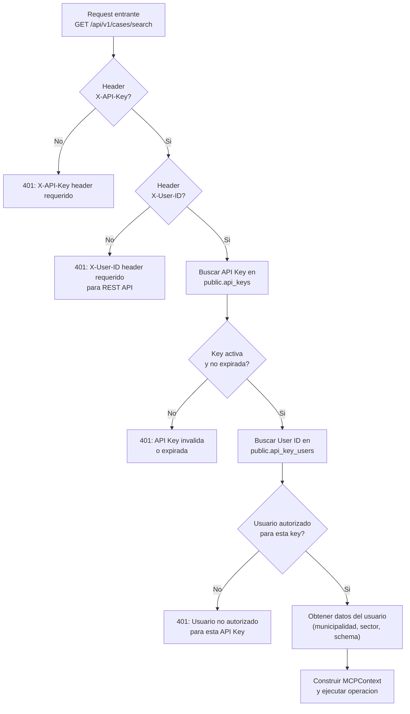
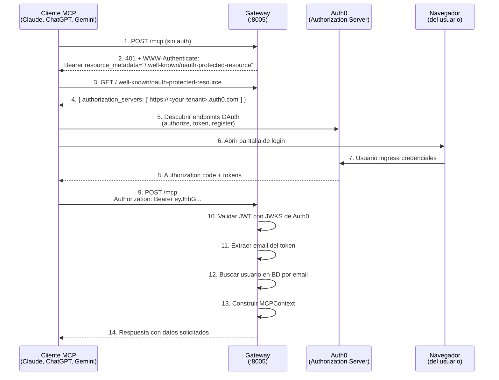
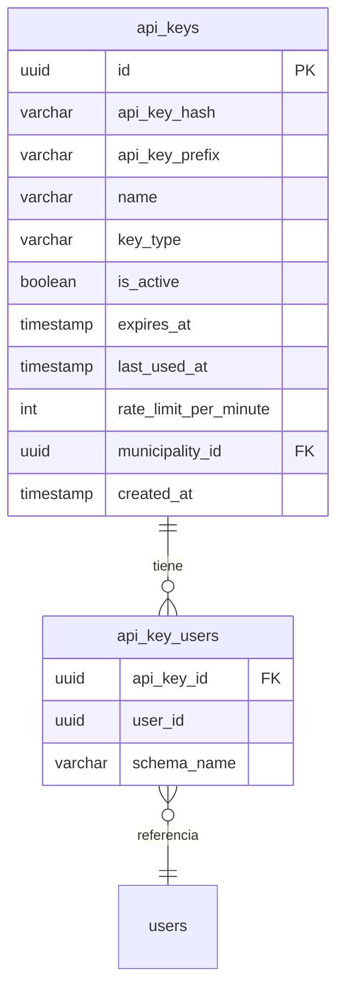
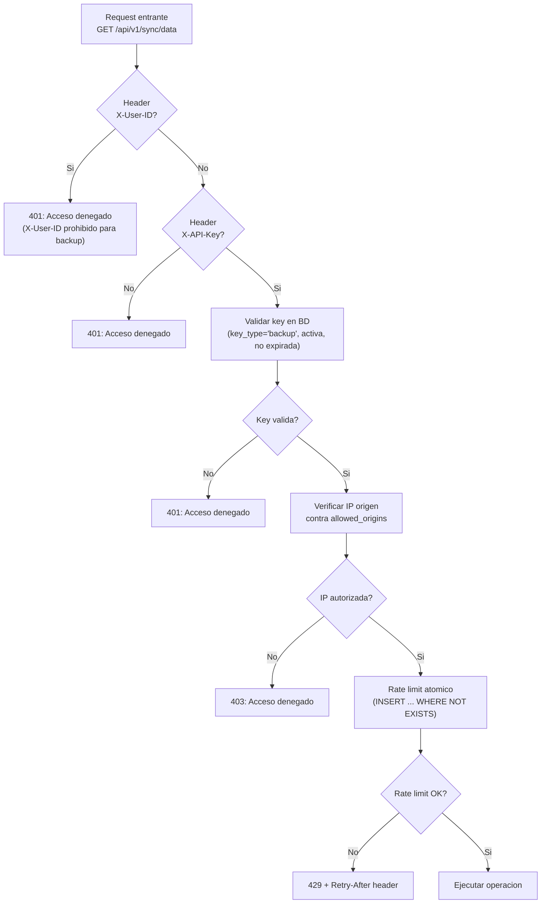

# Autenticacion

El Gateway soporta **dos metodos de autenticacion** segun el tipo de cliente:

| Metodo | Clientes | Mecanismo | Uso tipico |
|--------|----------|-----------|------------|
| **REST API Key** | Scripts, bots, sistemas | `X-API-Key` + `X-User-ID` (headers) | Integraciones programaticas |
| **MCP OAuth 2.0** | Claude, ChatGPT, Gemini | JWT via Auth0 | Agentes de inteligencia artificial |

---

## REST API - Autenticacion por API Key

### Headers requeridos

Cada request a la REST API (`/api/v1/*`) requiere **dos headers obligatorios**:

| Header | Formato | Descripcion |
|--------|---------|-------------|
| `X-API-Key` | `sk-gdi-xxx` | API Key del sistema externo, almacenada como hash en la tabla `public.api_keys` |
| `X-User-ID` | UUID v4 | Identificador del usuario que ejecuta la operacion. Debe estar autorizado para esa API Key en `public.api_key_users` |

!!! warning "Ambos headers son obligatorios"
    Si falta cualquiera de los dos headers, el Gateway responde `401 Unauthorized` inmediatamente. No existe autenticacion solo por API Key sin identificar al usuario.

### Ejemplo de request

```bash
curl -H "X-API-Key: sk-gdi-abc123" \
     -H "X-User-ID: 550e8400-e29b-41d4-a716-446655440000" \
     "https://gateway.your-domain.com/api/v1/cases/search?page=1&status=active"
```

### Flujo de validacion

El Gateway ejecuta los siguientes pasos en orden al recibir un request REST:



### Errores de autenticacion REST

| HTTP | Mensaje | Causa | Solucion |
|------|---------|-------|----------|
| 401 | `X-API-Key header requerido` | No se envio el header `X-API-Key` | Agregar el header con la API Key proporcionada por el administrador |
| 401 | `X-User-ID header requerido para REST API` | No se envio el header `X-User-ID` | Agregar el header con el UUID del usuario |
| 401 | `API Key invalida o expirada` | La API Key no existe, fue desactivada o expiro | Verificar la key con el administrador. Solicitar una nueva si expiro |
| 401 | `Usuario no autorizado para esta API Key` | El User ID no esta asociado a esa API Key | Solicitar al administrador que vincule el usuario a la API Key |

!!! note "Formato de respuesta de error"
    Todos los errores de autenticacion devuelven un JSON con la siguiente estructura:

    ```json
    {
      "error": "X-API-Key header requerido",
      "status": 401
    }
    ```

### Como obtener API Key y User ID

Las credenciales se gestionan exclusivamente desde el **BackOffice** (panel de administracion):

1. El administrador del municipio accede al BackOffice
2. En la seccion de **API Keys**, crea una nueva key con un nombre descriptivo (ej: "Sistema de Tramites Municipal")
3. El sistema genera una key con formato `sk-gdi-xxx` y la muestra **una sola vez**
4. El administrador asocia uno o mas usuarios a esa key (tabla `api_key_users`)
5. El administrador entrega la API Key y los User IDs al equipo tecnico que realizara la integracion

!!! danger "Seguridad de la API Key"
    La API Key se muestra una unica vez al momento de crearla. Si se pierde, el administrador debe generar una nueva. Nunca incluir API Keys en codigo fuente o repositorios publicos.

---

## MCP Server - Autenticacion OAuth 2.0

### Descripcion general

El MCP Server utiliza **OAuth 2.0** con Auth0 como proveedor de identidad. El flujo de autenticacion es **completamente automatico** para clientes compatibles: el usuario solo necesita iniciar sesion con su cuenta de GDI cuando el navegador se lo solicite.

Los clientes soportados actualmente son:

- **Claude Code** (Anthropic)
- **ChatGPT** (OpenAI)
- **Gemini** (Google)

!!! info "Estandares implementados"
    El flujo se basa en los RFCs 9728 (OAuth Protected Resource Metadata) y 8414 (OAuth Authorization Server Metadata), lo que permite a los clientes MCP descubrir automaticamente como autenticarse sin configuracion manual.

### Flujo de autenticacion paso a paso



### Detalle de cada paso

**Paso 1-2: Desafio de autenticacion**

El cliente MCP intenta conectarse al endpoint `/mcp` sin credenciales. El Gateway responde con un `401 Unauthorized` y un header `WWW-Authenticate` que indica donde descubrir la configuracion OAuth:

```http
HTTP/1.1 401 Unauthorized
WWW-Authenticate: Bearer resource_metadata="https://gateway.your-domain.com/.well-known/oauth-protected-resource"
Content-Type: application/json

{
    "error": "Authorization required",
    "hint": "Use OAuth 2.0 to authenticate"
}
```

**Paso 3-4: Discovery del recurso protegido (RFC 9728)**

El cliente consulta el endpoint de metadata para saber a que servidor de autorizacion debe dirigirse:

```bash
curl "https://gateway.your-domain.com/.well-known/oauth-protected-resource"
```

```json
{
    "resource": "https://gateway.your-domain.com",
    "authorization_servers": [
        "https://<your-tenant>.auth0.com"
    ],
    "scopes_supported": [
        "openid",
        "profile",
        "email",
        "offline_access"
    ],
    "bearer_methods_supported": ["header"]
}
```

**Paso 5-8: Login via Auth0**

El cliente MCP redirige al usuario a Auth0 para autenticarse. El usuario ingresa sus credenciales de GDI (email + contrasena) en el navegador. Auth0 emite un JWT al completar el login.

**Paso 9-14: Operacion autenticada**

El cliente envia requests al endpoint `/mcp` incluyendo el JWT como Bearer token. El Gateway valida el token, identifica al usuario y ejecuta la operacion con los permisos correspondientes.

### Endpoints de discovery

| Endpoint | RFC | Proposito |
|----------|-----|-----------|
| `/.well-known/oauth-protected-resource` | RFC 9728 | Indica el authorization server (Auth0) y scopes soportados |
| `/.well-known/oauth-authorization-server` | RFC 8414 | Metadata OAuth completa (authorize, token, register endpoints). Proxy del `openid-configuration` de Auth0 |
| `/.well-known/mcp.json` | MCP Spec | Manifest del servidor MCP (nombre, version, tools disponibles) |
| `/.well-known/openapi.json` | OpenAPI 3.0 | Especificacion REST API. Usado por ChatGPT Actions para auto-configuracion |

!!! note "ChatGPT y discovery"
    ChatGPT requiere especificamente el endpoint `/.well-known/oauth-authorization-server` (no el path estandar de OpenID Connect). Tambien acepta el alias `/.well-known/oauth-authorization-server/mcp`.

### Validacion del JWT

El Gateway valida el JWT recibido contra las JWKS (JSON Web Key Set) de Auth0, con cache de 30 minutos. Se aceptan multiples audiences para compatibilidad con distintos clientes:

```
Audiences validos:
- AUTH0_AUDIENCE (variable de entorno, audience del Backend)
- MCP_RESOURCE_URI (variable de entorno, configurable por deploy)
- https://gateway.your-domain.com (URL del recurso)
```

Del JWT se extrae el **email** del usuario (del claim `email` o, como fallback, consultando el endpoint `/userinfo` de Auth0). Con el email se busca al usuario en la base de datos y se construye el contexto de operacion.

### Multi-tenant: usuarios con multiples organizaciones

Si un usuario tiene acceso a mas de una organizacion (municipalidad), el Gateway responde con un error que indica que debe seleccionar un tenant:

```json
{
    "error": "multi_tenant_selection_required",
    "message": "El usuario tiene acceso a multiples organizaciones",
    "tenants": [
        {
            "tenant_id": "uuid-municipio-a",
            "name": "Municipalidad de San Martin"
        },
        {
            "tenant_id": "uuid-municipio-b",
            "name": "Municipalidad de Tres de Febrero"
        }
    ]
}
```

Para resolver esto:

1. El agente IA ejecuta el tool `list_my_tenants` para obtener las organizaciones disponibles
2. El usuario indica a cual quiere conectarse
3. Las llamadas subsiguientes incluyen el `tenant_id` seleccionado

---

## Tablas de base de datos

Las credenciales REST se almacenan en el schema `public` (compartido entre todos los tenants):

### `public.api_keys`

Almacena las API Keys generadas desde el BackOffice:

```sql
CREATE TABLE public.api_keys (
    id                   UUID PRIMARY KEY DEFAULT gen_random_uuid(),
    api_key_hash         VARCHAR NOT NULL,     -- Hash SHA-256 de la API Key
    api_key_prefix       VARCHAR,              -- Prefijo visible (primeros 12 chars)
    name                 VARCHAR NOT NULL,     -- Nombre descriptivo (ej: "Sistema Tramites")
    key_type             VARCHAR DEFAULT 'standard', -- 'standard' o 'backup'
    is_active            BOOLEAN DEFAULT true, -- Si la key esta activa
    expires_at           TIMESTAMP,            -- Fecha de expiracion (NULL = sin expiracion)
    last_used_at         TIMESTAMP,            -- Ultima vez usada
    rate_limit_per_minute INT,                 -- Limite de requests por minuto
    municipality_id      UUID NOT NULL,        -- Municipalidad propietaria
    created_at           TIMESTAMP DEFAULT now()
);
```

!!! note "Hash, no texto plano"
    La API Key se almacena como hash SHA-256 (`api_key_hash`). El valor original (`sk-gdi-xxx`) solo se muestra al momento de crear la key. El Gateway hashea la key recibida en el header y la compara contra `api_key_hash`.

### `public.api_key_users`

Vincula API Keys con usuarios autorizados y sus municipalidades:

```sql
CREATE TABLE public.api_key_users (
    api_key_id      UUID REFERENCES public.api_keys(id),
    user_id         UUID NOT NULL,         -- UUID del usuario en GDI
    schema_name     VARCHAR NOT NULL       -- Schema del tenant (municipalidad)
);
```

### Relacion entre tablas



Una API Key puede tener **multiples usuarios** asociados. Esto permite que un sistema externo opere con distintos usuarios segun el contexto (por ejemplo, un bot que crea documentos en nombre de diferentes funcionarios).

---

## Backup API Keys (Sync)

Los endpoints de sincronizacion (`/api/v1/sync/*`) usan un mecanismo de autenticacion diferente al flujo normal.

### Diferencias con las API Keys standard

| Aspecto | API Key standard | Backup API Key |
|---------|-----------------|----------------|
| `X-User-ID` | Requerido | **Prohibido** (se rechaza si se envia) |
| `key_type` en BD | `standard` | `backup` |
| Validacion IP | No | Si (campo `allowed_origins` en `api_keys`) |
| Uso | Todas las operaciones | Solo `/api/v1/sync/*` |

### Flujo de autenticacion Backup



### Errores de autenticacion Backup

Todos los errores de autenticacion backup devuelven `{"error": "Acceso denegado"}` sin detallar el motivo (por seguridad).

| HTTP | Causa real |
|------|-----------|
| 401 | Key no encontrada, tipo incorrecto, inactiva, expirada, o se envio `X-User-ID` |
| 403 | IP del cliente no esta en `allowed_origins` |
| 429 | Rate limit excedido (incluye `Retry-After` en segundos) |

---

## Comparacion de metodos

| Aspecto | REST API Key | MCP OAuth 2.0 |
|---------|-------------|---------------|
| **Quien lo usa** | Sistemas, scripts, bots | Agentes IA (Claude, ChatGPT, Gemini) |
| **Credenciales** | API Key + User ID (headers) | JWT automatico via Auth0 |
| **Configuracion** | Manual (el admin crea la key) | Automatica (discovery RFC 9728) |
| **Identidad del usuario** | Explicita (`X-User-ID` header) | Implicita (email del JWT) |
| **Expiracion** | Configurable o permanente | JWT con TTL de Auth0 + refresh token |
| **Multi-tenant** | Resuelto por `municipality_id` en `api_key_users` | Resuelto por email, con selector si hay multiples orgs |
| **Permisos** | Mismos que el usuario en la UI | Mismos que el usuario en la UI |
| **Revocacion** | Desactivar key en BackOffice | Desactivar usuario en Auth0 |

!!! tip "Cual usar"
    - Si tu integracion es un **script o sistema automatizado**, usa **REST API Key**. Es mas simple de configurar y no requiere flujo OAuth.
    - Si tu integracion es un **agente IA** que opera en nombre de un usuario humano, usa **MCP OAuth 2.0**. El usuario se autentica con su propia cuenta y el agente hereda sus permisos.
