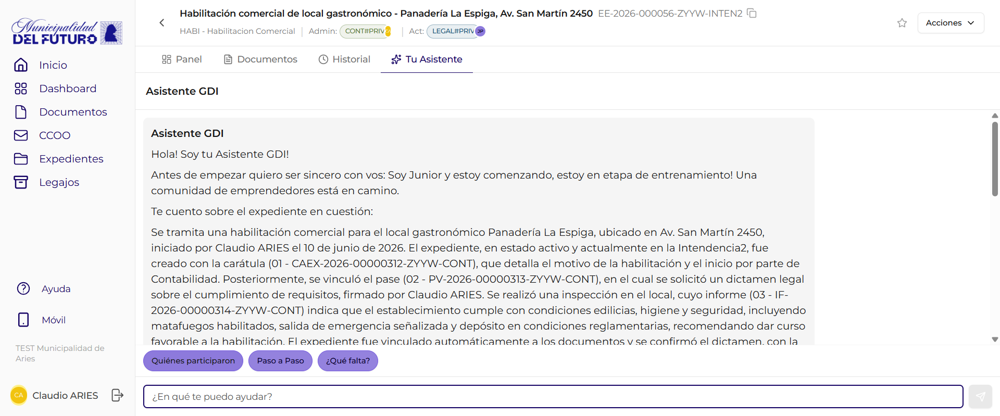

# Asistente AI

El Asistente AI es una herramienta integrada en GDI que permite consultar informacion sobre expedientes y documentos usando **lenguaje natural**. Esta disponible dentro de cada expediente para consultar su contenido. Al abrir el chat presenta automaticamente un **resumen del expediente** generado por IA y, para responder, lee los **resumenes de los documentos** vinculados y el **historial de movimientos** del expediente. Es de **solo lectura**: consulta y explica, pero no modifica nada.

!!! video "Video tutorial"
    **GDI — Asistente IA del expediente: pregunta en lenguaje natural**

    
<iframe src="https://www.youtube-nocookie.com/embed/kvCS4NgVMPs?list=PLRIZqApsdJ12JCSzhUxaZ73AheVHUEpDq" title="GDI — Asistente IA del expediente: pregunta en lenguaje natural" loading="lazy" allow="accelerometer; autoplay; clipboard-write; encrypted-media; gyroscope; picture-in-picture; web-share" allowfullscreen></iframe>

---

## Asistente en el Expediente

Dentro de la vista de detalle de un expediente, el tab **"Tu Asistente"** abre un chat integrado que permite hacer preguntas sobre ese expediente especifico.

Al abrir el tab, el asistente saluda (*"Hola! Soy tu Asistente GDI!"*), aclara que esta en etapa de entrenamiento (*"Soy Junior y estoy comenzando"*) y **presenta automaticamente un resumen del expediente** (*"Te cuento sobre el expediente en cuestion: ..."*). Ese resumen describe la caratula, los pases y asignaciones, los documentos vinculados con su contenido y el estado actual.

### Como usarlo

1. Abrir un expediente desde la seccion Expedientes.
2. Hacer click en el tab **"Tu Asistente"**.
3. El asistente muestra automaticamente el **resumen del expediente** generado por IA.
4. Escribir una pregunta en el campo de texto inferior o usar los **chips rapidos**.
5. El asistente responde leyendo los resumenes de los documentos y el historial del expediente.

---

### Chips rapidos

Los chips rapidos son botones de acceso directo que aparecen debajo del chat. Permiten hacer consultas frecuentes con un solo click.

| Chip | Que hace |
|------|----------|
| **Quienes participaron** | Lista los usuarios que intervinieron en el expediente |
| **Paso a Paso** | Describe la secuencia de movimientos y acciones del expediente en orden cronologico |
| **¿Que falta?** | Analiza la documentacion del expediente e indica si falta algun documento o paso pendiente |

---

### Campo de texto libre

Ademas de los chips rapidos, se puede escribir cualquier pregunta en el campo de texto con el placeholder *"¿En que te puedo ayudar?"*. El asistente interpreta la pregunta y responde leyendo los resumenes de los documentos vinculados y el historial de movimientos del expediente.

Ejemplos de preguntas que se pueden hacer:

| Pregunta | Tipo de respuesta |
|----------|-------------------|
| *"Quien creo este expediente?"* | Nombre del creador y fecha |
| *"Que documentos tiene vinculados?"* | Lista de documentos con tipo, referencia y estado |
| *"Cual fue el ultimo movimiento?"* | Descripcion del ultimo movimiento con fecha y sector |
| *"Resume el expediente en 3 lineas"* | Resumen breve generado por IA |

!!! tip "Resumen automatico al abrir"
    No hace falta pedirlo: apenas abris el tab **"Tu Asistente"**, el asistente presenta solo un resumen del expediente (caratula, pases, documentos vinculados y estado). A partir de ahi podes profundizar con los chips o con preguntas libres.

---

## Preguntas frecuentes

??? question "El asistente puede modificar documentos o expedientes?"
    No. El asistente es de **solo lectura**. Puede consultar informacion, generar resumenes y responder preguntas, pero no puede crear, editar ni firmar documentos.

??? question "De donde saca la informacion el asistente?"
    De los **resumenes de los documentos** vinculados al expediente y del **historial de movimientos** (pases, asignaciones, acciones). Con eso arma el resumen automatico y responde tus preguntas.

??? question "Pregunte por un documento recien creado y no aparece su contenido"
    Cuando un documento se acaba de crear, su contenido puede tardar un momento en quedar indexado para el asistente. En ese caso el asistente lo aclara. Si esperas unos instantes y volves a preguntar, ya deberia poder leerlo.

??? question "Puedo usar el asistente del expediente sin conexion?"
    No. El asistente requiere conexion a internet para funcionar, ya que procesa las consultas en tiempo real.

??? question "Por que a veces el asistente tarda en responder?"
    El servicio de IA puede tardar unos segundos en activarse si estuvo inactivo. Una vez que responde la primera consulta, las siguientes son mas rapidas.
