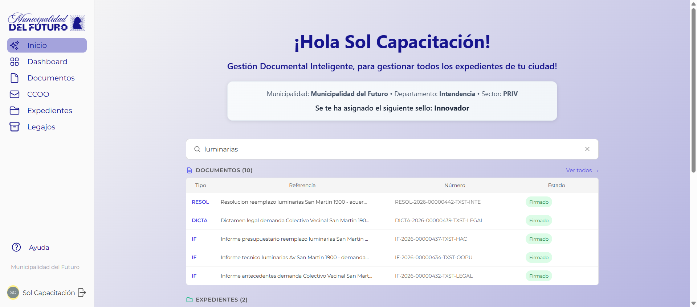

# Buscador General

El buscador general permite encontrar **documentos y expedientes** en todo el sistema desde una unica barra de busqueda. Tiene dos modos: resultados rapidos en tiempo real y busqueda inteligente completa.

---

## Donde encontrar el buscador

El buscador se encuentra en la **pantalla Home** (Inicio), debajo de la tarjeta de bienvenida con los datos del usuario.

---

## Como buscar

### Resultados rapidos (mientras escribis)

1. Escribir al menos **2 caracteres** en el campo de busqueda.
2. Los resultados aparecen automaticamente debajo del campo, divididos en dos secciones: **Documentos** y **Expedientes**.
3. Se muestran hasta **5 resultados** por seccion.
4. Para limpiar la busqueda, hacer click en el icono **X** a la derecha del campo.

### Busqueda inteligente completa (Enter)

Al presionar **Enter** (o hacer click en el hint <kbd>↵</kbd> busqueda inteligente que aparece en el campo), el sistema abre la pantalla de busqueda completa donde combina:

- **Busqueda por texto**: documentos y expedientes que coincidan con las palabras escritas.
- **Busqueda semantica**: documentos cuyo contenido tenga relacion con el significado de la consulta, aunque no contengan exactamente esas palabras.

Los resultados se organizan en tres pestanas: **Semantica**, **Docs** y **Expedientes**. Se pueden ver hasta **50 resultados** por seccion.

!!! tip "Busqueda sin acentos"
    El buscador ignora acentos y tildes. Buscar *"tramite"* encuentra resultados que contengan *"tramite"*, y viceversa.

!!! info "Numeros exactos"
    Si escribis el numero completo de un documento (ej: `NOTA-2026-00000149-TXST-HAC`) o de un expediente (ej: `EE-2026-000007-TXST-HAC`), el sistema lo busca directamente por numero exacto, sin busqueda semantica.

---

## Resultados de Documentos

Los documentos encontrados se muestran en una tabla con las siguientes columnas:

| Columna | Descripcion |
|---------|-------------|
| **Tipo** | Sigla del tipo de documento (ej: NOTA, IF, PREPL) |
| **Referencia** | Titulo descriptivo del documento |
| **Numero** | Numero oficial asignado al firmar (ej: `NOTA-2026-00000149-TXST-HAC`) |
| **Estado** | Estado actual del documento (Firmado, En edicion, etc.) |

Hacer click en un resultado para abrir el documento.

---

## Resultados de Expedientes

Los expedientes encontrados se muestran en una tabla con las siguientes columnas:

| Columna | Descripcion |
|---------|-------------|
| **Trata** | Tipo de expediente (ej: COMP, HABI) |
| **Motivo** | Descripcion del tramite |
| **Numero** | Numero oficial del expediente (ej: `EE-2026-000007-TXST-HAC`) |
| **Sector** | Sector actual donde se encuentra el expediente (ej: `OOPU#PRIV`) |

Hacer click en un resultado para abrir el expediente.

---

## Que se puede buscar

El buscador encuentra coincidencias en multiples campos:

| Criterio de busqueda | Ejemplo |
|----------------------|---------|
| Por referencia o motivo | Escribir *"panaderia"* encuentra expedientes con esa palabra en el motivo |
| Por numero de documento | Escribir *"NOTA-2026"* encuentra documentos con ese prefijo |
| Por numero de expediente | Escribir *"EE-2026-000007"* encuentra el expediente exacto |
| Por contenido del documento | Escribir *"presupuesto"* encuentra documentos que contengan esa palabra en el cuerpo |
| Por tipo | Escribir *"PREPL"* encuentra documentos de tipo Pre-Pliego |
| Por significado (busqueda inteligente) | Escribir *"habilitacion de local comercial"* + Enter encuentra documentos relacionados aunque no usen esas palabras exactas |

---

## Preguntas frecuentes

??? question "El buscador muestra todos los resultados del sistema?"
    El buscador muestra los resultados visibles para el usuario segun sus permisos. Solo se encuentran documentos y expedientes a los que el usuario tiene acceso.

??? question "Puedo buscar desde otra pantalla que no sea Home?"
    El buscador general esta ubicado en la pantalla Home. Cada seccion (Documentos, Expedientes) tiene su propio buscador interno para filtrar dentro de esa seccion.

??? question "La busqueda distingue mayusculas y minusculas?"
    No. La busqueda no distingue entre mayusculas y minusculas. Escribir *"nota"*, *"NOTA"* o *"Nota"* produce los mismos resultados.

??? question "Que pasa si la busqueda inteligente tarda en responder?"
    El sistema puede tardar unos segundos en activarse si estuvo inactivo. En ese caso, los resultados de texto aparecen de inmediato y los resultados semanticos se suman cuando el sistema termina de conectarse. No es necesario volver a buscar.
