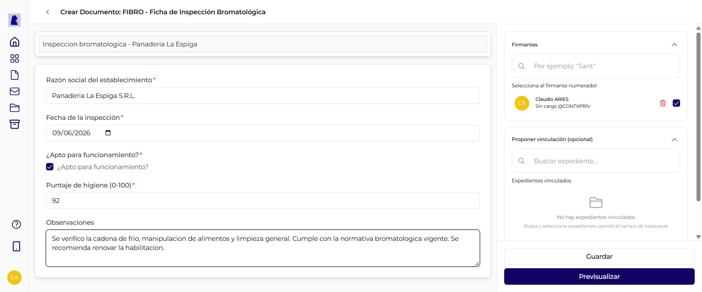
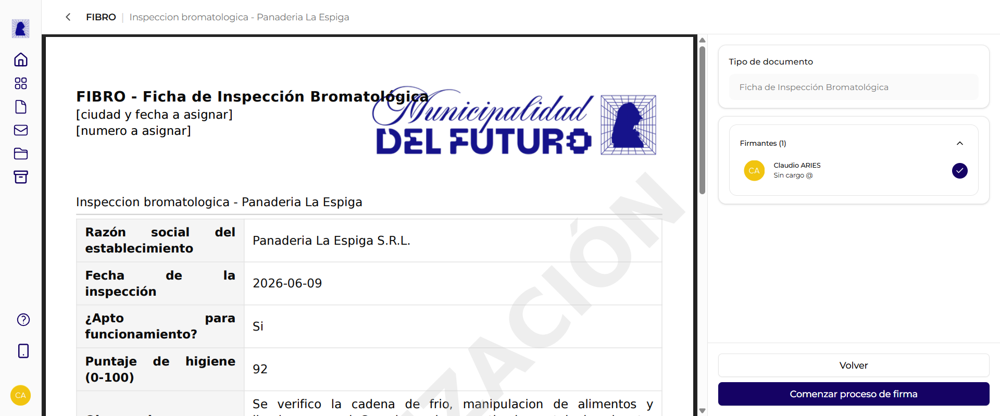

# Documento FFCC (Formulario Controlado)

Un documento **FFCC** (Formulario Controlado) reemplaza el editor de texto libre por un **formulario de campos** que el usuario completa. En vez de redactar el contenido a mano, se cargan valores en campos predefinidos (texto, fecha, numero, si/no, etc.) y el sistema arma el documento oficial con formato `campo: valor`.

Sirve para tramites que siempre tienen la misma estructura de datos: fichas de inspeccion, constancias, formularios de relevamiento, etc. Los campos los define el administrador del organismo en el tipo de documento (ver [Tipos de Documentos](../../administradores/tipos-de-documentos.md#formularios-controlados-ffcc)).

!!! info "Que tipos son FFCC"
    En la lista de tipos al crear un documento, los tipos FFCC se comportan distinto: al elegirlos, el editor muestra los campos del formulario en lugar de la barra de texto enriquecido. Pueden ser un tipo **FFCC** propio del municipio, o variantes **NOTA FFCC** / **MEMO FFCC**.

---

## Crear un documento FFCC

1. Ir a **Documentos** y presionar **"Crear"** (o crear el documento desde un expediente con **"Vincular Documento"**).
2. En **Tipo de Documento**, elegir un tipo FFCC (por ejemplo *Ficha de Inspeccion Bromatologica*).
3. Ingresar la **Referencia** y presionar **Crear**.
4. El editor abre el **formulario controlado** con los campos definidos para ese tipo.

---

## Completar el formulario

En lugar del editor de texto, el panel central muestra los campos del tipo. Cada campo tiene su **etiqueta** y un control segun su tipo:

| Tipo de campo | Control que ve el usuario |
|---------------|---------------------------|
| **Texto corto** | Cuadro de texto de una linea |
| **Texto largo** | Cuadro de texto de varias lineas |
| **Email** | Cuadro de texto que valida formato de correo |
| **Numero** | Campo numerico |
| **Fecha** | Selector de fecha (dia / mes / año) |
| **Seleccion (lista)** | Desplegable con opciones predefinidas |
| **Si / No** | Casilla de verificacion |
| **Documento adjunto** | Carga de un archivo |

Los campos marcados con asterisco (**\***) son **obligatorios**: hay que completarlos antes de poder firmar.

!!! note "El resto del documento es igual"
    Las secciones **Firmantes** y **Proponer vinculacion** (con la opcion de [vinculacion automatica al firmar](../expedientes/vincular-documentos.md)) funcionan igual que en cualquier otro documento. Solo cambia la forma de cargar el contenido.

---

## Como se ve el PDF

Al previsualizar o firmar, el sistema genera el PDF oficial con el membrete del organismo y una **tabla de campos y valores**: cada fila muestra la etiqueta del campo y el valor cargado.

A partir de ahi, el documento sigue el flujo habitual: se firma, se numera y puede vincularse a un expediente como cualquier otro documento.

---

## Preguntas frecuentes

??? question "Por que no veo la barra de texto enriquecido?"
    Porque el tipo de documento es **FFCC**: usa un formulario de campos controlados en vez del editor libre. Es el comportamiento esperado para ese tipo.

??? question "Puedo dejar campos vacios?"
    Solo los campos que **no** son obligatorios. Los campos marcados con asterisco (**\***) deben completarse antes de firmar.

??? question "Quien define los campos del formulario?"
    El administrador del organismo, desde el detalle del tipo de documento en el BackOffice. Ver [Tipos de Documentos - Formularios Controlados (FFCC)](../../administradores/tipos-de-documentos.md#formularios-controlados-ffcc).

??? question "Un FFCC se puede vincular a un expediente?"
    Si. Una vez firmado se comporta como cualquier documento: se puede proponer o vincular automaticamente a uno o varios expedientes.
