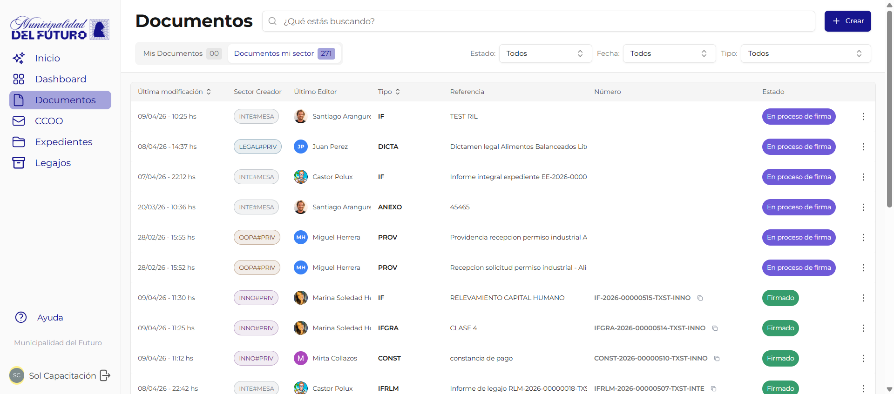

# Documentos

La seccion **Documentos** es el modulo principal de GDI. Desde aqui se crean, editan, firman y gestionan todos los documentos oficiales del organismo.

## Acceso

Desde el **menu lateral izquierdo**, hacer click en **Documentos**. Se muestra el listado de documentos visibles para el usuario.

## Pantalla principal: Listado de documentos

### Pestanas de filtrado

| Pestana | Que muestra |
|---------|-------------|
| **Mis Documentos** | Documentos creados por el usuario actual |
| **Documentos mi sector** | Documentos creados por cualquier usuario del sector al que pertenece el usuario |
| **Documentos favoritos** | Documentos marcados como favorito por el usuario |

### Filtros adicionales

En la parte superior derecha del listado se encuentran tres selectores:

| Filtro | Opciones | Descripcion |
|--------|----------|-------------|
| **Estado** | Todos, En edicion, En proceso de firma, Firmado, Rechazado | Filtrar documentos por su estado actual |
| **Fecha** | Todos, Hoy, Esta semana, Este mes | Filtrar por rango de fecha de ultima modificacion |
| **Tipo** | Todos, IF, NOTA, DICTA, etc. | Filtrar por tipo de documento |

### Tarjetas del listado

Cada documento se muestra como una tarjeta de dos filas.

**Fila 1** (de izquierda a derecha):

| Elemento | Descripcion |
|----------|-------------|
| **Sigla** | Acronimo del tipo de documento en badge primario (ej: `IF`, `NOTA`) |
| **Referencia** | Titulo descriptivo del documento (truncado si es largo) |
| **Estado** | Badge de color redondeado con el estado actual (ej: `Firmado`, `En edicion`) |
| **Numero oficial** | Numero asignado al firmar (ej: `IF-2026-00000122-TXST-INTE`), con boton de copiar al portapapeles. Solo aparece si el documento ya tiene numero |
| **Fecha** | Fecha y hora de ultima modificacion |
| **`>`** | Flecha de navegacion, se resalta al pasar el cursor |

**Fila 2** (de izquierda a derecha):

| Elemento | Descripcion |
|----------|-------------|
| **Resumen IA** | Resumen automatico del contenido generado por IA (`short_resume`), en texto italico gris. Solo aparece si el documento ya fue procesado |
| **Avatar + nombre del ultimo editor** | Foto de perfil (o iniciales en circulo) del ultimo usuario que edito, seguido de su nombre |
| **Avatares de firmantes** | Fotos de perfil (o iniciales) de los firmantes asignados. Se muestran hasta 2; si hay mas, aparece un contador `+N`. Solo aparece si el documento tiene firmantes |

### Buscador

En la parte superior central hay un campo de busqueda con placeholder *"Que estas buscando?"*. Permite buscar por referencia, numero o contenido del documento.

### Boton Crear

En la esquina superior derecha, el boton **"+ Crear"** abre el dialogo para crear un nuevo documento. Ver [Crear y Editar Documento](crear-editar-documento.md).

## Paginas de esta seccion

| Pagina | Descripcion |
|--------|-------------|
| [Crear y Editar Documento](crear-editar-documento.md) | Como crear un documento nuevo, completar campos, agregar firmantes y previsualizar |
| [Documento Importado (PDF)](documento-importado.md) | Como crear un documento subiendo un archivo PDF externo |
| [Documento tipo NOTA](documento-nota.md) | Como crear una nota oficial con destinatarios, copia y copia oculta |
| [Previsualizar Documento](previsualizar-documento.md) | Vista previa en formato PDF antes de enviar a firma |
| [Proceso de Firma](proceso-de-firma.md) | Como funciona el circuito de firmas, orden de firmantes y numerador |
| [Rechazar y Subsanar](rechazar-y-subsanar.md) | Como rechazar un documento y corregirlo en el ciclo de subsanacion |
