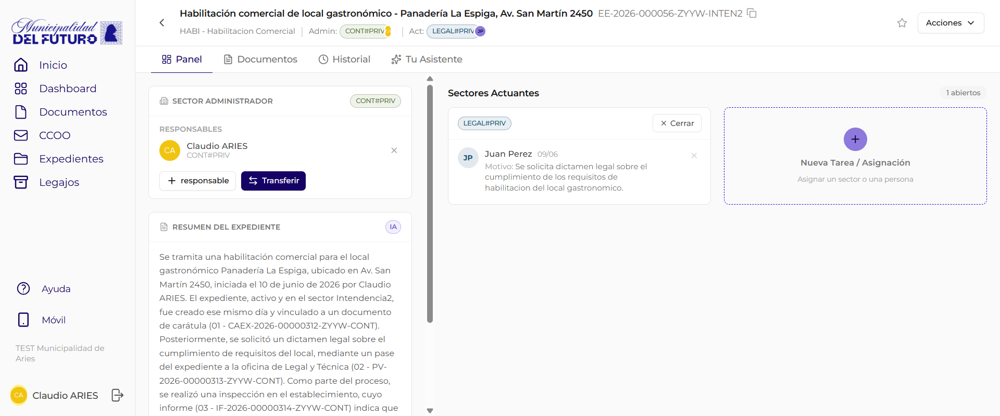

# Detalle del Expediente

Esta pantalla muestra la informacion completa de un expediente electronico: su panel de gestion (sectores, responsables y resumen IA), los documentos que lo componen, el historial de actividad y el asistente de inteligencia artificial. Se accede haciendo click en cualquier expediente desde el listado de expedientes.

---

## Header del expediente

En la parte superior de la pantalla se muestra la informacion general del expediente en dos lineas compactas. El header es comun a todas las pestanas.

### Primera linea: titulo y numero

| Elemento | Descripcion |
|----------|-------------|
| **Flecha de retorno** | Vuelve al listado de expedientes, preservando la solapa activa |
| **Titulo** | Nombre descriptivo del expediente (motivo de creacion) |
| **Numero oficial** | Identificador unico mostrado junto al titulo, con boton para copiar al portapapeles |
| **Estrella** (favorito) | Marca o desmarca el expediente como favorito. Amarilla cuando esta activa. Se sincroniza inmediatamente con el servidor |
| **Boton "Acciones"** | Desplegable con las operaciones disponibles sobre el expediente |

### Segunda linea: resumen inline

Debajo del titulo se muestra un resumen de los datos del expediente en una sola linea separada por barras:

| Dato | Descripcion | Ejemplo |
|------|-------------|---------|
| **Tipo** | Sigla y nombre del tipo de tramite | `HABI - Habilitacion comercial de local gastronomico` |
| **Admin** | Sector administrador actual (badge de color) con el avatar del responsable administrador inline | `CONT#PRIV` |
| **Act** | Sector actuante con las iniciales de la persona asignada. Si no hay actuante, aparece el badge **"Sin asignar"** | `LEGAL#PRIV` o badge "Sin asignar" |

### Opciones del menu "Acciones"

| Opcion | Descripcion |
|--------|-------------|
| **Descargar** | Descarga un archivo ZIP con todos los documentos oficiales del expediente. Ver seccion [Descargar expediente como ZIP](#descargar-expediente-como-zip) |
| **Nuevo Movimiento** | Abre el modal para crear una nueva asignacion o transferencia. Ver [Panel del Expediente](panel.md#nueva-tarea-asignacion) |
| **Vincular Documentos** | Navega a la pestana Documentos y abre el modal de vinculacion. Ver [Vincular Documentos](vincular-documentos.md) |
| **Subsanar** | Abre el proceso guiado de subsanacion. Ver [Subsanar en Expediente](subsanar-expediente.md) |

---

## Pestanas disponibles

La pantalla se organiza en cuatro pestanas:

| Pestana | Descripcion |
|---------|-------------|
| **Panel** | Vista de gestion del expediente: sector administrador, responsables, resumen IA y sectores actuantes (pestana por defecto) |
| **Documentos** | Lista de documentos oficiales y propuestos del expediente |
| **Historial** | Historial de actividad y acciones realizadas sobre el expediente. Ver [Historial](movimientos.md) |
| **Tu Asistente** | Asistente de inteligencia artificial para consultas sobre el expediente. Ver [Tu Asistente](../asistente-ai/index.md) |

!!! info "Panel es la pestana por defecto"
    Al abrir un expediente, la pestana **Panel** se muestra activa. La antigua pestana "Movimientos" ahora se llama **Historial**.

---

## Pestana Panel

Es la pestana central del expediente y la que se muestra por defecto al abrirlo. Concentra la gestion de quien controla el expediente, quienes son sus responsables, el resumen IA y los sectores actuantes; ademas, desde ahi se crean las asignaciones y transferencias ("Nueva Tarea / Asignacion").

Por su extension, el Panel se documenta en su propia pagina: ver **[Panel del Expediente](panel.md)**.

---

## Pestana Documentos

Lista los documentos que componen el expediente y permite previsualizar cada PDF.

### Documentos oficiales

La seccion colapsable **"DOCUMENTOS OFICIALES (N)"** muestra un contador con la cantidad total de documentos incorporados. Cada documento de la lista muestra:

| Elemento | Descripcion | Ejemplo |
|----------|-------------|---------|
| **Numero de orden** | Posicion dentro del expediente (001, 002, 003...) | `001` |
| **Numero oficial** | Identificador unico del documento, con boton para copiar | `CAEX-2026-00000133-...` |
| **Fecha** | Fecha de incorporacion al expediente | `18/02/26` |
| **Referencia** | Titulo descriptivo del documento | *Creacion del expediente* |
| **Linea de vinculacion** | `Vinculado el FECHA por USUARIO / Sector: SECTOR` | — |
| **Resumen IA** | A veces, un resumen de una linea generado por inteligencia artificial | — |

Al hacer click en un documento de la lista, se muestra una **vista previa del PDF** en el panel derecho.

!!! info "Primer documento: Caratula (CAEX)"
    El documento numero 001 de todo expediente es siempre la **caratula** (tipo CAEX), generada automaticamente por el sistema al crear el expediente. Contiene los datos basicos: tipo, numero, motivo y reparticion iniciadora.

El boton **"Vincular Documento"** abre el flujo de vinculacion. Ver [Vincular Documentos](vincular-documentos.md).

### Documentos propuestos

Cuando hay vinculaciones pendientes, aparece la seccion **"DOCUMENTOS PROPUESTOS"**, que muestra los documentos cuya vinculacion fue solicitada pero aun no fue aceptada por el sector administrador.

Cada documento propuesto muestra:

| Elemento | Descripcion |
|----------|-------------|
| **Badge "VINCULACION PROPUESTA"** | Etiqueta que indica que el documento esta pendiente de aceptacion |
| **Estado de firma** | Badge "En firma" o "Firmado", segun el estado actual del documento |
| **Menu "Acciones"** | Desplegable con las opciones disponibles segun el estado del documento |

#### Acciones sobre documentos propuestos

| Accion | Disponible cuando | Descripcion |
|--------|-------------------|-------------|
| **Aceptar Vinculacion** | El documento esta **Firmado** | Incorpora el documento al expediente como documento oficial. Se le asigna un numero de orden |
| **Rechazar Vinculacion** | Siempre (Firmado o En firma) | Rechaza la propuesta. El documento no se incorpora al expediente |

!!! warning "Documentos en firma"
    Un documento que esta **"En firma"** (aun no fue firmado por todos los firmantes) solo puede ser **rechazado**. La opcion "Aceptar Vinculacion" no esta disponible hasta que el documento este completamente firmado.

---

## Pestana Historial

La pestana **Historial** (antes "Movimientos") muestra la linea de tiempo de actividad del expediente: que documentos se vincularon, que acciones se realizaron, quien las ejecuto y cuando. Tiene su propia pagina: ver [Historial](movimientos.md).

---

## Pestana Tu Asistente

La pestana **Tu Asistente** abre el asistente de inteligencia artificial, que responde consultas sobre el contenido del expediente. Ver [Tu Asistente](../asistente-ai/index.md).

---

## Descargar expediente como ZIP

La opcion **"Descargar"** del menu Acciones genera y descarga un archivo `.zip` con todos los documentos oficiales activos del expediente.

### Que incluye el ZIP

- Solo los **documentos oficiales** del expediente (no borradores ni propuestas pendientes).
- El ZIP se nombra con el numero oficial del expediente: por ejemplo `EE-2026-000019-TXST-CONT.zip`.
- Cada PDF dentro del ZIP se nombra con su numero de orden y numero oficial: `001 - CAEX-2026-00000133-TXST-CONT.pdf`, `002 - IF-2026-00000136-TXST-CONT.pdf`, etc.

### Como descargar

1. Abrir el expediente.
2. Hacer click en el boton **"Acciones"** (esquina superior derecha).
3. Seleccionar **"Descargar"**.
4. El sistema prepara el archivo. El boton muestra el texto *"Descargando..."* mientras procesa.
5. El archivo `.zip` se descarga automaticamente al completarse.

!!! info "Expedientes grandes"
    Expedientes con muchos documentos pueden tardar unos segundos en prepararse antes de que comience la descarga. El boton queda deshabilitado durante ese tiempo para evitar descargas duplicadas.

!!! note "Solo documentos oficiales"
    Los documentos en estado de propuesta (pendientes de aceptacion) y los documentos subsanados no se incluyen en el ZIP.

---

## Preguntas frecuentes

??? question "Donde gestiono responsables, asignaciones y transferencias?"
    Todo eso se hace desde la pestana **Panel**. Ver [Panel del Expediente](panel.md), que detalla el sector administrador, los responsables, el resumen IA, los sectores actuantes y el modal "Nueva Tarea / Asignacion".

??? question "Puedo ver el contenido de un documento sin descargarlo?"
    Si. En la pestana Documentos, al hacer click en cualquier documento de la lista se muestra una vista previa del PDF en el panel derecho.

??? question "Que significa el numero de orden de cada documento?"
    Es la posicion cronologica del documento dentro del expediente. El 001 es siempre la caratula, y los siguientes se numeran en el orden en que fueron incorporados.

??? question "Quien puede aceptar o rechazar documentos propuestos?"
    Solo el **sector administrador** del expediente puede aceptar o rechazar propuestas de vinculacion de documentos.

??? question "Puedo copiar el numero del expediente o de un documento?"
    Si. Junto al numero oficial del expediente (en la primera linea del header) y junto a cada numero de documento hay un boton de copia que permite copiar al portapapeles con un solo click.

??? question "Que es la estrella junto al boton Acciones?"
    Es el boton de **favorito**. Al hacer click, marca el expediente como favorito (estrella amarilla) o lo desmarca. Los expedientes marcados como favoritos aparecen en la solapa "Favoritos" del listado de expedientes.

??? question "El ZIP incluye todos los documentos del expediente?"
    Incluye todos los documentos **oficiales** activos. No incluye documentos en estado de propuesta de vinculacion ni documentos que hayan sido subsanados (reemplazados por otro documento).
