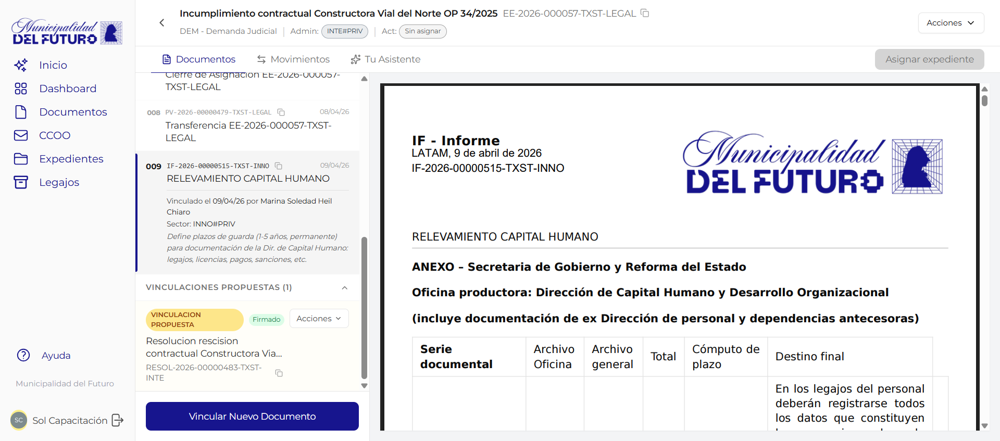

# Detalle del Expediente

Esta pantalla muestra la informacion completa de un expediente electronico: sus datos de cabecera, los documentos que lo componen, los documentos propuestos pendientes de aceptacion, y las acciones disponibles. Se accede haciendo click en cualquier expediente desde el listado de expedientes.

---

## Header del expediente

En la parte superior de la pantalla se muestra la informacion general del expediente en dos lineas compactas.

### Primera linea: titulo y numero

| Elemento | Descripcion |
|----------|-------------|
| **Flecha de retorno** | Vuelve al listado de expedientes, preservando la solapa activa |
| **Titulo** | Nombre descriptivo del expediente (motivo de creacion) |
| **Numero oficial** | Identificador unico mostrado junto al titulo, con boton para copiar al portapapeles |

### Segunda linea: resumen inline

Debajo del titulo se muestra un resumen de los datos del expediente en una sola linea separada por barras:

| Dato | Descripcion | Ejemplo |
|------|-------------|---------|
| **Tipo** | Sigla y nombre del tipo de tramite | `RRHH - Recursos Humanos` |
| **Admin** | Sector administrador actual del expediente (badge de color) | `INTE#PRIV` |
| **Act** | Primer actuante asignado. Si no hay ninguno, aparece el badge amarillo **"Sin asignar"** | `OOPA#PRIV` o badge amarillo |

Si hay mas de un actuante, se muestra el primero con un contador `+N` indicando los adicionales.

### Acciones del header (esquina superior derecha)

| Control | Descripcion |
|---------|-------------|
| **Estrella** (icono) | Marca o desmarca el expediente como favorito. Amarilla cuando esta activa. Se sincroniza inmediatamente con el servidor |
| **Boton "Acciones"** | Desplegable con las operaciones disponibles sobre el expediente |

#### Opciones del menu "Acciones"

| Opcion | Descripcion |
|--------|-------------|
| **Descargar** | Descarga un archivo ZIP con todos los documentos oficiales del expediente. Ver seccion [Descargar expediente como ZIP](#descargar-expediente-como-zip) |
| **Nuevo Movimiento** | Navega a la pestana Movimientos y abre el panel para crear una nueva accion |
| **Vincular Documentos** | Navega a la pestana Documentos y abre el modal de vinculacion. Ver [Vincular Documentos](vincular-documentos.md) |
| **Subsanar** | Abre el proceso guiado de subsanacion. Ver [Subsanar en Expediente](subsanar-expediente.md) |

---

## Descargar expediente como ZIP

La opcion **"Descargar"** del menu Acciones genera y descarga un archivo `.zip` con todos los documentos oficiales activos del expediente.

### Que incluye el ZIP

- Solo los **documentos oficiales** del expediente (no borradores ni propuestas pendientes).
- El ZIP se nombra con el numero oficial del expediente: por ejemplo `EE-2026-000019-TXST-INTE.zip`.
- Cada PDF dentro del ZIP se nombra con su numero de orden y numero oficial: `001 - CAEX-2026-00000133-TXST-INTE.pdf`, `002 - IF-2026-00000136-TXST-INTE.pdf`, etc.

### Como descargar

1. Abrir el expediente.
2. Hacer click en el boton **"Acciones"** (esquina superior derecha).
3. Seleccionar **"Descargar"**.
4. El sistema prepara el archivo. El boton muestra el texto *"Descargando..."* mientras procesa.
5. El archivo `.zip` se descarga automaticamente al completarse.

!!! info "Expedientes grandes"
    Expedientes con muchos documentos pueden tardar unos segundos en prepararse antes de que comience la descarga. El boton queda deshabilitado durante ese tiempo para evitar descargas duplicadas.

!!! note "Solo documentos oficiales"
    Los documentos en estado de propuesta (pendientes de aceptacion) y los documentos subsanados no se incluyen en el ZIP.

---

## Tabs disponibles

La pantalla se organiza en tres pestanas:

| Tab | Descripcion |
|-----|-------------|
| **Documentos** | Lista de documentos oficiales y propuestos del expediente (tab por defecto) |
| **Movimientos** | Historial de actividad y acciones realizadas sobre el expediente |
| **Tu Asistente** | Asistente de inteligencia artificial para consultas sobre el expediente |

### Responsables inline en la barra de tabs

A la derecha de los nombres de pestana, la barra de tabs muestra los **responsables asignados al expediente** de forma compacta:

- Cada responsable aparece con su **foto de perfil** (o iniciales si no tiene foto) y su nombre completo debajo con el sector en gris.
- Si no hay ningun responsable asignado, aparece el boton **"Asignar Responsables"** en su lugar.
- Haciendo click sobre cualquiera de los responsables (o sobre el boton), se abre el **modal de Responsables**. Ver seccion [Responsables del expediente](#responsables-del-expediente).

---

## Tab Documentos

Esta es la pestana principal y se muestra activa por defecto al abrir el detalle del expediente.

### Documentos oficiales

La seccion **"DOCUMENTOS OFICIALES"** muestra un badge con la cantidad total de documentos incorporados al expediente. Los documentos se listan en orden cronologico, numerados secuencialmente.

Cada fila de documento muestra:

| Columna | Descripcion | Ejemplo |
|---------|-------------|---------|
| **Numero de orden** | Posicion dentro del expediente (001, 002, 003...) | `001` |
| **Fecha** | Fecha de incorporacion al expediente | `18/02/26` |
| **Referencia** | Titulo descriptivo del documento | *Creacion EE-2026-000019-TXST-INTE* |
| **Numero oficial** | Identificador unico del documento, con boton para copiar | `CAEX-2026-00000133-TXST-INTE` |

Al hacer click en un documento de la lista, se muestra una **vista previa del PDF** en el panel derecho. Por ejemplo, al seleccionar el documento 001 (la caratula CAEX), se muestra el PDF con el logo de la organizacion, el tipo de expediente, el numero oficial, el motivo y la reparticion iniciadora.

!!! info "Primer documento: Caratula (CAEX)"
    El documento numero 001 de todo expediente es siempre la **caratula** (tipo CAEX), generada automaticamente por el sistema al crear el expediente. Contiene los datos basicos: tipo, numero, motivo y reparticion iniciadora.

### Documentos propuestos

Debajo de los documentos oficiales se encuentra la seccion **"DOCUMENTOS PROPUESTOS"**, que muestra los documentos cuya vinculacion fue solicitada pero aun no fue aceptada por el administrador del expediente.

Cada documento propuesto muestra:

| Elemento | Descripcion |
|----------|-------------|
| **Badge "VINCULACION PROPUESTA"** | Etiqueta naranja que indica que el documento esta pendiente de aceptacion |
| **Estado de firma** | Badge gris "En firma" o badge verde "Firmado", segun el estado actual del documento |
| **Menu "Acciones"** | Desplegable con las opciones disponibles segun el estado del documento |

#### Acciones sobre documentos propuestos

| Accion | Disponible cuando | Descripcion |
|--------|-------------------|-------------|
| **Aceptar Vinculacion** | El documento esta **Firmado** | Incorpora el documento al expediente como documento oficial. Se le asigna un numero de orden |
| **Rechazar Vinculacion** | Siempre (Firmado o En firma) | Rechaza la propuesta de vinculacion. El documento no se incorpora al expediente |

!!! warning "Documentos en firma"
    Un documento que esta **"En firma"** (aun no fue firmado por todos los firmantes) solo puede ser **rechazado**. La opcion "Aceptar Vinculacion" no esta disponible hasta que el documento este completamente firmado.

---

## Responsables del expediente

Los **responsables** son los usuarios designados para llevar adelante el expediente. Existen dos tipos:

| Tipo | Descripcion |
|------|-------------|
| **Responsable Administrador** | Usuario principal a cargo del expediente dentro del sector administrador |
| **Responsables Adicionales** | Usuarios de apoyo asignados para colaborar en el seguimiento |

!!! note "Responsables vs Sector Administrador"
    El **sector administrador** es el area organizacional que controla el expediente (visible en la segunda linea del header). Los **responsables** son las personas individuales dentro de ese (u otro) sector que fueron designadas para trabajar en el.

### Donde se ven

Los responsables se muestran en la barra de tabs, a la derecha de los nombres de las pestanas. Aparecen con avatar y nombre. Si no hay responsables asignados, se muestra el boton "Asignar Responsables".

### Como gestionar responsables

1. Hacer click sobre los responsables mostrados en la barra de tabs (o sobre el boton "Asignar Responsables" si no hay ninguno).
2. Se abre el **modal "Responsables"** con el numero de expediente en el titulo.

#### Modal de Responsables

El modal tiene dos secciones:

**Responsable Administrador**

- Muestra el responsable admin actual (foto, nombre, sector) si existe, o el mensaje *"Sin responsable asignado"*.
- Boton con icono de papelera para quitarlo.
- Boton **"Asignar responsable admin"** (o "Reemplazar responsable admin" si ya existe) para buscar y designar uno nuevo.

**Responsables Adicionales**

- Lista los responsables adicionales asignados, cada uno con su foto, nombre, sector y boton para quitar.
- Boton **"Agregar responsable adicional"** para sumar mas usuarios.

#### Buscador de usuarios

Al elegir agregar o reemplazar un responsable, aparece un buscador dentro del modal:

| Campo | Descripcion |
|-------|-------------|
| **Campo de busqueda** | Filtra por nombre o sigla de sector en tiempo real |
| **Lista de resultados** | Muestra los usuarios disponibles con avatar, nombre y sector |
| **Seleccion** | Hacer click en un usuario lo resalta con borde azul |
| **Boton Cancelar** | Cierra el selector sin cambios |
| **Boton Asignar / Agregar / Reemplazar** | Confirma la seleccion y actualiza los responsables |

!!! info "Actualizacion automatica al mover el expediente"
    Al completar una **actuacion interna** o una **transferencia**, el sistema actualiza automaticamente los responsables del expediente segun el sector y el usuario asignado en esa accion.

---

## Preguntas frecuentes

??? question "Puedo ver el contenido de un documento sin descargarlo?"
    Si. Al hacer click en cualquier documento de la lista, se muestra una vista previa del PDF en el panel derecho de la pantalla.

??? question "Que significa el numero de orden de cada documento?"
    Es la posicion cronologica del documento dentro del expediente. El 001 es siempre la caratula, y los siguientes se numeran en el orden en que fueron incorporados.

??? question "Quien puede aceptar o rechazar documentos propuestos?"
    Solo el **sector administrador** del expediente puede aceptar o rechazar propuestas de vinculacion de documentos.

??? question "Puedo copiar el numero del expediente o de un documento?"
    Si. Junto al numero oficial del expediente (en la primera linea del header) y junto a cada numero de documento hay un boton de copia que permite copiar al portapapeles con un solo click.

??? question "Que pasa si no tengo responsables asignados?"
    El expediente funciona normalmente sin responsables. La asignacion de responsables es opcional y sirve para designar las personas que llevan adelante el tramite.

??? question "El ZIP incluye todos los documentos del expediente?"
    Incluye todos los documentos **oficiales** activos. No incluye documentos en estado de propuesta de vinculacion ni documentos que hayan sido subsanados (reemplazados por otro documento).

??? question "Que es la estrella junto al boton Acciones?"
    Es el boton de **favorito**. Al hacer click, marca el expediente como favorito (estrella amarilla) o lo desmarca. Los expedientes marcados como favoritos aparecen en la solapa "Favoritos" del listado de expedientes.
