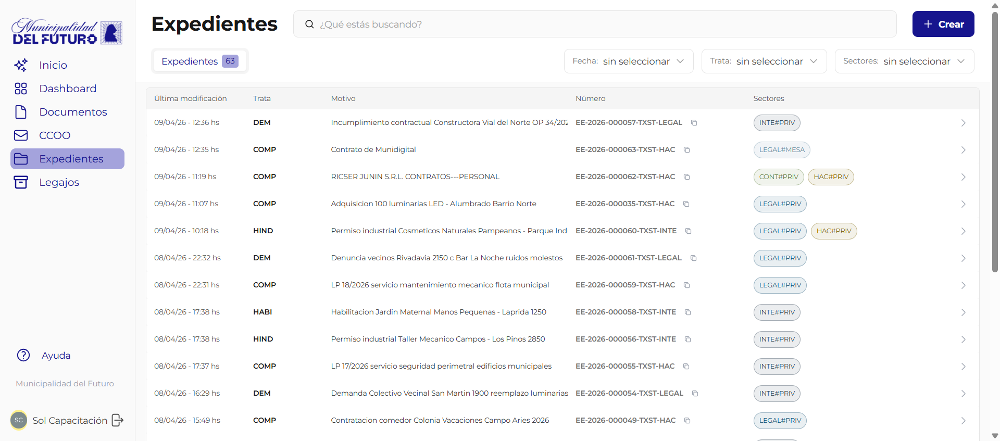

# Expedientes

Un **expediente electronico** es una carpeta digital que agrupa documentos oficiales relacionados a un mismo tramite o asunto administrativo. Funciona como el equivalente digital de una carpeta fisica de expediente: reune en un solo lugar todos los informes, dictamenes, resoluciones y demas documentos que forman parte de una gestion.

!!! video "Video tutorial"
    **GDI — Crear un expediente: paso a paso**

    <div class="video-embed"><iframe src="https://www.youtube-nocookie.com/embed/j2Svh6K2L2k?list=PLRIZqApsdJ12JCSzhUxaZ73AheVHUEpDq" title="GDI — Crear un expediente: paso a paso" loading="lazy" allow="accelerometer; autoplay; clipboard-write; encrypted-media; gyroscope; picture-in-picture; web-share" allowfullscreen></iframe></div>

---



## Identificacion del expediente

Cada expediente recibe un **numero oficial unico** al momento de su creacion, con el siguiente formato:

```
EE-{ANO}-{SECUENCIAL}-{TENANT}-{DEPARTAMENTO}
```

| Parte | Ejemplo | Descripcion |
|-------|---------|-------------|
| EE | `EE` | Prefijo fijo que identifica un expediente electronico |
| ANO | `2026` | Ano de creacion |
| SECUENCIAL | `000019` | Numero secuencial (6 digitos, unico por tenant) |
| TENANT | `TXST` | Codigo de la organizacion/tenant |
| DEPARTAMENTO | `INTE` | Acronimo del departamento iniciador |

Ejemplo completo: `EE-2026-000019-TXST-INTE`

---

## Composicion de un expediente

Al crearse un expediente, el sistema genera automaticamente una **caratula** (documento tipo CAEX) que contiene los datos basicos: tipo de expediente, motivo, reparticion iniciadora y numero oficial. Esta caratula queda como el primer documento del expediente.

Cada expediente tiene:

| Elemento | Descripcion |
|----------|-------------|
| **Tipo** | Categoria del tramite (ej: RRHH - Recursos Humanos, HABI - Habilitacion Comercial, COMP - Compras) |
| **Sector administrador** | El sector que tiene el control actual del expediente |
| **Responsables** | Usuarios designados para llevar adelante el tramite (administrador y adicionales) |
| **Documentos oficiales** | Documentos firmados y vinculados al expediente, numerados en orden |
| **Documentos propuestos** | Documentos cuya vinculacion fue propuesta pero aun no fue aceptada |

---

## Listado de expedientes

El listado muestra los expedientes como **tarjetas** (cards), una por expediente. Cada tarjeta tiene dos filas:

**Fila superior:** tipo del expediente (badge azul) | motivo | sector administrador | actuantes | numero oficial | boton copiar | fecha de ultima modificacion | estrella de favorito | flecha de ingreso.

**Fila inferior:** resumen breve generado por inteligencia artificial (en cursiva gris).

---

## Solapas de vista

En la parte superior del listado hay cinco solapas para filtrar la vista:

| Solapa | Muestra |
|--------|---------|
| **Todo** | Todos los expedientes a los que el usuario tiene acceso |
| **Personal** | Expedientes donde el usuario es responsable o actuante directo |
| **Administrador** | Expedientes donde el sector del usuario es el administrador |
| **Actuante** | Expedientes donde el sector del usuario participa como actuante |
| **Favoritos** | Expedientes que el usuario marco con la estrella de favorito |

Cada solapa muestra un contador con la cantidad de expedientes correspondientes (excepto "Todo", que muestra todos).

---

## Secciones de esta guia

| Pagina | Descripcion |
|--------|-------------|
| [Detalle del Expediente](detalle-expediente.md) | Vista principal del expediente: header, documentos oficiales, documentos propuestos, responsables y acciones disponibles incluyendo la descarga ZIP |
| [Movimientos](movimientos.md) | Historial de actividad, acciones en curso/finalizadas, y como crear actuaciones internas o transferencias |
| [Vincular Documentos](vincular-documentos.md) | Como vincular documentos oficiales a un expediente, aceptar o rechazar propuestas de vinculacion |
| [Subsanar en Expediente](subsanar-expediente.md) | Como reemplazar un documento dentro de un expediente aportando un justificante |
