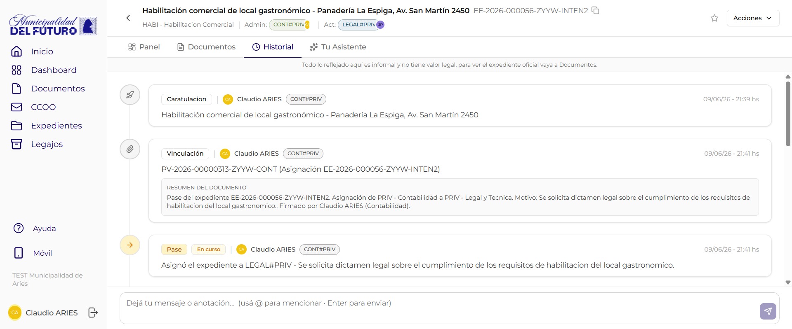
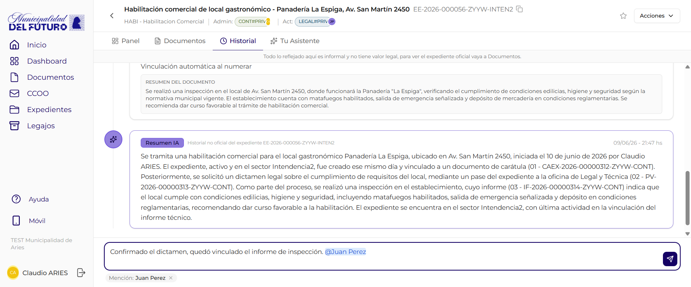
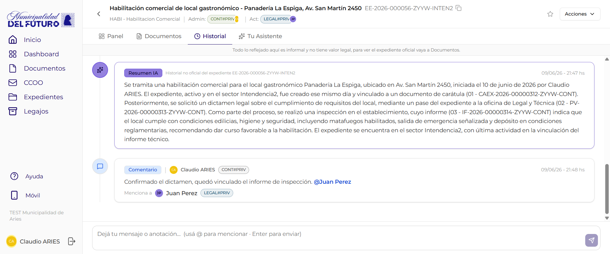

# Historial

La pestana **Historial** muestra la actividad del expediente como una **linea de tiempo** de eventos (caratulacion, vinculaciones, pases, asignaciones, propuestas, resumenes de IA) y, al pie, un **chat de comentarios** con menciones para anotar y comunicarse de forma informal con el equipo.

!!! warning "Informacion no oficial"
    Arriba de la pestana hay un banner que aclara: *"Todo lo reflejado aqui es informal y no tiene valor legal, para ver el expediente oficial vaya a Documentos."* El historial y el chat sirven como apoyo de trabajo y trazabilidad, pero **no constituyen un registro legal** del expediente.

!!! video "Video tutorial"
    **GDI Latam #8 — Historial y movimientos: trazabilidad completa del expediente**

    
<iframe src="https://www.youtube-nocookie.com/embed/PeIdFCqKutA?list=PLRIZqApsdJ12JCSzhUxaZ73AheVHUEpDq" title="GDI Latam #8 — Historial y movimientos" loading="lazy" allow="accelerometer; autoplay; clipboard-write; encrypted-media; gyroscope; picture-in-picture; web-share" allowfullscreen></iframe>

!!! note "Crear acciones ahora se hace desde Panel"
    La creacion de **Actuacion Interna** y **Transferencia** ya **no** se realiza desde el Historial. Ahora se hace desde la pestana **Panel**, con el modal **"Nueva Tarea / Asignacion"**. Ver [Detalle del Expediente](detalle-expediente.md) para el detalle de esos formularios. Esta pestana se enfoca en consultar la actividad (timeline) y comentar (chat).

---

## Timeline de actividad

El area central muestra los eventos del expediente en **orden cronologico**. Cada evento incluye:

| Elemento | Descripcion |
|----------|-------------|
| **Icono de color** | Identifica visualmente el tipo de evento |
| **Badge de tipo** | Etiqueta con el tipo de evento (ej: *Vinculacion*, *Pase*, *Comentario*) |
| **Avatar y nombre** | Usuario que genero el evento, con su foto o iniciales |
| **Badge de sector** | Sector del usuario (ej: `LEGAL#PRIV`) |
| **Hora** | Momento en que se registro el evento |
| **Tarjeta de detalle** | Algunos eventos suman una tarjeta con informacion ampliada (resumen del documento, motivo del pase, etc.) |

### Tipos de evento

| Tipo | Que representa |
|------|----------------|
| **Caratulacion** | Creacion del expediente (primer evento de la linea de tiempo) |
| **Vinculacion** | Se vinculo un documento al expediente. Incluye una tarjeta **"RESUMEN DEL DOCUMENTO"** |
| **Vinculacion automatica al numerar** | El documento se vinculo solo al obtener su numero oficial |
| **Pase** | Movimiento del expediente hacia un sector. Muestra el estado (ej: *En curso*) |
| **Asignacion de responsable** | Se designo o cambio un responsable del expediente |
| **Propuesta** | Se propuso la vinculacion de un documento, pendiente de aceptacion |
| **Resumen IA** | Resumen del expediente generado por inteligencia artificial (ver abajo) |
| **Comentario** | Anotacion informal cargada desde el chat (ver [Chat de comentarios](#chat-de-comentarios)) |

### Resumen IA

Periodicamente el sistema genera un **resumen automatico** del expediente con inteligencia artificial. Aparece en la timeline como una **tarjeta dorada** titulada *"Historial no oficial del expediente &lt;numero&gt;"*, con el contenido sintetizado del estado y la evolucion del tramite.

!!! info "Resumen no oficial"
    El resumen generado por IA es un apoyo informativo. No constituye un documento oficial ni reemplaza la lectura de los documentos del expediente.

---

## Chat de comentarios

Al pie del historial hay un **campo de mensaje** para dejar comentarios y anotaciones informales. Cada comentario publicado queda en la timeline como un evento de tipo **Comentario**, con tu avatar, nombre, sector y hora.

| Elemento | Descripcion |
|----------|-------------|
| **Campo de mensaje** | Cuadro de texto con el placeholder *"Deja tu mensaje o anotacion… (usa @ para mencionar · Enter para enviar)"* |
| **Boton "Publicar"** | Envia el comentario al historial. Tambien podes enviar con **Enter** |

### Como dejar un comentario

1. Escribi tu mensaje en el campo de la parte inferior.
2. Presiona **Enter** o el boton **"Publicar"**.
3. El comentario aparece de inmediato en la timeline con el badge **"Comentario"**.

---

## Menciones con @

Dentro de un comentario podes **mencionar** a otra persona para vincularla y notificarla.

### Como mencionar a alguien

1. En el campo de mensaje, escribi **`@`** seguido del nombre de la persona.
2. Aparece un **autocompletado** con personas (avatar, nombre y badge de sector).
3. Elegi una de la lista: la mencion se inserta en el texto y aparece un chip **"Mencion: &lt;Nombre&gt;"** sobre el campo.
4. Si te equivocaste, presiona **"Quitar mencion"** en el chip para removerla.
5. Publica el comentario.

### Como se ve el comentario publicado

El comentario ya publicado muestra:

| Elemento | Descripcion |
|----------|-------------|
| **Badge "Comentario"** | Identifica el evento como una anotacion del chat |
| **Texto con la mencion resaltada** | El `@Nombre` aparece destacado dentro del mensaje |
| **Linea "Menciona a..."** | Debajo del texto, una linea *"Menciona a &lt;avatar&gt; Nombre &lt;sector&gt;"* con la persona mencionada |

!!! info "La persona mencionada queda vinculada"
    Al mencionar a alguien, esa persona queda **notificada y vinculada** al comentario. Por ejemplo, en el expediente *"Habilitacion comercial - Panaderia La Espiga"*, Claudio menciona a **Juan Perez (LEGAL#PRIV)**: el comentario muestra la mencion resaltada y la linea *"Menciona a Juan Perez"*.

---

## Preguntas frecuentes

??? question "Como creo una actuacion interna o una transferencia?"
    Ya no se crean desde el Historial. Se hacen desde la pestana **Panel**, con el modal **"Nueva Tarea / Asignacion"**. Ver [Detalle del Expediente](detalle-expediente.md).

??? question "El historial es un registro oficial?"
    No. El banner en la parte superior aclara que todo lo reflejado ahi es **informal y no tiene valor legal**. Para el expediente oficial, anda a la pestana **Documentos**.

??? question "Como menciono a una persona en un comentario?"
    Escribi **`@`** seguido del nombre en el campo de mensaje, elegi a la persona del autocompletado y publica. Quedara resaltada en el texto y notificada.

??? question "Puedo quitar una mencion antes de publicar?"
    Si. Mientras redactas, el chip **"Mencion: &lt;Nombre&gt;"** tiene un boton **"Quitar mencion"** para removerla.

??? question "Como envio un comentario rapido?"
    Escribi el mensaje y presiona **Enter**, o usa el boton **"Publicar"**.

??? question "Que es la tarjeta dorada del expediente?"
    Es el **Resumen IA**: un resumen no oficial del expediente generado por inteligencia artificial, titulado *"Historial no oficial del expediente &lt;numero&gt;"*. Es un apoyo informativo, no reemplaza los documentos oficiales.

??? question "Que tipos de eventos veo en la timeline?"
    Caratulacion, Vinculacion (con resumen del documento), Vinculacion automatica al numerar, Pase, Asignacion de responsable, Propuesta, Resumen IA y Comentario.
