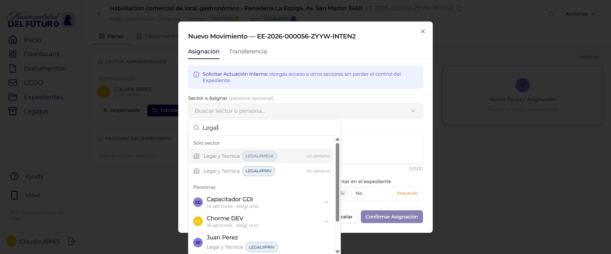

# Panel del Expediente

La pestana **Panel** es la vista de gestion del expediente y la **pestana por defecto** al abrirlo. Concentra quien controla el expediente (sector administrador y responsables), un resumen generado por IA, y que sectores estan actuando sobre el. Se organiza en dos columnas.

!!! info "Panel, Documentos, Historial y Tu Asistente"
    El detalle del expediente tiene cuatro pestanas: **Panel**, **Documentos**, **Historial** y **Tu Asistente**. El Panel es la que se muestra activa al abrir el expediente. Para el header y la vista general ver [Detalle del Expediente](detalle-expediente.md); para la linea de tiempo y los comentarios ver [Historial](movimientos.md).

---

## Columna izquierda: administracion y responsables

### Sector Administrador

La tarjeta **"SECTOR ADMINISTRADOR"** muestra el badge del sector que controla el expediente (por ejemplo `CONT#PRIV`). Es el area organizacional responsable del expediente.

### Responsables

Debajo, la seccion **"RESPONSABLES"** lista cada responsable asignado:

| Elemento | Descripcion |
|----------|-------------|
| **Avatar y nombre** | Foto o iniciales del responsable, su nombre y su sector |
| **Boton "Quitar responsable" (X)** | Quita al responsable de la lista |
| **"Sin responsables asignados."** | Mensaje que aparece cuando no hay ningun responsable |
| **Boton "+ responsable"** | Abre el modal para agregar un responsable administrador |
| **Boton "Transferir"** | Cede el control administrativo del expediente a otro sector |

!!! note "Responsable administrador y responsables adicionales"
    El expediente puede tener un **responsable administrador** principal y **responsables adicionales**. El responsable administrador solo puede elegirse entre los usuarios del **sector administrador** del expediente.

#### Modal "Agregar responsable administrador"

El boton **"+ responsable"** abre el modal titulado **"Agregar responsable administrador - Busca y elegi la persona"**. El buscador solo muestra usuarios pertenecientes al sector administrador. Al elegir una persona y confirmar, queda registrada como responsable.

### Resumen del expediente (IA)

La tarjeta **"RESUMEN DEL EXPEDIENTE"**, identificada con el badge **"IA"**, muestra un resumen generado automaticamente por inteligencia artificial a partir de los documentos y movimientos del expediente. Si todavia no se genero, muestra el mensaje **"Todavia no hay resumen."**.

!!! info "Resumen no oficial"
    El resumen generado por IA es un apoyo informativo. No constituye un documento oficial ni reemplaza la lectura de los documentos del expediente.

---

## Columna derecha: Sectores Actuantes

La columna **"Sectores Actuantes"** lista los sectores que tienen acceso para actuar sobre el expediente sin controlarlo. Un contador en el encabezado indica cuantos hay (por ejemplo **"1 abiertos"**).

Cada sector actuante se muestra como una tarjeta con:

| Elemento | Descripcion |
|----------|-------------|
| **Badge del sector** | Sigla del sector actuante (por ejemplo `LEGAL#PRIV`) |
| **Persona asignada** | Avatar, nombre y fecha de la persona a cargo de la tarea |
| **Motivo** | Texto de la solicitud (`Motivo: ...`) |
| **Boton "Reasignar responsable"** | Cambia la persona asignada dentro del sector actuante |
| **Boton "Cerrar tarea"** | Cierra la tarea de ese sector actuante |
| **Boton "Cerrar"** | Cierra el sector actuante |

Debajo de las tarjetas hay una caja punteada **"Nueva Tarea / Asignacion — Asignar un sector o una persona"** con un boton **+** que abre el modal de nuevo movimiento.

---

## Nueva Tarea / Asignacion

El boton **"Nueva Tarea / Asignacion"** (la caja punteada de la columna Sectores Actuantes, o la opcion **"Nuevo Movimiento"** del menu Acciones) abre el modal **"Nuevo Movimiento — &lt;numero&gt;"**, con dos pestanas: **Asignacion** y **Transferencia**.

### Asignacion

Solicita una **Actuacion Interna**: otorgas acceso a otros sectores **sin perder el control** del Expediente. El sector asignado puede consultar los documentos y realizar las tareas solicitadas, pero el sector administrador mantiene la responsabilidad.

| Campo | Tipo | Descripcion |
|-------|------|-------------|
| **Sector a Asignar (persona opcional)** | Combobox con busqueda | Al escribir 2 o mas caracteres busca y agrupa los resultados en **"Solo sector"** y **"Personas"**. Si se elige una persona, se muestran sus sectores para seleccionar uno |
| **Motivo (min. 5 caracteres)** | Textarea | Descripcion de lo que se solicita. Muestra un contador `/500` |
| **Sector Solicitante** | Texto fijo | El sector del usuario que realiza la solicitud. No es editable |
| **Asentar en el expediente** | Si / No | Si es **Si**, genera una providencia de pase (PV) que queda registrada en la pestana Documentos |

| Boton | Accion |
|-------|--------|
| **Cancelar** | Cierra el modal sin crear la asignacion |
| **Confirmar Asignacion** | Crea la actuacion interna y otorga el acceso al sector o persona elegida |

!!! info "Asignar otorga acceso, no cede el control"
    Una asignacion suma al sector o persona como **actuante**: obtiene acceso para consultar y actuar sobre el expediente, pero el control administrativo sigue en el sector administrador.

### Transferencia

La pestana **Transferencia** **cede el control administrativo** del expediente a otro sector, igual que la transferencia clasica. A diferencia de la asignacion, el sector que transfiere pierde el rol de administrador y el sector destino pasa a ser el nuevo administrador.

!!! warning "La transferencia cambia el administrador"
    Al transferir, el sector de origen pierde el control administrativo. Solo el nuevo sector administrador podra volver a transferir el expediente o gestionarlo.

---

## Preguntas frecuentes

??? question "Cual es la diferencia entre asignacion y transferencia?"
    La **asignacion** (actuacion interna) otorga acceso a otro sector o persona sin perder el control: el sector administrador sigue siendo el mismo. La **transferencia** cede el control administrativo al sector destino, que pasa a ser el nuevo administrador.

??? question "Quien puede ser responsable administrador?"
    El responsable administrador solo puede elegirse entre los usuarios del **sector administrador** del expediente. Se asigna desde el modal "Agregar responsable administrador" en la pestana Panel.

??? question "Que es el badge IA en la tarjeta de resumen?"
    Indica que el resumen del expediente fue generado automaticamente por inteligencia artificial a partir de sus documentos y movimientos. Si aun no se genero, muestra "Todavia no hay resumen.".

??? question "Que significa el contador 'N abiertos' en Sectores Actuantes?"
    Es la cantidad de sectores actuantes activos sobre el expediente, es decir, los sectores a los que se les otorgo acceso mediante una asignacion y que todavia no fueron cerrados.

??? question "Una asignacion genera algun documento en el expediente?"
    Si el campo **"Asentar en el expediente"** queda en **Si**, la asignacion genera una providencia de pase (PV) que queda registrada en la pestana Documentos.
