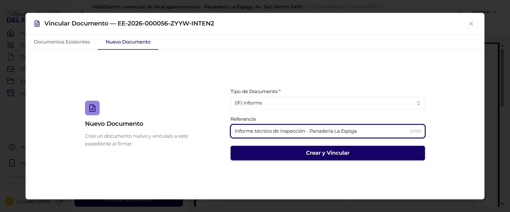
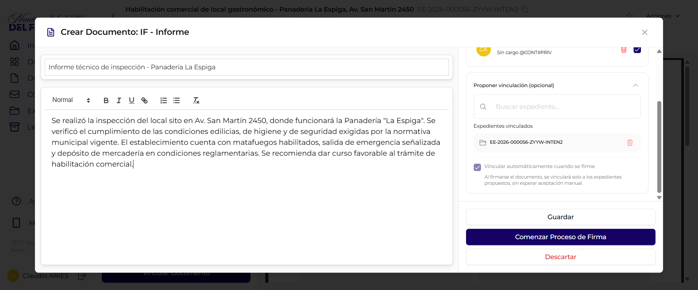
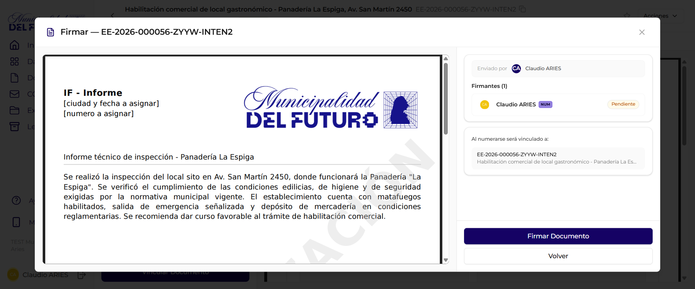
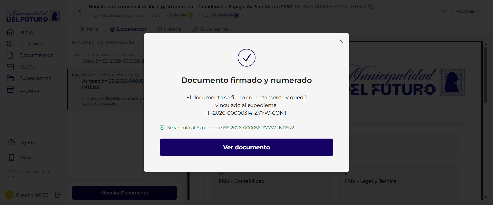

# Vincular Documentos

Vincular un documento a un expediente significa incorporarlo como parte oficial del tramite. Solo los documentos firmados pueden quedar vinculados de forma definitiva. Esta pagina describe el proceso completo: vincular un documento ya existente o crear uno nuevo que se vincule automaticamente al firmarse, confirmar la vinculacion, y gestionar las propuestas pendientes.

!!! video "Video tutorial"
    **GDI Latam #6 — Como vincular documentos a un expediente**

    
<iframe src="https://www.youtube-nocookie.com/embed/ENjH5NOb1no?list=PLRIZqApsdJ12JCSzhUxaZ73AheVHUEpDq" title="GDI Latam #6 — Como vincular documentos a un expediente" loading="lazy" allow="accelerometer; autoplay; clipboard-write; encrypted-media; gyroscope; picture-in-picture; web-share" allowfullscreen></iframe>

    **GDI Latam #7 — Gestionar propuestas de vinculacion en expedientes**

    
<iframe src="https://www.youtube-nocookie.com/embed/oSekb0IWj4A?list=PLRIZqApsdJ12JCSzhUxaZ73AheVHUEpDq" title="GDI Latam #7 — Gestionar propuestas de vinculacion" loading="lazy" allow="accelerometer; autoplay; clipboard-write; encrypted-media; gyroscope; picture-in-picture; web-share" allowfullscreen></iframe>

---

## Iniciar la vinculacion

Desde la pestana **Documentos** del detalle del expediente, presionar el boton **"Vincular Documento"** ubicado en la parte inferior de la lista de documentos. Se abre el modal **"Vincular Documento — <numero>"**, que tiene dos pestanas:

- **Documentos Existentes**: el flujo clasico de buscar y seleccionar un documento ya firmado para vincularlo.
- **Nuevo Documento**: crear un documento nuevo y vincularlo a este expediente al firmarse (vinculacion automatica).

!!! info "Dos formas de vincular"
    Usa **Documentos Existentes** cuando el documento ya esta creado (y normalmente firmado). Usa **Nuevo Documento** cuando todavia no existe y queres que se incorpore solo al expediente en el momento en que se firme.

---

## Modal "Vincular Documento" — pestana Documentos Existentes

La pestana **Documentos Existentes** permite buscar y seleccionar un documento existente para vincularlo al expediente.

### Buscador

En la parte superior del modal hay un campo de busqueda con el texto guia: *"Selecciona el documento a vincular o busca aqui por Numero, referencia o contenido."* Se puede buscar por:

- Numero oficial del documento (ej: `IF-2026-00000134`)
- Referencia o titulo del documento
- Contenido del documento

### Tabla de resultados

Los documentos se muestran en una tabla paginada con las siguientes columnas:

| Columna | Descripcion |
|---------|-------------|
| **Ultima modificacion** | Fecha de la ultima edicion del documento |
| **Sector Creador** | Sector que creo el documento, mostrado como badge de color |
| **Ultimo Editor** | Avatar y nombre del usuario que edito por ultima vez |
| **Tipo** | Sigla del tipo de documento (ej: CONST, RESOL, IF, DICTA) |
| **Referencia** | Titulo descriptivo del documento |
| **Numero** | Numero oficial del documento, con boton para copiar |

### Paginacion

La tabla muestra 10 documentos por pagina. En la parte inferior se indica la pagina actual y el total (ej: *"Pagina 2 de 10 (10 documentos)"*) con botones **"Anterior"** y **"Siguiente"** para navegar.

### Botones del modal

| Boton | Accion |
|-------|--------|
| **Cancelar** | Cierra el modal sin vincular nada |
| **Vincular** | Confirma la seleccion y abre el modal de confirmacion |

---

## Modal de confirmacion (documento existente)

Al seleccionar un documento de la tabla, se abre un segundo modal de confirmacion que muestra:

| Elemento | Descripcion |
|----------|-------------|
| **Vista previa PDF** | Preview del documento seleccionado con su membrete y contenido |
| **Banner de confirmacion** | Mensaje azul que indica el numero oficial y la referencia del documento que se va a vincular al expediente |

### Botones del modal

| Boton | Accion |
|-------|--------|
| **Cancelar** | Vuelve al modal de seleccion sin vincular |
| **Vincular** | Confirma la vinculacion del documento al expediente |

!!! info "Vinculacion como propuesta"
    Si el usuario que vincula no es el administrador del expediente, el documento queda como **propuesta de vinculacion** pendiente de aceptacion. Si el usuario es el administrador, el documento se incorpora directamente como documento oficial.

---

## Crear y vincular un documento nuevo (vinculacion automatica)

Ademas de vincular documentos ya existentes, podes crear un documento nuevo directamente desde el expediente y dejarlo configurado para que **se vincule solo en el momento en que se firme**, sin tener que esperar la aceptacion manual de una propuesta.

### 1. Pestana "Nuevo Documento" del modal

En el modal **"Vincular Documento — <numero>"**, abrir la pestana **"Nuevo Documento"**. El texto guia indica: *"Crea un documento nuevo y vinculalo a este expediente al firmar."* Completar los campos:

| Campo | Descripcion |
|-------|-------------|
| **Tipo de Documento** | Obligatorio. Buscador que filtra por nombre o sigla del tipo (ej: IF, RESOL, NOTA) |
| **Referencia** | Titulo descriptivo del documento a crear |

Presionar **"Crear y Vincular"**. El sistema abre el editor del documento ya con el expediente cargado como destino de la vinculacion.

### 2. Editor del documento: "Proponer vinculacion (opcional)"

En el editor (titulo **"Crear Documento: TIPO - Nombre"**), ademas de redactar el contenido, vas a ver la seccion **"Proponer vinculacion (opcional)"**, que muestra:

- **Expedientes vinculados: <numero>** — el expediente desde el que se inicio la creacion.
- Un checkbox **"Vincular automaticamente cuando se firme"**, **tildado por defecto**, con la nota: *"Al firmarse el documento, se vinculara solo a los expedientes propuestos, sin esperar aceptacion manual."*

Mas abajo se configuran los **Firmantes** y, cuando todo esta listo, se presiona **"Comenzar Proceso de Firma"**.

!!! info "Que controla el checkbox"
    - **Tildado** (por defecto): al firmarse, el documento se incorpora **automaticamente** como documento oficial del expediente. No queda como propuesta pendiente.
    - **Destildado**: al firmarse, el documento queda como **propuesta de vinculacion** que el administrador del expediente debe aceptar (flujo clasico descrito mas arriba).

### 3. Confirmacion en el paso de firma

En el modal **"Firmar — <numero>"**, antes de confirmar la firma, el sistema avisa el destino de la vinculacion automatica con el texto: *"Al numerarse sera vinculado a: <numero> <titulo del expediente>"*.

### 4. Resultado: documento firmado y vinculado

Al firmar, aparece la confirmacion **"Documento firmado y numerado — El documento se firmo correctamente y quedo vinculado al expediente."**, con el numero asignado al documento y la leyenda *"Se vinculo al Expediente <numero>"*.

El documento queda **directamente como documento oficial** del expediente, sin pasar por la seccion "DOCUMENTOS PROPUESTOS" ni requerir aceptacion manual.

!!! note "Diferencia clave con la vinculacion clasica"
    Con la **vinculacion automatica** (checkbox tildado) el documento se incorpora solo al firmarse. Si en cambio **destildas** el checkbox, vuelve al flujo clasico: queda como propuesta de vinculacion que el administrador del expediente debe aceptar o rechazar.

---

## Documentos propuestos

Los documentos cuya vinculacion fue propuesta (pero aun no aceptada) aparecen en la seccion **"DOCUMENTOS PROPUESTOS"** dentro de la pestana Documentos del expediente.

Cada documento propuesto muestra:

| Elemento | Descripcion |
|----------|-------------|
| **Badge "VINCULACION PROPUESTA"** | Etiqueta naranja que identifica al documento como pendiente de aceptacion |
| **Estado de firma** | Badge que indica si el documento esta "En firma" (gris) o "Firmado" (verde) |
| **Menu "Acciones"** | Desplegable con las opciones disponibles |

---

## Aceptar vinculacion

Para aceptar la vinculacion de un documento propuesto:

1. Ubicar el documento en la seccion **"DOCUMENTOS PROPUESTOS"**
2. Hacer click en el boton **"Acciones"** del documento
3. Seleccionar **"Aceptar Vinculacion"** (icono check verde)

El documento se incorpora a la lista de **documentos oficiales** del expediente y recibe un numero de orden secuencial.

!!! warning "Solo documentos firmados"
    La opcion "Aceptar Vinculacion" solo esta disponible para documentos con estado **"Firmado"**. Un documento que aun esta "En firma" no puede ser aceptado.

---

## Rechazar vinculacion

Para rechazar la vinculacion de un documento propuesto:

1. Ubicar el documento en la seccion **"DOCUMENTOS PROPUESTOS"**
2. Hacer click en el boton **"Acciones"** del documento
3. Seleccionar **"Rechazar Vinculacion"** (icono X rojo)

El documento se elimina de la lista de propuestos. No se incorpora al expediente.

!!! note "Rechazar documentos en firma"
    A diferencia de la aceptacion, la opcion de rechazar esta disponible **siempre**, tanto para documentos "En firma" como para documentos "Firmados".

---

## Reglas de negocio

!!! abstract "Resumen de reglas"

    1. Solo el **sector administrador** del expediente puede aceptar o rechazar propuestas de vinculacion
    2. Un documento debe estar **completamente firmado** para poder ser aceptado como vinculacion oficial
    3. Un documento **en proceso de firma** solo puede ser rechazado, no aceptado
    4. Al aceptar una vinculacion, el documento recibe un **numero de orden** secuencial dentro del expediente
    5. Rechazar una vinculacion **no afecta** al documento original; solo lo quita de la lista de propuestos del expediente
    6. Un mismo documento puede ser propuesto para vinculacion en **multiples expedientes**
    7. Con la **vinculacion automatica** (checkbox tildado al crear el documento), al firmarse el documento se incorpora directo como oficial, sin pasar por "DOCUMENTOS PROPUESTOS" ni requerir aceptacion manual

---

## Preguntas frecuentes

??? question "Cual es la diferencia entre vincular un documento existente y crear uno nuevo?"
    En la pestana **Documentos Existentes** seleccionas un documento que ya fue creado (normalmente firmado) y lo vinculas. En la pestana **Nuevo Documento** creas el documento desde cero y el sistema te lleva al editor con el expediente ya cargado para que se vincule al firmarse.

??? question "Que significa el checkbox 'Vincular automaticamente cuando se firme'?"
    Tildado (por defecto), el documento se incorpora solo al expediente en el momento de firmarse, sin esperar la aceptacion de una propuesta. Destildado, el documento queda como propuesta de vinculacion que el administrador del expediente debe aceptar manualmente.

??? question "Si uso la vinculacion automatica, el documento queda en 'DOCUMENTOS PROPUESTOS'?"
    No. Con el checkbox tildado, al firmarse el documento queda directamente como documento oficial del expediente. Solo aparece en "DOCUMENTOS PROPUESTOS" si destildas el checkbox y dejas la vinculacion como propuesta pendiente.
