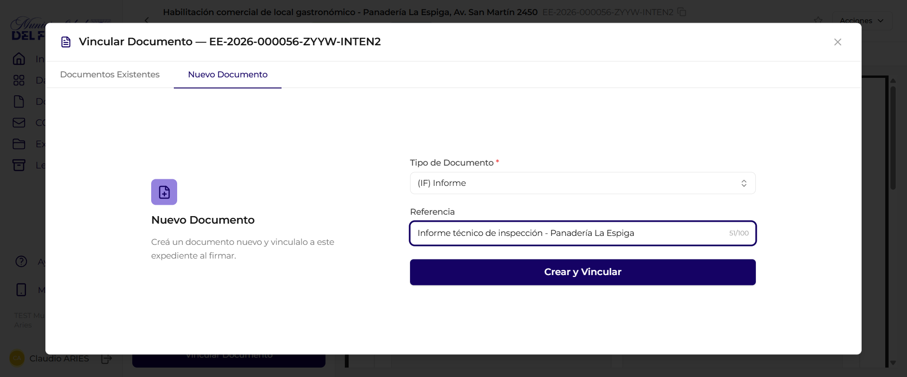
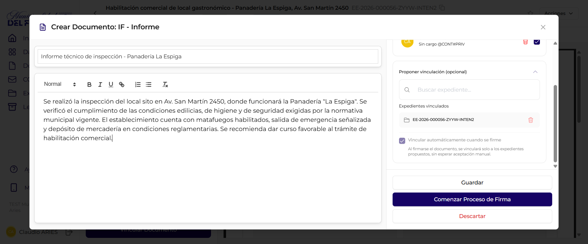
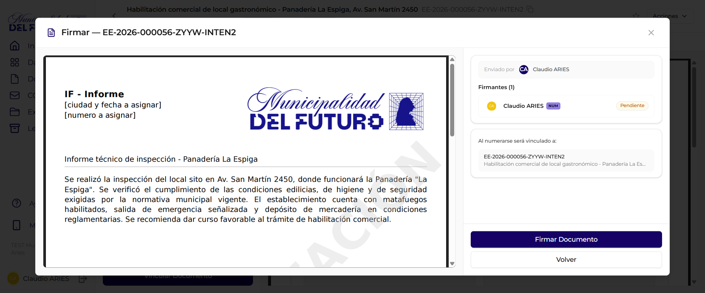
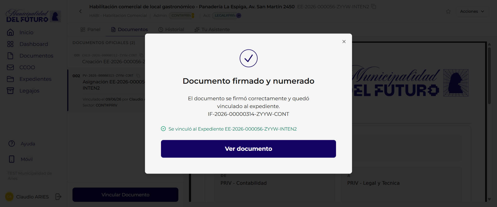

# Vincular Documentos

Vincular un documento a un expediente significa incorporarlo como parte oficial del tramite. Solo los documentos firmados pueden quedar vinculados de forma definitiva. Esta pagina describe el proceso completo: vincular un documento ya existente o crear uno nuevo que se vincule automaticamente al firmarse, confirmar la vinculacion, y gestionar las propuestas pendientes.

!!! video "Video tutorial"
    **GDI — Vincular un documento existente a un expediente**

    
<iframe src="https://www.youtube-nocookie.com/embed/11BY6OkI9BU?list=PLRIZqApsdJ12JCSzhUxaZ73AheVHUEpDq" title="GDI — Vincular un documento existente a un expediente" loading="lazy" allow="accelerometer; autoplay; clipboard-write; encrypted-media; gyroscope; picture-in-picture; web-share" allowfullscreen></iframe>

    **GDI — Crear y vincular un documento nuevo al firmar**

    
<iframe src="https://www.youtube-nocookie.com/embed/1vnJknK57MA?list=PLRIZqApsdJ12JCSzhUxaZ73AheVHUEpDq" title="GDI — Crear y vincular un documento nuevo al firmar" loading="lazy" allow="accelerometer; autoplay; clipboard-write; encrypted-media; gyroscope; picture-in-picture; web-share" allowfullscreen></iframe>

---

## Iniciar la vinculacion

Hay dos formas de abrir el mismo modal:

- Desde la pestana **Documentos** del detalle del expediente, con el boton **"Vincular Documento"** ubicado en la parte inferior de la lista de documentos.
- Desde el menu **Acciones** del encabezado del expediente, con la opcion **"Vincular Documentos"**.

En ambos casos el sistema primero verifica los permisos (muestra *"Verificando permisos..."* un instante). Si el usuario no tiene permiso de edicion en los sectores asociados al expediente, en lugar del modal aparece el aviso **"Sin permisos para actuar sobre este expediente"**.

Se abre el modal **"Vincular Documento — <numero>"**, que tiene dos pestanas:

- **Documentos Existentes**: el flujo clasico de buscar y seleccionar un documento ya firmado para vincularlo.
- **Nuevo Documento**: crear un documento nuevo y vincularlo a este expediente al firmarse (vinculacion automatica).

!!! info "Dos formas de vincular"
    Usa **Documentos Existentes** cuando el documento ya esta creado (y normalmente firmado). Usa **Nuevo Documento** cuando todavia no existe y queres que se incorpore solo al expediente en el momento en que se firme.

---

## Modal "Vincular Documento" — pestana Documentos Existentes

La pestana **Documentos Existentes** permite buscar y seleccionar un documento existente para vincularlo al expediente.

### Buscador

En la parte superior del modal hay un campo de busqueda con el texto guia: *"Selecciona el documento a vincular o busca aqui por Numero, referencia o contenido."* Se puede buscar por:

- Numero oficial del documento (ej: `IF-2026-00000134`)
- Referencia o titulo del documento
- Contenido del documento

!!! info "Que documentos se listan"
    - Sin escribir nada, la tabla lista los documentos **firmados del sector del usuario**. Los borradores y los documentos en proceso de firma no aparecen: no se pueden vincular.
    - Si el texto ingresado tiene forma de **numero oficial**, la busqueda se hace en **todo el sistema** y el resultado se marca con una etiqueta **"Global"** u **"Oficial"**. Es la forma de vincular un documento de otro sector.
    - Si el expediente **no** es reservado, los documentos reservados quedan excluidos de la busqueda.

### Tabla de resultados

Los documentos se muestran en una tabla paginada con las siguientes columnas:

| Columna | Descripcion |
|---------|-------------|
| **Ultima modificacion** | Fecha de la ultima edicion del documento |
| **Sector Creador** | Sector que creo el documento, mostrado como badge de color |
| **Ultimo Editor** | Avatar y nombre del usuario que edito por ultima vez |
| **Tipo** | Sigla del tipo de documento (ej: CONST, RESOL, IF, DICTA) |
| **Referencia** | Titulo descriptivo del documento |
| **Numero** | Numero oficial del documento, con boton para copiar |

### Paginacion

La tabla muestra 10 documentos por pagina. En la parte inferior se indica la pagina actual y el total (ej: *"Pagina 2 de 10 (10 documentos)"*) con botones **"Anterior"** y **"Siguiente"** para navegar.

### Botones del modal

| Boton | Accion |
|-------|--------|
| **Cancelar** | Cierra el modal sin vincular nada |
| **Continuar** | Pasa al segundo paso (vista previa y confirmacion). Solo se habilita con un documento seleccionado |

La seleccion es **de a un documento por vez**: al elegir una fila, sobre los botones aparece la tarjeta *"Seleccionado: <numero> - <referencia>"*.

---

## Segundo paso: vista previa y confirmacion

Al presionar **"Continuar"** el modal cambia de paso (no se abre una ventana nueva) y muestra:

| Elemento | Descripcion |
|----------|-------------|
| **Vista previa PDF** | Preview del documento seleccionado con su membrete y contenido |
| **Panel lateral** | Documento seleccionado, sector creador y resumen automatico del documento |
| **Aviso de confirmacion** | Cartel azul **"Atencion"**: *"Al presionar Vincular, el documento <numero> sera vinculado al Expediente."* |

### Botones del paso de confirmacion

| Boton | Accion |
|-------|--------|
| **Volver** | Regresa al buscador sin vincular |
| **Vincular** | Confirma la vinculacion del documento al expediente |

!!! info "Vinculacion como propuesta"
    Si el usuario que vincula no es el administrador del expediente, el documento queda como **propuesta de vinculacion** pendiente de aceptacion. Si el usuario es el administrador, el documento se incorpora directamente como documento oficial. La decision la toma el sistema al confirmar: el modal es el mismo en los dos casos.

---

## Crear y vincular un documento nuevo (vinculacion automatica)

Ademas de vincular documentos ya existentes, podes crear un documento nuevo directamente desde el expediente y dejarlo configurado para que **se vincule solo en el momento en que se firme**, sin tener que esperar la aceptacion manual de una propuesta.

### 1. Pestana "Nuevo Documento" del modal

En el modal **"Vincular Documento — <numero>"**, abrir la pestana **"Nuevo Documento"**. El texto guia indica: *"Crea un documento nuevo y vinculalo a este expediente al firmar."* Completar los campos:

| Campo | Descripcion |
|-------|-------------|
| **Tipo de Documento** | Obligatorio. Buscador que filtra por nombre o sigla del tipo (ej: IF, RESOL, NOTA) |
| **Referencia** | Titulo descriptivo del documento a crear |

Presionar **"Crear y Vincular"**. El sistema abre el editor del documento ya con el expediente cargado como destino de la vinculacion.

### 2. Editor del documento: "Proponer vinculacion (opcional)"

En el editor (titulo **"Crear Documento: TIPO - Nombre"**), ademas de redactar el contenido, vas a ver la seccion **"Proponer vinculacion"**, que muestra:

- **Expedientes vinculados: <numero>** — el expediente desde el que se inicio la creacion.
- Un checkbox **"Vincular automaticamente cuando se firme"**, **tildado**, con la nota: *"Al firmarse el documento, se vinculara solo a los expedientes propuestos, sin esperar aceptacion manual."*

Mas abajo se configuran los **Firmantes** y, cuando todo esta listo, se presiona **"Comenzar Proceso de Firma"**.

!!! warning "En este flujo la vinculacion automatica no se puede desactivar"
    Cuando el documento se crea **desde el expediente** (pestana "Nuevo Documento"), el panel de vinculacion queda **bloqueado**: el expediente de origen no se puede quitar ni se pueden agregar otros, y el checkbox **"Vincular automaticamente cuando se firme"** queda fijo en tildado. Es logico: la finalidad de este flujo es justamente que el documento se incorpore al expediente al firmarse.

    Para elegir entre vinculacion automatica y propuesta pendiente hay que crear el documento por el camino normal (**Documentos › Crear documento**): ahi la seccion "Proponer vinculacion" es editable y el checkbox se puede destildar. Destildado, al firmarse el documento queda como **propuesta de vinculacion** que el administrador del expediente debe aceptar.

### 3. Confirmacion en el paso de firma

En el modal **"Firmar — <numero>"**, antes de confirmar la firma, el sistema avisa el destino de la vinculacion automatica con el texto: *"Al numerarse sera vinculado a: <numero> <titulo del expediente>"*.

### 4. Resultado: documento firmado y vinculado

Al firmar, aparece la confirmacion **"Documento firmado y numerado — El documento se firmo correctamente y quedo vinculado al expediente."**, con el numero asignado al documento y la leyenda *"Se vinculo al Expediente <numero>"*.

El documento queda **directamente como documento oficial** del expediente, sin pasar por la seccion "DOCUMENTOS PROPUESTOS" ni requerir aceptacion manual.

!!! note "Diferencia clave con la vinculacion clasica"
    Con la **vinculacion automatica** el documento se incorpora solo al firmarse. El flujo clasico —queda como propuesta que el administrador del expediente acepta o rechaza— es el que se da cuando el documento se crea por fuera del expediente y se destilda el checkbox, o cuando se vincula un documento existente sin ser administrador.

---

## Vinculaciones propuestas

Los documentos cuya vinculacion fue propuesta (pero aun no aceptada) aparecen en una seccion desplegable al final de la lista de documentos, dentro de la pestana Documentos del expediente, con el titulo **"Vinculaciones Propuestas (N)"**.

Cada documento propuesto muestra:

| Elemento | Descripcion |
|----------|-------------|
| **Badge "Vinculacion Propuesta"** | Etiqueta que identifica al documento como pendiente de aceptacion |
| **Estado de firma** | Badge con el estado del documento: "Borrador", "En firma", "Firmado", "Rechazado" o "Cancelado" |
| **Menu "Acciones"** | Desplegable con las opciones disponibles |

Al seleccionar una propuesta, el panel derecho del expediente muestra su contenido (el PDF si ya esta firmado, o el borrador si todavia no), junto con quien la propuso, la fecha y el resumen del documento.

---

## Aceptar vinculacion

Para aceptar la vinculacion de un documento propuesto:

1. Ubicar el documento en la seccion **"Vinculaciones Propuestas"**
2. Hacer click en el boton **"Acciones"** del documento
3. Seleccionar **"Aceptar Vinculacion"** (icono check verde)
4. Confirmar en el mensaje que aparece en la misma fila: *"Se vinculara <referencia> al expediente. Confirmar?"*

El documento se incorpora a la lista de **documentos oficiales** del expediente y recibe un numero de orden secuencial.

!!! warning "Solo documentos firmados"
    La opcion "Aceptar Vinculacion" solo esta disponible para documentos con estado **"Firmado"**. Un documento que aun esta "En firma" no puede ser aceptado.

---

## Rechazar vinculacion

Para rechazar la vinculacion de un documento propuesto:

1. Ubicar el documento en la seccion **"Vinculaciones Propuestas"**
2. Hacer click en el boton **"Acciones"** del documento
3. Seleccionar **"Rechazar Vinculacion"** (icono X rojo)
4. Confirmar en el mensaje que aparece en la misma fila: *"Se descartara la propuesta de <referencia>. Confirmar?"*

El documento se elimina de la lista de propuestos. No se incorpora al expediente.

!!! note "Rechazar documentos en firma"
    A diferencia de la aceptacion, la opcion de rechazar esta disponible **siempre**, tanto para documentos "En firma" como para documentos "Firmados".

---

## Reglas de negocio

!!! abstract "Resumen de reglas"

    1. Solo el **sector administrador** del expediente puede aceptar o rechazar propuestas de vinculacion
    2. Un documento debe estar **completamente firmado** para poder ser aceptado como vinculacion oficial
    3. Un documento **en proceso de firma** solo puede ser rechazado, no aceptado
    4. Al aceptar una vinculacion, el documento recibe un **numero de orden** secuencial dentro del expediente
    5. Rechazar una vinculacion **no afecta** al documento original; solo lo quita de la lista de propuestos del expediente
    6. Un mismo documento puede ser propuesto para vinculacion en **multiples expedientes**
    7. Con la **vinculacion automatica** (checkbox tildado al crear el documento), al firmarse el documento se incorpora directo como oficial, sin pasar por "Vinculaciones Propuestas" ni requerir aceptacion manual
    8. Desde el modal solo se pueden vincular documentos **firmados**; para traer uno de otro sector hay que buscarlo por su **numero oficial**

---

## Preguntas frecuentes

??? question "Cual es la diferencia entre vincular un documento existente y crear uno nuevo?"
    En la pestana **Documentos Existentes** seleccionas un documento que ya fue creado (normalmente firmado) y lo vinculas. En la pestana **Nuevo Documento** creas el documento desde cero y el sistema te lleva al editor con el expediente ya cargado para que se vincule al firmarse.

??? question "Que significa el checkbox 'Vincular automaticamente cuando se firme'?"
    Tildado, el documento se incorpora solo al expediente en el momento de firmarse, sin esperar la aceptacion de una propuesta. Destildado, el documento queda como propuesta de vinculacion que el administrador del expediente debe aceptar manualmente.

??? question "Por que no puedo destildar el checkbox de vinculacion automatica?"
    Porque el documento se esta creando **desde el expediente**: en ese flujo el destino ya esta definido y el panel de vinculacion queda bloqueado. Si necesitas dejarlo como propuesta pendiente, crea el documento desde **Documentos › Crear documento** y elegi ahi el expediente.

??? question "Si uso la vinculacion automatica, el documento queda en 'Vinculaciones Propuestas'?"
    No. Con el checkbox tildado, al firmarse el documento queda directamente como documento oficial del expediente. Solo aparece en "Vinculaciones Propuestas" si se deja la vinculacion como propuesta pendiente.

??? question "Por que no encuentro en el buscador un documento que existe?"
    Tres motivos posibles: todavia no esta **firmado** (los borradores y los documentos en firma no se listan), es de **otro sector** (hay que buscarlo por su numero oficial completo) o es un documento **reservado** y el expediente no lo es.
