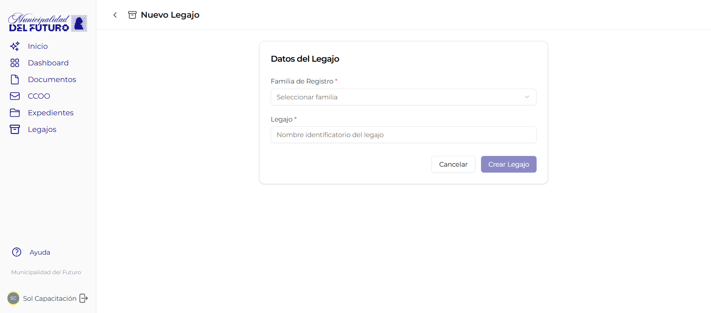
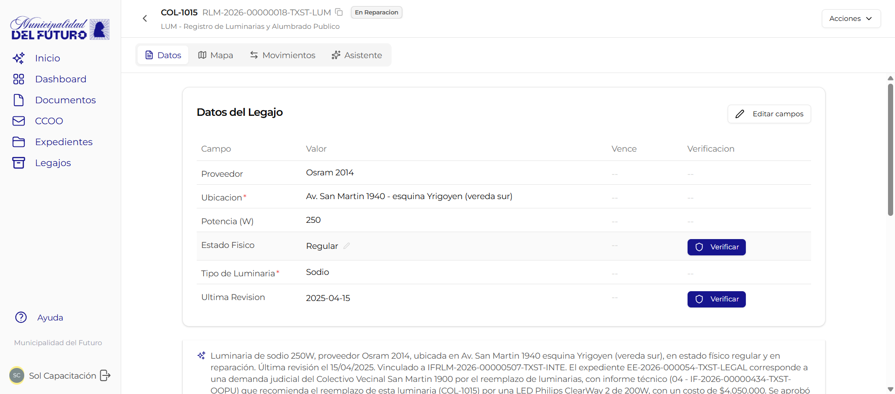

# Crear y editar legajo

Esta pagina explica como crear un legajo nuevo, completar sus campos, cambiar su estado y generar informes IFRLM.

---

## Crear un legajo nuevo

### Paso 1: Seleccionar la familia de registro

Desde la pantalla principal de **Legajos**, hace click en el boton **"+ Crear"**. El sistema muestra un selector con las familias de registro disponibles para tu usuario.

!!! tip "Solo ves las familias que tenes habilitadas"
    Si no aparece la familia que necesitas, contacta al administrador del sistema para que te asigne el permiso `can_create` en esa familia.

Selecciona la familia que corresponda al tipo de legajo que queres crear (ej: Arquitectura, Luminarias, Ordenanzas).

### Paso 2: Completar el nombre descriptivo

El campo **display_name** es el nombre que identifica al legajo de forma legible. Debe ser claro y descriptivo para que cualquier usuario pueda entender de que se trata.

!!! example "Ejemplos de display_name"
    - `Obra Av. San Martin 1250 - Gonzalez`
    - `Luminaria LED #4521 - Rotonda Belgrano`
    - `Ordenanza 3847/2025 - Uso de suelo zona norte`
    - `Habilitacion - Panaderia Don Carlos - Mitre 890`

### Paso 3: Completar los campos

Cada familia de registro define un conjunto de campos especificos. Los campos pueden ser de distintos tipos:

| Tipo de campo | Ejemplo |
|---------------|---------|
| Texto libre | Nombre del titular, observaciones |
| Numero | Superficie en m2, numero de medidor |
| Fecha | Fecha de habilitacion, fecha de vencimiento |
| Seleccion | Estado de la obra (en curso, finalizada, paralizada) |
| Archivo adjunto | Plano aprobado, foto del frente |

!!! warning "Campos obligatorios"
    Los campos marcados con asterisco (*) son obligatorios. El legajo no puede pasar a estado **Activo** hasta que todos los campos obligatorios esten completos.

Al guardar, el sistema asigna automaticamente el **numero oficial** con formato `RLM-{ANO}-{SEQ}-{TENANT}-{CODIGO}`.

---

## Editar campos de un legajo

Para modificar los datos de un legajo existente:

1. Abri el legajo desde el listado
2. Hace click en el campo que queres modificar
3. Ingresa el nuevo valor
4. Guarda los cambios

!!! info "Campos verificados"
    Si un campo ya fue verificado por un verificador, al editarlo se pierde la verificacion y el campo vuelve a estado **pendiente de verificacion**. Ver [Verificacion](verificacion.md).

Todos los cambios quedan registrados en el **historial** del legajo con fecha, usuario y valor anterior.

---

## Cambiar el estado de un legajo

Desde la vista de detalle del legajo, podes cambiar su estado usando el selector de estado en la parte superior.

Los estados disponibles dependen de la familia de registro. Podes cambiar de cualquier estado a cualquier otro sin restricciones. El sistema registra cada cambio en el historial con fecha, usuario y motivo.

!!! tip "Motivo del cambio"
    Al cambiar de estado podes agregar un motivo opcional. Es recomendable hacerlo para mantener la trazabilidad del legajo.

---

## Generar informe IFRLM

El **IFRLM (Informe de Registro Legajo Multiproposito)** es una foto del legajo en un momento determinado. Genera un documento oficial con todos los datos del legajo tal como estan al momento de emitirlo.

### Como generarlo

1. Abri el legajo del que queres emitir el informe
2. Hace click en **"Generar IFRLM"**
3. El sistema crea un documento tipo IFRLM con:
    - Todos los campos del legajo y sus valores actuales
    - Estado de verificacion de cada campo
    - Fecha y hora de emision
    - Numero oficial del informe

!!! tip "Usos tipicos del IFRLM"
    - Adjuntar a un expediente como constancia del estado actual de un registro
    - Responder un pedido de informe sobre una habilitacion vigente
    - Documentar el estado de una obra antes de una inspeccion

El informe generado queda disponible en la seccion **Documentos** y puede vincularse a expedientes como cualquier otro documento oficial.

!!! info "El IFRLM es un snapshot"
    El informe refleja los datos al momento de su emision. Si los datos del legajo cambian despues, el informe no se actualiza. Para obtener datos actualizados, genera un nuevo IFRLM.
