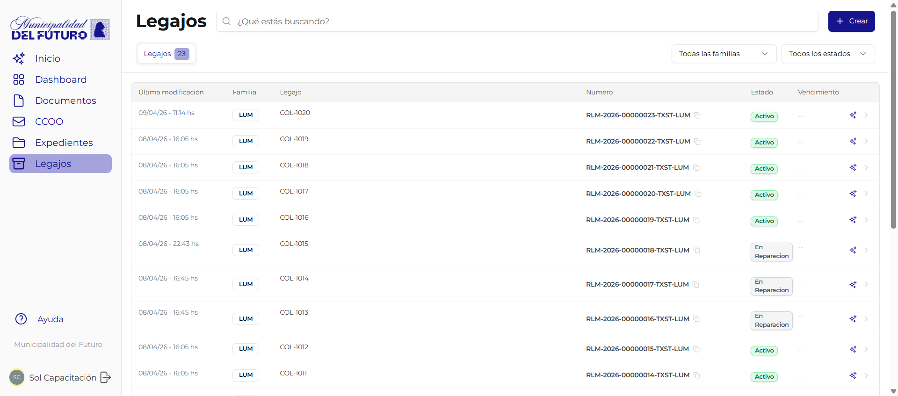

# Legajos (RLM)

El **Registro Legajo Multiproposito (RLM)** es un sistema de legajos digitales que permite organizar, verificar y consultar informacion estructurada sobre cualquier tema que el municipio necesite registrar.

Un legajo es una ficha digital que agrupa campos de datos verificables sobre un asunto especifico. A diferencia de un expediente (que agrupa documentos de un tramite), un legajo agrupa **datos** que se mantienen actualizados a lo largo del tiempo.

---



## Para que sirve

| Uso | Ejemplo |
|-----|---------|
| Registrar habilitaciones | Legajo de un comercio con datos del titular, rubro, vencimiento de habilitacion |
| Control de obras | Legajo de una obra con datos del profesional, planos aprobados, estado de inspeccion |
| Inventario de activos | Legajo de una luminaria con ubicacion, tipo de lampara, fecha de instalacion |
| Registro normativo | Legajo de una ordenanza con numero, fecha de sancion, tematica |

---

## Familias de registro

Cada legajo pertenece a una **familia de registro**. La familia define que tipo de informacion se registra y que campos estan disponibles.

!!! example "Ejemplos de familias"
    - **Arquitectura** -- Legajos de obras, permisos de construccion, planos
    - **Luminarias** -- Legajos de puntos de luz, mantenimiento, recambios
    - **Ordenanzas** -- Legajos de normativa municipal vigente
    - **Habilitaciones Comerciales** -- Legajos de comercios habilitados

La familia determina:

- Que **campos** tiene cada legajo (ej: direccion, responsable, fecha de vencimiento)
- Que **codigo** se usa en la numeracion
- Que **permisos** se requieren para ver, crear, editar o verificar

---

## Numeracion oficial

Cada legajo recibe un **numero oficial unico** al momento de su creacion, con el siguiente formato:

```
RLM-{ANO}-{SECUENCIAL}-{TENANT}-{CODIGO}
```

| Parte | Ejemplo | Descripcion |
|-------|---------|-------------|
| RLM | `RLM` | Prefijo fijo que identifica un legajo |
| ANO | `2026` | Ano de creacion |
| SECUENCIAL | `00000042` | Numero secuencial unico por tenant (8 digitos) |
| TENANT | `TXST` | Codigo de la organizacion/tenant |
| CODIGO | `ARQ` | Codigo de la familia de registro |

Ejemplo completo: `RLM-2026-00000042-TXST-ARQ`

---

## Estados de un legajo

Cada familia de registro define sus propios estados posibles. Los estados mas comunes son:

| Estado | Descripcion |
|--------|-------------|
| :material-pencil-outline: **Borrador** | El legajo fue creado pero aun no tiene todos los campos obligatorios completos |
| :material-check-circle-outline: **Activo** | El legajo esta completo y vigente |
| :material-pause-circle-outline: **Suspendido** | El legajo fue suspendido temporalmente (ej: habilitacion observada) |
| :material-archive-outline: **Archivado** | El legajo fue archivado y ya no esta en uso activo |

!!! info "Estados personalizables"
    Cada familia puede definir sus propios estados segun su necesidad. Por ejemplo, una familia de habilitaciones podria tener: *Ingresado*, *En revision*, *Aprobado*, *Rechazado*, *Vencido*. Los estados se configuran desde el [BackOffice](../../administradores/familias-registro.md).

!!! info "Quien puede cambiar el estado"
    Solo los usuarios con permiso de edicion sobre la familia de registro pueden cambiar el estado de un legajo. No hay restriccion de transiciones: cualquier estado puede pasar a cualquier otro. Los cambios de estado quedan registrados en el historial.

---

## Permisos

El acceso a los legajos se gestiona con permisos granulares por familia de registro:

| Permiso | Que permite |
|---------|-------------|
| **Ver** (`can_view`) | Consultar legajos y sus campos |
| **Crear** (`can_create`) | Crear legajos nuevos dentro de la familia |
| **Editar** (`can_edit`) | Modificar campos y cargar datos en los legajos |
| **Verificar** (`can_verify`) | Confirmar datos cargados con documento oficial de respaldo |

!!! warning "Editar no es verificar"
    Un usuario que puede editar no necesariamente puede verificar. La verificacion es un paso separado que requiere su propio permiso. Ver [Verificacion](verificacion.md) para mas detalle.

---

## Secciones de esta guia

| Pagina | Descripcion |
|--------|-------------|
| [Crear y editar legajo](crear-legajo.md) | Como crear un legajo nuevo, completar campos, cambiar estado y generar informes |
| [Verificacion](verificacion.md) | Workflow de verificacion en 2 pasos: carga de datos y confirmacion con documento oficial |
| [Relaciones y vinculos](relaciones.md) | Vincular documentos, expedientes y otros legajos. Historial de cambios |
